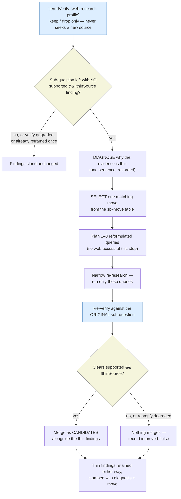

# ADR-0012: Remediative escalation for `thin-source` — in the consumer, not in the verify engine

## Status

Accepted (2026-08-06, librarian trust-contract slice — experimental).

## Related

Parent: docs/explanation/features/orchestration-gating.md

## Supersedes

_(none)_

## Superseded by

_(none)_

## Context

[ADR-0006](0006-tiered-adversarial-verify-standard.md) established the tiered-adversarial verify
protocol and its per-consumer profiles. Under that protocol a finding can escalate from Tier 1 for
several different reasons, and the reasons were treated as interchangeable inputs to a single
pipeline: whatever escalated went to Tier 2, then possibly Tier 3, and each tier could only **keep**
or **drop** it.

The reasons are not interchangeable in what they *say*:

| Reason | What it says about the finding |
|---|---|
| `uncertain`, `disagree` | The claim may be **wrong**. |
| `unsupported` | The premise is not supported. |
| `thin-source` | The claim may be **right but under-evidenced**. |

Only the first two are answered by challenging the claim harder. `thin-source` is a judgement about
the **source**, not a verdict against the claim — a vendor blog that names the right technique is a
working pointer. Challenging it harder cannot make the evidence better; the only response that
addresses what the signal actually reports is to go and **look for a better source**. Under
[ADR-0006](0006-tiered-adversarial-verify-standard.md) alone, no stage does that: Tier 2 re-reads
the cluster's *existing* source and never seeks a new one.

`web-research` is the only profile with `thin-source` in its `escalateOn` set, and it is also the
only surface where seeking a new source is even meaningful — a code-review finding's "source" is a
file that is already in hand.

## Decision

**A remediative response to `thin-source` is legitimate, and it belongs in the consumer, downstream
of verify.** The `librarian` workflow (`scripts/librarian.workflow.mjs`) implements it as a
diagnose-then-shift stage; the verify engine (`scripts/lib/verify.mjs`) is unchanged.

Two scoping statements are part of the decision, not caveats on it:

1. **Verify's own escalation remains uniformly subtractive.** Every tier of the protocol can only
   keep or drop. Tier 2 still re-reads the cluster's existing source and never seeks a new one, and
   *within verify* `thin-source` remains a scrutiny signal rather than a remediation path. This ADR
   adds a stage **after** verify in one consumer; it does not change what any tier does.

2. **"Never drop for thinness" is not "thin findings are kept."** Thinness alone is never a drop
   reason at Tier 1 — that is the claim. An escalated thin finding is **not** drop-proof: it joins
   the same escalation set as every other reason, and **Tiers 2 and 3 can still drop it on the
   merits of the claim** — Tier 2 on a `keep: false` re-check, Tier 3 on a majority refutation. When
   that happens the drop is a verdict on the claim, not a penalty for thinness. (See
   `skills/dispatching-parallel-agents/references/verify-protocol.md` § What each escalation reason
   means.)

### The stage

It fires **per sub-question**, only for a sub-question left with no `supported && !thinSource`
finding. One grounded finding among five thin ones means the thread *is* grounded and reframing
there is wasted spend. A sub-question with **zero** findings does not qualify — that is a coverage
failure with a different owner (the coverage gate and `coverage.missing`); conflating "found weak
evidence" with "found none" merges two failures with two different fixes.

The agent's first job is to **diagnose why** the evidence is thin, and only then select the one move
that matches. An adversarial challenge decomposed "thin source" into five distinct conditions, so a
single unconditional transformation — "reformulate the query" — would be the wrong shape by
construction: a vocabulary swap addresses exactly one of them.

### Three mechanical bounds — code, not prompt instructions

- **Exactly one round.** A sub-question whose findings already carry a `reframe` stamp is excluded.
  Reformulation quality degrades as the count rises (Venktesh et al., arXiv:2605.00560).
- **Re-verified against the ORIGINAL sub-question**, never the reformulated query. A finding that
  answers the reformulation but not the original one is drift and is refused. A **degraded**
  re-verify contributes **zero** candidates — the reframe cannot bypass the scrutiny that triggered
  it.
- **Candidates, not replacements.** New material merges only if it clears `supported && !thinSource`
  — a bar the thin findings did not. Material that is merely *different* does not enter the dossier.
  Thin findings are never dropped; they were the stepping stone, and a future session may want the
  path.

### The trigger's independence, stated precisely

The trigger comes from verify — an **independent adversarial pass** — rather than from a leaf
assessing its own work. **Independence is the property relied on, not source re-reading.**
`thinSource` is a **Tier-1 triage** judgement, and that prompt explicitly forbids re-research
(`scripts/lib/verify.mjs:135-137`); triage performs no new lookups at all. What verify uniquely
contributes is a judgement of **source authority** over the evidence the fan-out already cited — a
downstream consumer holds the URL but not that judgement, which is why the flag is carried onto the
finding rather than recomputed later.

The stage is **skipped entirely when verify degraded.** A degraded verify falls back to raw findings
carrying no `support` or `thinSource` stamp, and reframing on the *absence* of a signal is a
different thing from reframing on one.

### The diagnosis is recorded, not just acted on

Each reframe stamps its diagnosed condition and applied move onto the sub-question's findings —
**including when it failed to improve them** (`improved: false`). The `shift` value is normalized
against a closed set the code owns; an agent never types a flag. A stage whose failures go
unrecorded cannot be improved.

## Alternatives Considered

- **Leave `thin-source` purely subtractive** — rejected: it makes the flag advisory-only. Every
  response available to verify (challenge harder, drop) answers "the claim may be wrong," which is
  not what the signal reports.
- **Add a remediative tier to the verify engine** — rejected: the engine is shared by six consumers,
  four of which (`code-review`, `plan-review`, `audit`, and any future non-web profile) have no
  meaningful notion of "a new source." Putting a web-shaped stage in a portable engine imposes it on
  surfaces that cannot use it. The consumer is the correct home.
- **One unconditional reformulation** — rejected: "thin source" decomposes into five distinct
  conditions and a vocabulary swap addresses one. Reformulating reflexively is the wrong shape by
  construction, which is why diagnosis precedes move selection.
- **Let reframed findings replace the thin ones** — rejected: it deletes working pointers on the
  strength of material that has not yet cleared a higher bar. Candidates merge; they do not
  displace.
- **Skip the re-verify and merge the re-research directly** — rejected: it would let the reframe
  bypass exactly the scrutiny that triggered it, and drift toward an adjacent, easier question would
  be undetectable.
- **More than one round** — rejected on the cited evidence: reformulation quality degrades as the
  round count rises.

## Consequences

- **Gained:** a response to `thin-source` that matches what the signal reports; thin findings
  retained as stepping stones rather than discarded; a recorded distribution of *diagnosed
  conditions* across real runs, which is the only observable this stage produces about itself.
- **Gave up / accepted risks** — stated, not overlooked:
  1. **Success is unmeasurable with any instrument this repo has.** `thinSource` is an LLM
     judgement, so the trigger and the success metric come from the same mechanism; a shift
     returning different-but-equally-thin sources is indistinguishable from one that failed.
     `scripts/recall/` measures finding recall, not source authority. The recorded diagnosis is the
     partial substitute.
  2. **Low-quality seeds may amplify drift rather than transfer vocabulary.** A literature check on
     low-quality-seed pseudo-relevance feedback specifically is unresolved. This applies only to the
     `vocabulary` move; the other five do not expand the query with seed-document terms.
  3. **Prior art covers 2 of the 6 move keys** — which is 3 of the cited paper's named operations,
     because `abstraction` here merges specialization and generalization. Huang & Efthimiadis
     (CIKM 2009) classify query-string operations and ground `vocabulary` (substitution) and both
     directions of `abstraction`. The other four ship unvalidated for **two different reasons**:
     `entity-anchored` and `evidence-type` change the **retrieval target** rather than the query
     string, so they fall outside the cited taxonomy's axis entirely; `inversion` and `discipline`
     *are* expressible as query-string substitutions, so the axis argument does not apply — they are
     ungrounded because the paper does not name or study them as strategies. Being classifiable as a
     substitution is not the same as being validated.
- **Blast radius:** confined to the `librarian` consumer and the `web-research` profile.
  `scripts/lib/verify.mjs` and the protocol's three tiers are untouched, so no other consumer's
  behaviour changes.
- **Follow-up:** the stage ships **experimental**. The distribution of diagnosed conditions across
  real runs is the evidence that would justify keeping it, narrowing the move table, or removing it.
