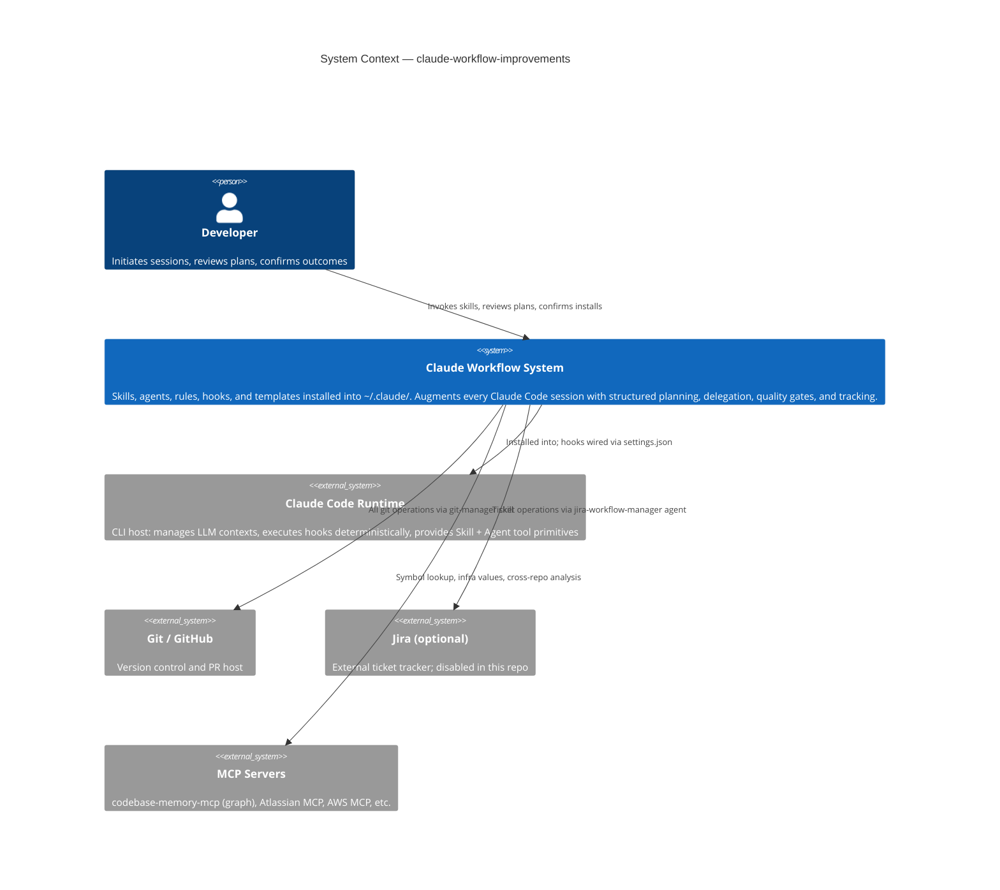
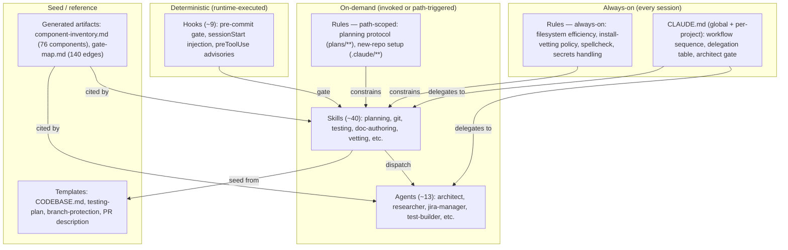
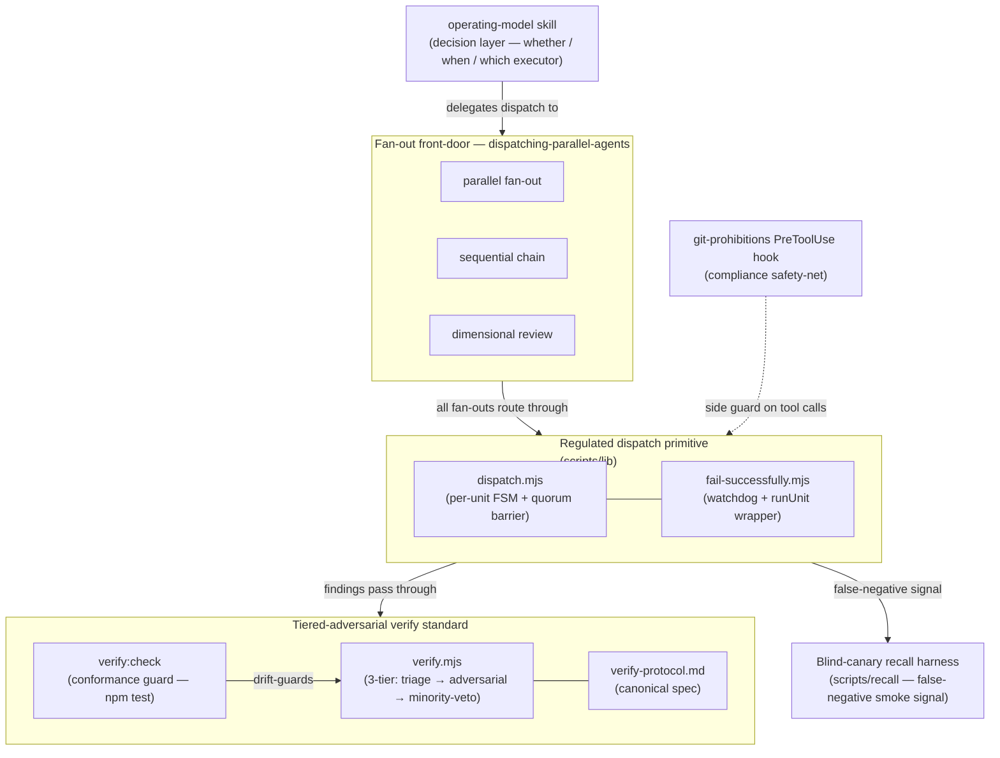

---
**Repo:** claude-workflow-improvements
**C4 Layers:** C1 System Context + C2 Containers
**Owner:** solo
**Last updated:** 2026-06-25
---

# Architecture

## System Context (C1)

The `claude-workflow-improvements` repo is a personal Claude Code workflow system — a layered set of instructions, procedures, and runtime gates installed globally on a developer's machine that augments every Claude Code session with structured planning, delegation, quality, and tracking behaviors.

The system sits between the developer and the Claude Code runtime. It does not replace Claude Code; it installs into it via `~/.claude/`, extending every session without requiring per-repo configuration beyond an initial setup step.

**Actors**

| Actor | Role |
|---|---|
| Developer | Initiates sessions, reviews plans, confirms test results, decides every install (the workflow never acts autonomously against the developer's codebase) |
| Claude main context | The primary LLM context per session — reads rules and CLAUDE.md, invokes skills, dispatches subagents, runs hooks |
| Dispatched subagents | Isolated LLM instances spawned by the main context for specialist work (architect review, test writing, Jira operations, security vetting, parallel research) |
| Claude Code runtime | Executes hooks deterministically (pre-commit, session-start, preToolUse), manages subagent lifecycle, provides the `Skill` and `Agent` tool primitives |
| Jira (optional) | External ticket tracker; fed from plan docs at execution start; updated via the `jira-workflow-manager` agent (disabled in this repo: `project.json` `jira.enabled: false`) |
| Git / GitHub | Version control and PR host; all git operations routed through the `git-manager` skill |

**Installation target**

`scripts/setup.sh` installs everything via symlinks (not copies) so repo updates propagate immediately. After setup, the developer's machine contains:

```
~/.claude/
├── CLAUDE.md                     — always-on global workflow instructions
├── rules/                        — always-on and path-scoped instruction files
├── skills/                       — on-demand invokable procedures (SKILL.md per skill)
├── agents/                       — specialist subagent definitions
├── hooks/                        — deterministic runtime gates (settings.json wired)
├── stacks/                       — per-technology "hat" guidance files
└── templates/                    — seed files (branch-protection, PR description, testing-plan, etc.)
```

Per-repo artifacts generated on first use:

```
<project-repo>/
├── CLAUDE.md                     — project-scoped config (Jira project key, test commands, etc.)
├── .claude-init/
│   ├── CODEBASE.md               — generated by infra-init: repo map, entry points, key modules
│   └── enrichments.json          — generated by infra-init: env vars, serverless triggers
├── .claude/
│   └── testing-plan.md           — generated by e2e-init
├── plans/<slug>/                 — four-file plan tree (design / plan / journal / handoff)
└── TODO.md                       — pointer registry (one entry per active plan)
```



---

## Containers (C2)

The workflow system is organized into six component classes, plus a generated reference layer. Each class has a distinct loading model, enforcement level, and runtime scope.



**Rules**

Rules are Markdown files injected into the system prompt. They are advisory — the LLM reads and follows them with judgment. The workflow has 14 rule files in two loading modes:

- **Always-on** (no frontmatter): loaded every session across all projects. Examples: `filesystem/efficiency.md` (scoped reads, prohibited glob patterns), `install-vetting.md` (3-gate funnel policy), `secrets-handling.md` (no paste-secret anti-pattern).
- **Path-scoped** (frontmatter `paths:` glob): loaded only when Claude reads a file matching the glob. Examples: `planning.md` (triggered by `plans/**/*.md`), `new-repo-setup.md` (triggered by `CLAUDE.md` / `.claude/**`).

The loading model is a budget-conservation mechanism: a flat cap of roughly 150–200 instruction lines applies reliably. Always-on files consume that budget unconditionally, so they are kept to ~110 lines total. Detailed guidance lives in path-scoped rules, agent definitions, or skill definitions — it loads only when relevant.

**Skills**

Skills are on-demand invokable procedures, each defined in `~/.claude/skills/<name>/SKILL.md`. The main context invokes them via the `Skill` tool; their definitions load only on invocation. The workflow has approximately 40 skills across several functional groups:

- **Orchestration:** `brainstorming`, `writing-plans`, `plan-gate`, `executing-plans`, `subagent-driven-development`, `finishing-a-development-branch`
- **Component creation:** `creating-tools` (router), `writing-skills`, `writing-agents`, `writing-rules`
- **Infrastructure and quality:** `infra-init`, `e2e-init`, `project-setup`, `adherence-audit`, `pulser`
- **Git, plan, and tracking:** `git-manager`, `plan-management`
- **Thinking and debugging:** `different-viewpoint`, `different-viewpoints-lite`, `dispatching-parallel-agents`, `verification-before-completion`, `systematic-debugging`, `test-driven-development`, `feedback`
- **Code review:** `requesting-code-review`, `receiving-code-review`
- **Install vetting:** `vet-install` (orchestrator), `vet-reputation`, `vet-capability-fit`, `vet-security`
- **Documentation:** `doc-author`, `doc-backfill`, `docs-refresh`, `docs-status`
- **Session support:** `using-superpowers`, `using-git-worktrees`, `handoff`

The complete roster with descriptions is the authoritative source at `docs/reference/component-inventory.md`.

**Agents**

Agents are isolated subagent definitions in `~/.claude/agents/<name>.md`. They run in a separate LLM context with their own system prompt and tool set. The main context dispatches them via the `Agent` tool. The workflow has approximately 13 agents:

- **Gate agents:** `architect` (plan reviewer, invoked before ExitPlanMode and before task completion), `test-strategy` (derives validation criteria), `test-builder` (writes failing tests from spec), `test-runner` (executes tests post-implementation)
- **Specialist agents:** `researcher` (single-question MCP lookup), `integration-engineer` (cross-repo contract analysis), `jira-workflow-manager` (all Jira operations — never call Atlassian MCP directly), `ai-tool-security-reviewer` (semantic OWASP-ASI/AST judge for agentic install surfaces)
- **Infrastructure subagents** (spawned by `infra-init`, no persistent file): `infra-init-structure`, `infra-init-batch-indexer`, `infra-init-graph-builder`

Isolation is intentional: agents cannot read the main context's conversation history, preventing context contamination and keeping specialist work tightly scoped.

**Hooks**

Hooks are the only deterministic layer. They are JavaScript scripts wired into `settings.json` and executed by the Claude Code runtime — not by the LLM. Because they run as code, they can block, redirect, or mutate tool calls unconditionally. The workflow has approximately 9 hooks:

- **`sessionStart`:** `stack-hat-directive.mjs` (injects per-stack `## Hat` guidance from `~/.claude/stacks/<tech>.md` based on `project.json` `stacks`), `graph-tools-directive` (sets codebase-graph tools as the navigation default when a graph is present), `session-start` (general session initialization)
- **`preToolUse`:** `install-vetting-advisory.mjs` (detects install commands, returns `permissionDecision: "ask"` recommending the `vet-install` funnel — never denies), `graph-tools-enforcement`, `agent-model-pinning`, `subagent-prefix-prepend`
- **`postToolUse`:** `graph-tools-self-heal`
- **`userPromptSubmit`:** `slash-command-enforcement`
- **`preCommit`** (via settings): runs `scripts/run-tests.sh`, ESLint, ruff, and gitleaks — all skip gracefully if the tool is absent

**Orchestration-regulation layer**

The orchestration-regulation layer is a cross-cutting subsystem — not a separate installation directory, but a set of standards and shared primitives that every multi-agent fan-out consumes. It was codified by the Orchestration & Regulation Campaign (Waves 1–5, 2026) and is anchored in `docs/explanation/features/orchestration-gating.md`.

- **Fan-out front-door.** Every regulated multi-agent fan-out routes through the `dispatching-parallel-agents` skill over `scripts/lib/dispatch.mjs`. All dispatches are `fail-successfully`-wrapped (per-unit FSM: watchdog + `runUnit` + `quorumBarrier`), model-pinned (Haiku scan / Sonnet judgment, never inherit Opus), and token-budget-gated. Consumers do not re-implement dispatch.
- **One severity/verdict/enforcement taxonomy.** Three concepts: `error` / `warning` / `note` per finding (SARIF-verbatim); `RED` / `GREEN` verdict per gate (computed — `RED` iff ≥1 `error`); `hard` (hook) / `soft` (markdown) enforcement-hardness per gate. All fan-out producers and consumers share this vocabulary.
- **Tiered-adversarial verify standard.** Every fan-out's collected findings pass through the three-tier verify protocol before surfacing: (1) batched triage labels each finding `supported`/`uncertain`/`unsupported`; (2) clustered adversarial re-check of the escalation set reads each finding's cited premise; (3) minority-veto 3-voter consensus on the contested tail (a finding survives iff ≥2 of 3 structurally-diverse voters fail to refute it; a lone refuter forces `contested` logging rather than silent survival). Canonical doc: `skills/dispatching-parallel-agents/references/verify-protocol.md`; engine: `scripts/lib/verify.mjs`; drift-guarded by the `verify:check` conformance test wired into `npm test`.
- **Blind-canary recall harness.** `scripts/recall/` holds quarantined fixtures and an answer-key registry (`registry.json`) never shown to detectors. A cheap hash-check runs on every commit (`npm run recall:check`); a periodic full run (`scripts/recall/run-recall.mjs`) scores real detectors for false-negative signal. Framed as a smoke test, not a statistical recall score.
- **Decision layer.** The `operating-model` skill is the whether/when/which-executor layer above the front-door: single-threaded is the default; fan-out is the exception that must earn its cost. It carries the 2026 executor map, the circuit-reasoning frame, and the fan-out sizing model, and delegates all dispatch mechanics to the front-door.
- **Surgical hook-hardening.** A small number of matured × high-stakes × tool-observable control edges are hardened into `preToolUse` hooks (the `git-prohibitions` hook is the first, denying `git add -A` / `git add .` / `--no-verify` flag abuse). This is a compliance safety-net against the assistant's own drift — not a security boundary. Most control edges are not tool-observable and remain soft by design.

The following diagram shows the container relationships within the orchestration-regulation layer.



**Templates**

Templates under `templates/` are seed files copied (not symlinked) on first use. They include `CODEBASE.md` (5-category codebase summary for `infra-init`), `testing-plan.md` (starter for `.claude/testing-plan.md`, used by `e2e-init`), `branch-protection.json` (Bitbucket API payload), `pr-description.md`, `mcp-settings.json`, and `stack-setup-record.md` (per-repo install record for project-setup Phase 4).

**Generated reference artifacts**

Two drift-checked artifacts under `docs/reference/` are generated by `scripts/harvest-components.mjs` (run via `npm run harvest`) and committed to the repo:

- `docs/reference/component-inventory.md` — the complete list of all 76 components (40 skills, 13 agents, 14 rules, 9 hooks) with type, name, model/event, and description. This is the authoritative "what exists" record — narrative docs cite it rather than duplicating lists that would drift.
- `docs/reference/gate-map.md` — 140 directed edges representing explicit references between components (which skill invokes which agent, which rule constrains which skill, etc.). A drift-check CI step gates commits on this map staying current.

### Component status

The workflow tracks implementation lifecycle with four status tiers, defined in `docs/component-status.md` (source for this overview):

| Symbol | Meaning |
|---|---|
| ✅ | Implemented and stable |
| 🏗️ | In progress — partially implemented |
| ⚠️ | Deprecated — pending cleanup or replacement |
| ❌ | Planned but not yet implemented |

The generated `docs/reference/component-inventory.md` is the source of truth for *what components exist*. Status and lifecycle are tracked narratively in `docs/component-status.md` — the two files are complementary rather than redundant. The inventory is drift-resistant (auto-generated); the status file is hand-maintained and authoritative for lifecycle state.

One notable lifecycle note: the `todo-manager` agent (⚠️ Deprecated) has been superseded by the `plan-management` skill, which absorbs its TODO.md maintenance responsibilities.

### Instruction-loading layers

The workflow uses a five-layer instruction hierarchy. Layers load at different times and carry different enforcement levels:

| Layer | Location | Loaded when | Enforcement | Role |
|---|---|---|---|---|
| **CLAUDE.md** (global) | `~/.claude/CLAUDE.md` | Every session, every project | Advisory | Workflow sequence, delegation routing, architect gate, task sizing |
| **CLAUDE.md** (project) | `<repo>/CLAUDE.md` | Every session in that project | Advisory | Project-specific config: Jira key, test commands, repo safety |
| **Rules** (always-on) | `~/.claude/rules/*.md` (no frontmatter) | Every session, every project | Advisory | Guidance that must fire before any file is read |
| **Rules** (path-scoped) | `~/.claude/rules/*.md` (with `paths:` frontmatter) | When a matching file is read | Advisory | Conditional guidance for specific task types (planning, repo setup) |
| **Skills** | `~/.claude/skills/*/SKILL.md` | When the skill is invoked | Advisory | Reusable procedures — detailed operational instructions load on demand |
| **Agents** | `~/.claude/agents/*.md` | When the agent is dispatched | Advisory | Isolated specialist context — agent definitions load only at dispatch |
| **Hooks** | `settings.json` (JS scripts) | Programmatic triggers (pre-commit, sessionStart, preToolUse) | Deterministic | Non-negotiable enforcement: gates, advisories, injections |

**Priority hierarchy:** user instructions (CLAUDE.md) > rules > skills. When a rule and a skill conflict on a convention, the rule wins. When `rules/doc-tools.md` and `skills/doc-author/SKILL.md` conflict on a doc-author-related convention, `doc-author` is canonical.

**Context-budget constraint:** Claude reliably follows roughly 150–200 instruction lines. The system prompt consumes ~50 lines. Always-on files (global CLAUDE.md + always-on rules) are budgeted to ~110 lines total — leaving room for the system prompt and one path-scoped rule. This constraint is the design rationale for progressive disclosure: detailed planning protocols, agent policies, and skill procedures stay out of always-on content and load only when relevant. A typical coding session consumes ~220 lines; a planning session (which loads `rules/planning.md`) consumes ~320 — still within reliable compliance range.

**The `feedback` skill** captures workflow friction mid-session. It appends observations to the session memory store at `.claude/projects/<project>/memory/` and optionally opens a GitHub issue for structural improvements. It does not write to any archived flat doc.

## Decisions

Backlinks to ADRs that operate at C1 or C2.

- [ADR-0005](adr/0005-orchestration-regulation-standard.md) — Repo-wide orchestration-regulation standard (Accepted)
- [ADR-0006](adr/0006-tiered-adversarial-verify-standard.md) — Tiered-adversarial verify standard (Accepted)
