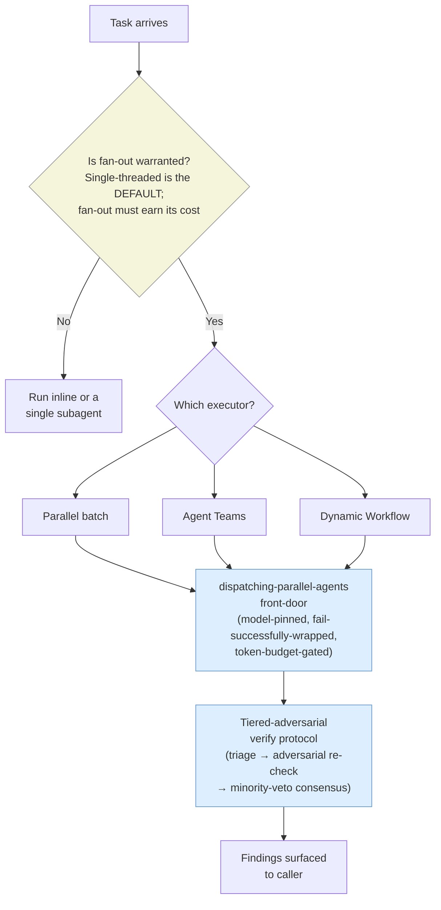

---
**Feature:** Agents & Skills
**C4 Layer:** C3 Component
**Status:** Active
**Owner:** solo
**Last updated:** 2026-06-25
**Related plans:** plans/orchestration-layer-foundation/ (Phase 1B docs)
**Related ADRs:** ADR-0005 (orchestration-regulation-standard), ADR-0006 (tiered-adversarial-verify-standard)
**Key files:**
  - `docs/reference/component-inventory.md` — generated roster of all skills + agents
  - `rules/new-repo-setup.md` — agent/skill registry + invocation conventions
  - `skills/writing-skills/SKILL.md`, `skills/writing-agents/SKILL.md` — authoring contracts
---

# Agents & Skills

## Context & Scope

This document covers the component model that Claude Code uses to extend its own behaviour: **skills**, **agents**, and **rules**. Together these three artifact types form the building blocks of the workflow — every automated procedure, every isolated subagent, and every ambient constraint is expressed as one of them.

**In scope:**

- What each artifact type is, how it is declared, and when it is used
- The invocation contract for skills (the `Skill` tool) and agents (the `Agent` tool)
- The SKILL.md frontmatter schema and how discovery works at startup
- The isolation model that makes agents meaningful
- How the three types compose into larger workflows

**Not in scope:**

- Per-skill or per-agent implementation details — those live in the individual SKILL.md and agent `.md` files
- The full roster of installed components — see `docs/reference/component-inventory.md` for the authoritative generated list (40 skills, 13 agents as of the last harvest run)
- Infrastructure-init and testing-backbone setup procedures — covered in `docs/explanation/features/codebase-graph.md` and the testing-system explainer
- Plan lifecycle and task execution sequencing — covered in `docs/explanation/architecture.md` and `docs/explanation/features/planning-and-plan-docs.md`

---

## Building Block View

The workflow has three building-block types. Each has a distinct execution context, a distinct invocation mechanism, and a distinct authoring contract.

### Skills — Invokable Procedures in Main Context

A **skill** is a prompted procedure that runs inside the current conversation context. Invoking a skill hands control to the skill's instructions, which direct Claude's next actions; when the skill completes, control returns to the caller in the same context window.

**Where skills live:** `~/.claude/skills/<skill-name>/SKILL.md` — one directory per skill, one required entry point.

**Directory layout:**

```
~/.claude/skills/<skill-name>/
├── SKILL.md          ← required entry point
├── agents/           ← optional: per-phase agent prompt files (e.g. infra-init)
│   └── <phase>.md
└── template.md       ← optional: output templates for Claude to fill in
```

**Required SKILL.md frontmatter:**

```yaml
---
name: skill-name          # kebab-case, max 64 chars — becomes the /slash-command
description: >            # max 1024 chars — the only field read at startup
  [Third-person. What this skill does and when to invoke it.]
argument-hint: optional   # shown in autocomplete; describes expected args
---
```

The `description` field is the primary discovery mechanism. At startup, Claude reads only `name` and `description`; the full SKILL.md body loads only when Claude determines the skill is relevant. The description must read as if it is the only text available when deciding whether to invoke the skill.

**Invocation:**

```
Skill { skill: "<name>", args: "..." }
```

Skills are invoked via the `Skill` tool. They cannot be called directly as Bash commands. All routing through a skill happens in main context — the skill sees the conversation history and can read and write files, call other tools, and dispatch agents.

**The `feedback` skill** is an example of a support skill with side effects beyond conversation: it captures workflow friction mid-session, appends a structured observation to the session memory store at `.claude/projects/<project>/memory/`, and optionally files a GitHub issue against the workflow repo. It does not produce a file in the working tree; the observation persists in memory across sessions.

### Agents — Isolated Subagents

An **agent** is a subagent dispatched into a fresh context window with its own system prompt and a restricted tool set. The defining property of an agent is **isolation**: the agent does not see the main conversation history, has no ambient rules, and cannot reach back into the caller's context. This is intentional, not a limitation.

**Why isolation matters:** The `architect` agent's design articulates the core rationale. The architect reads plan docs cold — without the conversational context that produced them — precisely so it can catch contradictions and logical gaps that the main context has already rationalised away. Cold reads counter sycophancy. The same logic applies across agents: isolation preserves the independence of each subagent's judgment.

**Where agents live:** `~/.claude/agents/<agent-name>.md` — a single Markdown file per agent that is the agent's complete system prompt.

**Agent frontmatter (not a formal schema — embedded in the prose system prompt):** Agent files do not use a SKILL.md-style frontmatter block. They are prose system prompts. The registry in `rules/new-repo-setup.md` is the canonical invocation reference.

**Invocation:**

```
Agent { subagent_type: "<agent-name>", prompt: "..." }
```

Agents are invoked via the `Agent` tool. The caller passes a structured prompt (goal, inputs, any context the agent needs). The agent runs to completion and returns a structured result. The caller reads the result and makes all subsequent decisions — agents do not chain themselves or spawn further agents unless their design explicitly describes it (e.g. the `architect` may invoke `researcher` for cross-reference verification).

**Spawned-only agents** do not have persistent files. The three `infra-init-*` agents (`infra-init-structure`, `infra-init-batch-indexer`, `infra-init-graph-builder`) are defined inline in `skills/infra-init/SKILL.md` and spawned at runtime by the `infra-init` skill. They have no `~/.claude/agents/` entry.

**Model selection:** Haiku is used for execution-only agents that perform retrieval, extraction, or MCP lookups without synthesis (`researcher`, `infra-init-structure`, `infra-init-batch-indexer`, `test-runner`). Sonnet is used for review and synthesis agents that must reason about or correlate what they find (`architect`, `infra-init-graph-builder`, `test-strategy`, `test-builder`, `integration-engineer`).

### Rules — System-Prompt-Injected Guidance

A **rule** is a Markdown file under `~/.claude/rules/` that is injected into the system prompt at session start. Rules are ambient — Claude reads them as background constraints rather than executing them as procedures.

**Rules shape behavior without invocation.** There is no tool call to "run" a rule. The `plugin-lifecycle` rule, for example, suppresses direct invocation of Integrated plugin skills; it takes effect because it is present in the system prompt, not because anything calls it. This makes rules the correct mechanism for constraints that must apply unconditionally across all sessions and all skills.

**Rules vs. skills:** When a constraint requires judgment (decide whether to invoke it, branch on conditions, produce an artifact), it belongs in a skill. When a constraint must apply unconditionally as ambient guidance, it belongs in a rule. Path-scoped rules (with YAML frontmatter specifying `paths:`) apply only to sessions where matched files are in scope.

**The component inventory** at `docs/reference/component-inventory.md` includes rules alongside skills and agents in its generated roster and is the canonical list of what is installed.

### How the Three Types Compose

Skills, agents, and rules are designed to compose across all three dimensions:

**Rules constrain skills and agents.** The `mcp-governance` rule prevents skills from calling Atlassian MCP tools directly; instead they must delegate to the `jira-workflow-manager` agent. The `plugin-lifecycle` rule prevents direct invocation of Integrated plugin skills; instead they must route through the `creating-tools` skill. Rules establish the boundaries; skills and agents operate within them.

**Skills orchestrate agents.** The orchestration skills (`brainstorming` → `writing-plans` → `plan-gate` → `executing-plans`) form a chain. Along the chain, skills dispatch agents: `plan-gate` dispatches `architect`, then `test-strategy`, then `test-builder`. The `infra-init` skill dispatches the three `infra-init-*` agents in sequence and in parallel. Skills run in main context and own all coordination decisions; agents run isolated and return results.

**The `operating-model` skill is the whether/when/which-executor decision layer.** It sits above the fan-out front-door (`dispatching-parallel-agents`), answering the prior question: should this work be fanned out at all, and if so, via which executor surface? Single-threaded inline reasoning is the default; fan-out is the exception that must earn its cost. The skill carries the 2026 executor map (inline → single subagent → parallel batch via the front-door → Agent Teams → Dynamic Workflows), the circuit-reasoning frame for thinking about series vs. parallel cost, the fan-out sizing model (concurrency defers to the runtime ceiling; total volume is token-budget-gated, not spawn-count-capped), and the anti-patterns that most commonly make fan-out a false economy. It delegates all dispatch mechanics to `dispatching-parallel-agents` — the decision layer and the dispatch layer are separated by design.

**Agents invoke agents (narrowly).** The `architect` agent invokes the `researcher` agent when it needs to verify a cross-reference in a plan doc. The `vet-security` skill invokes the `ai-tool-security-reviewer` agent as Gate 3 of the install-vetting funnel. Agent-to-agent dispatch is always narrow and purpose-specific — it is not recursive orchestration.

The following diagram shows the `operating-model` decision layer in full: whether fan-out is warranted, which executor to use, and how all fan-out paths converge on the shared dispatch front-door and verify protocol before findings are surfaced.



```
Rules (ambient system prompt)
  └── constrain →
        Skills (main context, Skill tool)
          └── orchestrate →
                Agents (isolated context, Agent tool)
                  └── optionally invoke →
                        Agents (narrowly, e.g. architect → researcher)
```

---

## Runtime View

### Skill Invocation Flow

1. User or calling skill emits `Skill { skill: "git-manager", args: "commit files:[...] type:feat description:'...' jira-key:PROJ-12" }`.
2. Claude Code resolves the `skill` name to `~/.claude/skills/git-manager/SKILL.md`.
3. The SKILL.md body loads into the current context window (the `description` was already in context from startup).
4. Claude reads the skill's instructions and executes them in main context — running Bash commands, calling other tools, staging files, forming the commit message.
5. The skill completes. Control returns to the caller in the same conversation.

The caller retains full context across the skill call. The skill does not produce a clean handoff boundary; it extends the current context with the skill's procedure.

### Agent Dispatch Flow

1. Orchestrator (main context or a skill running in main context) emits `Agent { subagent_type: "architect", prompt: "Review plans/auth-rework/auth-rework-plan.md for design soundness and self-containment." }`.
2. Claude Code spawns a fresh subagent process with `~/.claude/agents/architect.md` as its system prompt.
3. The subagent receives only: its system prompt, and the structured prompt from the caller. It has no access to main conversation history, no ambient rules, no tool calls from the caller's session.
4. The `architect` agent reads the plan doc cold. If it needs to verify a cross-reference, it dispatches `researcher` as a nested agent call with a specific question.
5. The architect returns a structured verdict (`BLOCKING` / `MINOR` / `LOOKS GOOD` / `VERDICT: APPROVED or NEEDS REVISION`).
6. The main context receives the result and decides what to do: revise the plan, surface blockers to the user, or proceed to `test-strategy`.

The agent's isolation is what makes the review meaningful. The architect cannot be influenced by the reasoning that produced the plan.

### The Orchestration Chain

The primary workflow from user intent to committed code flows through six orchestration skills in a fixed sequence:

```
brainstorming
  └── produces <slug>-design.md
       └── writing-plans
             └── produces <slug>-plan.md
                  └── plan-gate (auto-fires)
                        ├── dispatches architect (up to 3 review rounds)
                        ├── dispatches test-strategy (on APPROVED)
                        ├── dispatches test-builder (on test strategy approval)
                        └── hands off to →
                              operating-model  (whether/when/which-executor decision layer)
                                └── delegates dispatch mechanics to →
                                      executing-plans  (sequential, multi-session)
                                      OR
                                      subagent-driven-development  (parallel, single-session)
                                            └── finishing-a-development-branch
```

Each handoff in the chain is explicit — a skill emitting the next skill's invocation — not implicit continuation.

### Fan-Out / Reduce Pattern

The `infra-init` skill demonstrates the fan-out / reduce pattern used when independent work can be parallelised:

1. `infra-init-structure` (Haiku) runs once, sequentially: reads the repo shape and assigns all source files to batches in `progress.json`.
2. Up to 5 `infra-init-batch-indexer` (Haiku) agents run in parallel, each with a pre-assigned batch ID. State lives in `progress.json`, not in conversation history. Batches are pre-assigned by the orchestrator before agents are spawned — no contention.
3. `infra-init-graph-builder` (Sonnet) runs once, sequentially: queries the codebase-memory-mcp and writes `.claude-init/CODEBASE.md`.

Re-running the skill reads `progress.json` and resumes from the first incomplete batch. The pattern is recoverable by design.

**Fan-out sizing model (2026):** The old fixed "≤20 concurrent" principle is superseded. Concurrency defers to the runtime's machine-aware ceiling (`min(16, cores−2)` for the Workflow tool; 25 for Agent Teams); total volume is token-budget-gated rather than spawn-count-capped. The real spend controls are model-pinning (Haiku for scan/retrieval, Sonnet for judgment — never inherit Opus) and batched verify (one verifier per ~10 findings, not per-finding voting). The `operating-model` skill is the authoritative reference for these heuristics.

**Shared tiered-adversarial verify protocol:** All six regulated fan-out consumers — the architect panel, `adherence-audit`, `requesting-code-review`, `subagent-driven-development`'s two-lens review, the `librarian` workflow, and the `orchestration-audit` workflow — route their post-fan-out finding verification through one shared protocol (`skills/dispatching-parallel-agents/references/verify-protocol.md`) instead of per-skill ad-hoc verify. The protocol has three tiers: (1) a cheap batched triage that labels findings `supported`/`uncertain`/`unsupported`; (2) a clustered adversarial re-check on the escalation set, one re-check per cluster; (3) a minority-veto 3-voter consensus on the contested tail only. A finding survives Tier 3 iff ≥2 of 3 structurally-diverse voters fail to refute it. This is codified in ADR-0006.

---

## Dependencies

- **`~/.claude/` global install** — all skills, agents, and rules live here and are available in every repo without per-project copies. Installed once via `scripts/setup.sh`. Skills and agents in this repo are symlinked into `~/.claude/` by the setup script.
- **`Skill` tool** — required for skill invocation. Claude Code CLI provides this tool natively; subagents receive it only if the caller's environment includes it. Skills that dispatch agents (e.g. `plan-gate`, `executing-plans`) require the caller to have `Agent` tool access.
- **`Agent` tool** — required for agent dispatch. Available in Claude Code CLI sessions. Subagents do not automatically inherit it — `test-runner` requires the caller (orchestrator) to have `Skill` tool access so its REQUIRED NEXT STEP block on failure is actionable.
- **codebase-memory-mcp** — used by the `researcher` agent, the `infra-init-graph-builder` agent, and by main context code navigation. Must be installed and indexed (via `/infra-init`) before graph queries are available.
- **Atlassian remote MCP** — used by `jira-workflow-manager`. Governed by the `mcp-governance` rule: never call Atlassian MCP tools directly; always delegate through the agent.
- **`operating-model` skill** — the whether/when/which-executor decision layer consulted before committing to a fan-out. Carries the 2026 executor map and fan-out sizing model; delegates dispatch mechanics to `dispatching-parallel-agents`. Authoring-time dependency used whenever a workflow step is being designed.
- **`pulser` skill** — structural quality check for new skills/agents against Anthropic's 7 design principles. Authoring dependency, not a runtime dependency.
- **`adherence-audit` skill** — semantic consistency checker for dead references, mismatches, and orphaned components across the skill/agent/rule corpus. Invoked periodically and after adding new components.

---

## Decisions

- [ADR-0005](../adr/0005-orchestration-regulation-standard.md) — Repo-wide orchestration-regulation standard (Accepted)
- [ADR-0006](../adr/0006-tiered-adversarial-verify-standard.md) — Tiered-adversarial verify standard (Accepted)

---

## Known Issues & Gotchas

- **Agents cannot see ambient rules.** Rules are injected into the main context system prompt. An agent dispatched via `Agent` tool starts with only its own system prompt — the `mcp-governance` rule, for example, does not automatically apply inside an agent. Agent system prompts that need a rule's constraint must duplicate or reference it explicitly. The `jira-workflow-manager` and `researcher` agent files each carry their own governance constraints for this reason.

- **`Skill` tool availability in subagents.** Not all agent contexts receive the `Skill` tool. The `test-runner` agent emits a REQUIRED NEXT STEP block mandating `systematic-debugging` on failure — but that block is only actionable if the caller (the orchestrator, not a leaf implementer subagent) has `Skill` tool access. Leaf subagents spawned by `subagent-driven-development` must never invoke `test-runner` directly.

- **Spawned-only agents have no persistent file.** The three `infra-init-*` agents are defined inline inside `skills/infra-init/SKILL.md`. They do not appear under `~/.claude/agents/` and cannot be invoked directly by name via `Agent { subagent_type: "infra-init-batch-indexer" }` in an ad-hoc session. They are only accessible through the `infra-init` skill.

- **Description field is the sole startup signal.** Claude reads only the `name` and `description` frontmatter fields at session start; the body of SKILL.md does not load until invocation. A poorly written description causes missed triggers. Write the description as if it is the only text Claude will ever read about the skill.

- **`plugin-lifecycle` suppression is soft enforcement.** The `plugin-lifecycle` rule instructs Claude not to invoke Integrated plugin skills directly. This is model-judgment-dependent, not a technical block. If direct invocation of an Integrated skill persists, the escalation path is narrowing the skill's trigger description — which requires forking the plugin.

- **`feedback` skill does not write to `docs/workflow-feedback.md`.** An earlier version of the skill wrote to that path. The file has been archived. Current behavior: the skill appends observations to the session memory store at `.claude/projects/<project>/memory/` and optionally files a GitHub issue. Do not reference `docs/workflow-feedback.md` in any new skill or rule.

- **Per-skill verify is superseded.** Prior to Wave 5 of the Orchestration & Regulation Campaign, each fan-out consumer (architect panel, `adherence-audit`, `requesting-code-review`, SDD, `librarian`, `orchestration-audit`) maintained its own ad-hoc verify step, most of which were dedup/rank-only rather than adversarial. These are replaced by the shared tiered-adversarial verify protocol (`skills/dispatching-parallel-agents/references/verify-protocol.md`). Do not introduce new per-skill verify logic; route through the shared protocol instead.

- **Agent iteration limit.** The `architect` agent supports a maximum of 3 review rounds. If BLOCKING issues remain after the third pass, the main context surfaces them to the user — a fourth round is not attempted. This prevents infinite review loops but means some blocking issues require human resolution.

- **Windows path portability in agent spawns.** Agents that receive file paths (e.g. `infra-init-graph-builder` receiving `.claude-init/progress.json`) must receive OS-native paths (`C:/Users/...`) not MSYS Unix paths (`/c/Users/...`). The `infra-init` skill derives `REPO_PATH` with `git rev-parse --show-toplevel` for this reason. Any new skill that spawns agents and passes paths must follow the same pattern.

---

## Observability

The component model is observed through generated artifacts and periodic audits rather than runtime metrics, because skills and agents leave no persistent execution logs.

- **Component inventory** (`docs/reference/component-inventory.md`) — generated by `scripts/harvest-components.mjs` (run via `npm run harvest`). Reflects the current installed set of skills, agents, hooks, and rules. Drift between this file and the actual `~/.claude/` contents surfaces as missing or extra rows. The harvest is drift-checked on commit.

- **Gate-map** (`docs/reference/gate-map.md`) — generated alongside the component inventory. Maps dependency edges between skills and agents (which skill dispatches which agent, which rule constrains which skill). Used to verify that orchestration chains are complete and that no component references a dependency that is not installed.

- **`pulser` skill** — invoke against a newly authored skill or agent to check structural quality against Anthropic's 7 design principles (clear purpose, scoped tool access, correct model tier, etc.). Run before merging any new component.

- **`adherence-audit` skill** — semantic consistency sweep across the skill/agent/rule corpus. Detects dead references (a skill that invokes an agent that no longer exists), orphaned components (a component that nothing invokes), and frontmatter mismatches. Invoke after adding new components, modifying rules, or after a significant refactor of the skill chain.

- **`docs-status` skill** — cross-link integrity sweep for documentation. Will flag this feature doc if its `## Related ADRs` or internal links become stale.

---

## Glossary

**Agent** — A subagent dispatched via the `Agent` tool into an isolated context window with its own system prompt and restricted tool set. Has no access to the caller's conversation history. Returns a structured result to the caller.

**Ambient rule** — A rule that applies unconditionally across all sessions by virtue of being present in the system prompt. Not invoked explicitly; active by default.

**Dispatch** — The act of spawning an agent via the `Agent` tool or invoking a skill via the `Skill` tool from within a workflow step.

**Fan-out / reduce** — An orchestration pattern where an orchestrator (skill or main context) spawns N agents in parallel on independent work units, then aggregates their outputs via a single reduce step. Used by `infra-init`.

**Frontmatter** — YAML block at the top of a SKILL.md file containing `name`, `description`, and optional `argument-hint`. The `description` is the sole field read at session startup for skill discovery.

**Informed isolation** — The `architect` agent's design property: it reads plan docs and CLAUDE.md cold (no main conversation history) to counter sycophancy. Not a limitation — a deliberate choice that makes independent review meaningful.

**Main context** — The primary conversation window where skills execute and orchestration decisions are made. Holds the full conversation history and has access to all tools the CLI session provides.

**Model tier** — The assignment of a model (Haiku vs. Sonnet) to an agent based on the cognitive demand of its task. Haiku: retrieval and extraction, no synthesis. Sonnet: review, reasoning, and cross-file synthesis.

**Operating-model skill** — The whether/when/which-executor decision layer that sits above the fan-out front-door. Answers: should this work be fanned out at all, and via which executor surface? Single-threaded is the default; fan-out is the exception. Carries the 2026 executor map, the fan-out sizing model, and the anti-patterns. Delegates all dispatch mechanics to `dispatching-parallel-agents`.

**Orchestration skill** — One of the six skills that form the primary workflow chain: `brainstorming`, `writing-plans`, `plan-gate`, `executing-plans`, `subagent-driven-development`, `finishing-a-development-branch`. Each hands off explicitly to the next.

**Rule** — A Markdown file under `~/.claude/rules/` injected into the system prompt at session start. Provides ambient constraints that apply without invocation. Contrast with skills, which are invoked explicitly.

**Skill** — An invokable procedure defined in `~/.claude/skills/<name>/SKILL.md` and called via the `Skill` tool. Runs in main context. Has access to conversation history.

**Spawned-only agent** — An agent defined inline in a skill's SKILL.md (not as a persistent `~/.claude/agents/<name>.md` file) and dispatched only by that skill at runtime. The three `infra-init-*` agents are spawned-only.

**Stack hat** — Per-technology best-practice guidance (`~/.claude/stacks/<name>.md`) injected alongside ambient rules when a repo declares a matching stack in `project.json`. Composed on top of the base skill/agent/rule model without replacing it.

**Tiered-adversarial verify** — The repo-wide standard for verifying findings produced by a fan-out before they are surfaced (ADR-0006). Three tiers: (1) batched triage labels each finding `supported`/`uncertain`/`unsupported`; (2) clustered adversarial re-check re-reads each finding cluster's cited premise; (3) minority-veto 3-voter consensus on the contested tail — a finding survives iff ≥2 of 3 structurally-diverse voters fail to refute it. Canonical reference: `skills/dispatching-parallel-agents/references/verify-protocol.md`.
