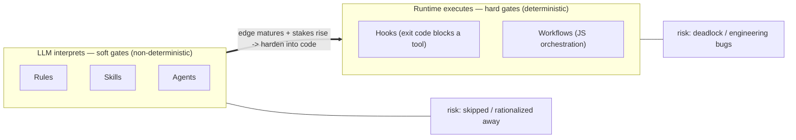
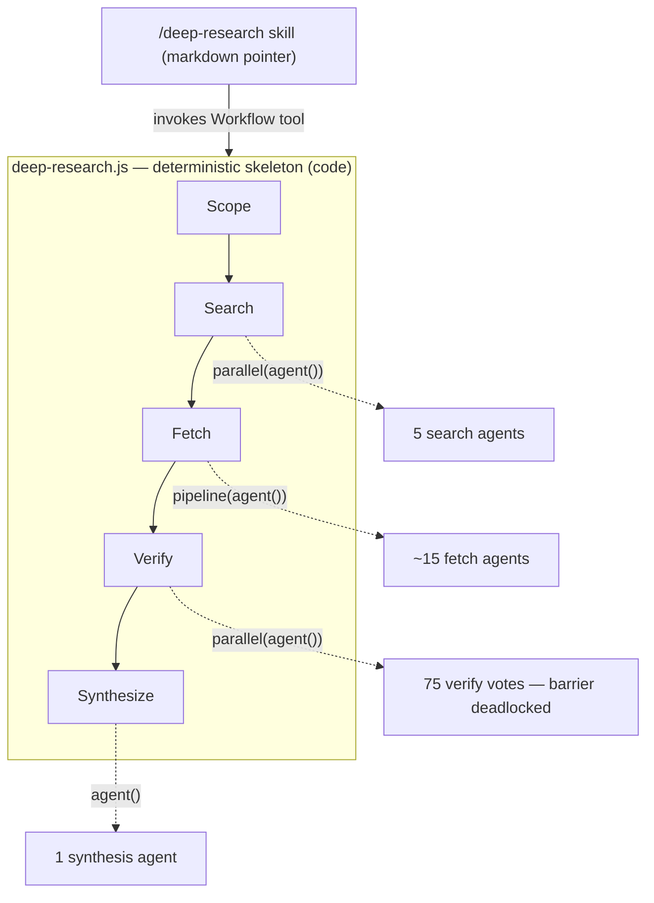

---
**Feature:** Orchestration & Gating
**C4 Layer:** C3 Component
**Status:** Active
**Owner:** solo
**Last updated:** 2026-06-18
**Related plans:** plans/orchestration-layer-foundation/ (Phase 1B docs)
**Related ADRs:** _(none yet — executor-spectrum ADR promoted at sub-plan close)_
**Key files:**
  - `.claude/hooks/` — deterministic runtime gates (sessionStart, preToolUse, postToolUse, userPromptSubmit, pre-commit)
  - `skills/plan-gate/skill.md` — the canonical soft-gate sequence
  - `docs/reference/gate-map.md` — generated 140-edge gate/dependency map
---

# Orchestration & Gating

## Context & Scope

This feature describes the two-layer control system that governs how the Claude Code workflow enforces sequencing, delegation, and quality gates. Every skill invocation, every tool call, and every plan lifecycle event passes through one or both layers.

**Who uses it:** All workflow participants — the developer (who configures hooks and sets env vars), Claude's main session context (which reads and follows soft-gate rules), and the Claude Code harness (which executes hooks as Node.js processes at defined event points).

**What it does:**

- Defines and enforces the execution order of planning, review, testing, and commit steps.
- Provides a hard gate layer (hooks) that the harness enforces unconditionally via exit codes.
- Provides a soft gate layer (rules, skills, agents) that the LLM interprets and follows with judgment.
- Supplies the conceptual framework — the executor spectrum — for deciding which gate layer a given control edge belongs in.

**What it explicitly does NOT do:**

- It does not implement business logic or domain reasoning — that lives in individual skills and agents.
- It does not provide a CI/CD pipeline. Gates are session-time and commit-time; they do not run in GitHub Actions or any cloud environment.
- It does not replace human review. Soft gates surface recommendations; hard gates block tool calls. Neither substitutes for deliberate judgment on consequential changes.

---

The conceptual spine of this feature is the **executor spectrum**:

> Every workflow component is "instructions," but there are two executors:
> - **Markdown (rules / skills / agents)** is read by the **LLM**, which follows it with judgment — flexible, language-aware, but **non-deterministic** (can be misread, skipped, or rationalized away). This is the substrate of **soft gates**.
> - **Code (hooks / workflows)** is run by a **deterministic runtime** — exact sequencing, fan-out, retries — but rigid (no judgment) and subject to ordinary programming bugs. This is the substrate of **hard gates**.
>
> Design principle: **put cognition in markdown, put control flow in code.** A *workflow* is the hybrid — a deterministic code skeleton whose steps each delegate back to an LLM via `agent()` calls. Hardening a gate from prose to code trades "the model might skip it" for "the code might deadlock"; it moves risk from *compliance* to *engineering*, so only mature, high-stakes edges are worth hardening.

## Building Block View

### The executor spectrum

The left column (soft gates) covers everything the LLM reads and acts upon. The right column (hard gates) covers everything the Claude Code harness executes directly. The arrow between them is not a migration path for all edges — only mature, high-stakes control edges are worth hardening. Moving an edge from prose to code eliminates compliance risk but introduces engineering risk; the tradeoff is only favorable when the edge is well-understood and the consequences of skipping it are severe.

### Workflow as hybrid (deep-research example)

A *workflow* sits at the intersection: a deterministic code skeleton that fans out to LLM subagents at each step. The `deep-research` skill illustrates this pattern clearly:

The skill file (`/deep-research`) is a markdown pointer — its trigger description fires the Skill tool, which invokes a JavaScript workflow. The workflow provides guaranteed phase order (Scope → Search → Fetch → Verify → Synthesize) and fan-out mechanics; the individual phases delegate back to the LLM via `agent()` calls. This is the "put cognition in markdown, put control flow in code" principle made concrete. The Verify phase in the diagram was a cautionary case: a verification barrier that over-fanned its votes and deadlocked. This is the canonical example of the engineering risk introduced when edges are hardened — not a compliance failure, but a structural bug in the deterministic layer.

### Key files

| Path | Role |
|---|---|
| `.claude/hooks/sessionStart/graph-tools-directive.mjs` | Inject graph-tools loading directive when CODEBASE.md present |
| `.claude/hooks/sessionStart/stack-hat-directive.mjs` | Inject stack-hat guidance from `project.json` stacks |
| `.claude/hooks/preToolUse/agent-model-pinning.mjs` | Pin / default model on Agent tool dispatches |
| `.claude/hooks/preToolUse/graph-tools-enforcement.mjs` | Block code-symbol Grep/Glob when graph tools are available |
| `.claude/hooks/preToolUse/install-vetting-advisory.mjs` | Advisory nudge before install commands |
| `.claude/hooks/postToolUse/graph-tools-self-heal.mjs` | Catch "project not found" on codebase-memory-mcp; auto-repair CLAUDE.md |
| `.claude/hooks/userPromptSubmit/slash-command-enforcement.mjs` | Inject context when user types a slash-command |
| `skills/plan-gate/skill.md` | Canonical soft-gate sequence: architect → test-strategy → test-builder → Jira → TODO |
| `docs/reference/gate-map.md` | Generated 140-edge dependency map (first-cut: explicit references only) |

The gate-map (`docs/reference/gate-map.md`) is the authoritative record of inter-component edges in the workflow. It is generated and drift-checked — consult it for concrete gate edges rather than deriving them from source. For example, it records the `plan-gate → architect`, `plan-gate → test-strategy`, `plan-gate → test-builder`, `plan-gate → jira-workflow-manager`, and `plan-gate → plan-management` edges that define the canonical soft-gate sequence, as well as `executing-plans → systematic-debugging` (the debugging pre-condition gate) and `git-manager → secrets-handling` (the credential-safety gate).

## Runtime View

### Soft gates — how plan-gate fires

`plan-gate` is the canonical soft-gate example. It is invoked by the `writing-plans` skill immediately after a plan doc is drafted, before `executing-plans` begins. The LLM reads the `plan-gate` skill file and follows its sequence as interpreted prose instructions:

1. **Architect review** — the `architect` agent receives the plan doc, reviews for design soundness and self-containment, and returns APPROVED or a list of BLOCKING items.
2. **Test-strategy** — after APPROVED, the `test-strategy` agent appends a Testing section to the plan doc.
3. **Test-builder** — produces failing tests aligned with the plan's acceptance criteria (skipped for `test-suite-addition` plans).
4. **Jira ticket creation** — `jira-workflow-manager` agent creates Epic and Task tickets (skipped when `jira.enabled: false` in `project.json`).
5. **TODO registration** — `plan-management` skill updates `TODO.md` with the new plan's tasks.

Only after all steps pass does `executing-plans` begin. This entire sequence is **soft**: the LLM interprets each step and may, in principle, skip or abbreviate it. The `rules/` layer (particularly `rules/workflow-phases.md` and the CLAUDE.md delegation table) reinforces the sequence as a behavioral constraint, but does not make it technically impossible to bypass.

**Sub-plan mode:** When `plan-gate` runs for a Form-A sub-plan, it invokes architect and adherence-audit but skips test-strategy, test-builder, Jira ticket creation, and TODO registration. The parent plan owns those. A `mode: minimal` invocation runs architect only.

### Hard gates — how a hook fires

Hooks are Node.js ESM scripts invoked by the Claude Code harness at defined event points. The harness passes the tool input (or session context) as JSON via stdin; the hook writes a JSON response to stdout; the harness interprets the exit code and response fields.

A hard gate fires as follows:

1. Claude's main session decides to call a tool (e.g., `Grep` with a code-symbol pattern).
2. The harness fires `PreToolUse` before executing the tool call.
3. The matching hook script (`graph-tools-enforcement.mjs`) reads the tool input from stdin, classifies the pattern, and determines whether graph tools are available (checks for `.claude-init/CODEBASE.md`).
4. If blocking: the hook exits 0 and writes `{"permissionDecision": "deny", "permissionDecisionReason": "..."}` to stdout. The harness **does not execute the tool call** — the block is unconditional.
5. If passing: the hook exits 0 with no deny field. The tool call proceeds.

Exit code non-zero from a hook signals a hook error (not an advisory block) — the harness surfaces this as a system error. Hook authors use exit 0 on all paths, including blocks; the block signal is the `permissionDecision: deny` field, not the exit code.

The `PostToolUse` hook (`graph-tools-self-heal.mjs`) fires after a codebase-memory-mcp tool call. It checks for "project not found" in the output and, if found, automatically updates `CLAUDE.md` and emits a retry instruction. This is a recovery gate, not a blocking gate — it never denies a tool call.

### Override contract

Setting `CLAUDE_DISABLE_WORKFLOW_HOOKS=1` in the shell environment disables **all** workflow hooks. Each hook checks this env var as its first action and exits 0 (pass-through) immediately if set. This is the emergency rollback mechanism — useful when a hook is misbehaving during development of the hooks themselves.

Individual hook bypass:
- **graph-tools-enforcement.mjs:** prefix the Grep pattern with `[grep-allowed]` to pass through without block.
- **install-vetting-advisory.mjs:** set `CLAUDE_DISABLE_WORKFLOW_HOOKS=1` or override via the `ask` dialog the hook surfaces.

There is no per-hook disable mechanism other than the prefix marker for graph-tools-enforcement. The `CLAUDE_DISABLE_WORKFLOW_HOOKS=1` env var is the universal override.

## Dependencies

**External:**
- **Node.js / ESM runtime** — hooks are `.mjs` files; Node.js must be available on the PATH at hook execution time. Version constraint: ESM module syntax (`import`/`export`); Node 16+ required.
- **Claude Code harness hook API** — hooks rely on the `PreToolUse` / `PostToolUse` / `SessionStart` / `UserPromptSubmit` event model and the `permissionDecision` / `additionalContext` response fields. Hook behavior is coupled to the harness version; API changes require hook updates.

**Internal features this depends on:**
- **Codebase knowledge graph** (`features/codebase-graph.md`) — `graph-tools-directive.mjs` and `graph-tools-enforcement.mjs` both check for `.claude-init/CODEBASE.md`; behavior degrades gracefully to silent pass when the graph is absent.
- **Stack hats** (`features/stack-hats.md`) — `stack-hat-directive.mjs` reads `project.json` `stacks` and `~/.claude/stacks/<stack>.md`; absent stacks or missing catalog entries produce a one-line note rather than an error.
- **Plan gate** (`skills/plan-gate/skill.md`) — the canonical soft-gate sequence; consumed by `writing-plans` to enforce the architect → test-strategy → test-builder → Jira → TODO ordering.
- **Install vetting** (`features/install-vetting.md`) — `install-vetting-advisory.mjs` surfaces the `vet-install` funnel; the hook delegates reputation and security analysis to the three-gate skill chain.
- **Git manager** (`skills/git-manager/`) — the pre-commit hard gate (`preToolUse` on Bash for `git commit`) enforces the secrets-handling rule; `git-manager → secrets-handling` is a gate edge in `docs/reference/gate-map.md`.

## Decisions

Backlinks to ADRs that govern this feature (status inline).

- [ADR-0002](../adr/0002-executor-spectrum-soft-vs-hard-gates.md) — Executor spectrum — markdown vs code (soft vs hard gates) (Accepted)

## Known Issues & Gotchas

- **Soft gates can be skipped.** The LLM reading a skill file is not guaranteed to follow every step — judgment, context limits, and rationalization are all real failure modes. High-stakes control edges (architect review, pre-commit secrets check) have been hardened into hooks or are reinforced by multiple rule files precisely because prose alone is insufficient. When a soft gate is routinely skipped, that is the signal to harden it.

- **Hook API prose-injection limit.** `userPromptSubmit/slash-command-enforcement.mjs` can only inject `additionalContext` — it cannot force the LLM to invoke a skill. If Claude receives the injected context and still handles the slash command inline rather than via the Skill tool, the hook has no further recourse. This is a documented limitation of the current Claude Code hook API; mechanical enforcement is not available until the API exposes a `permissionDecision` equivalent for `UserPromptSubmit`.

- **`PostToolUse` re-entry guard.** `graph-tools-self-heal.mjs` sets the env var `CLAUDE_HOOK_GRAPH_TOOLS_HEAL_ACTIVE` to prevent recursion when its own retry instruction triggers another codebase-memory-mcp call. If this guard is not cleared after the retry resolves (e.g., process exits abnormally), a subsequent session may see the hook silently pass-through. Clear the env var manually if self-heal appears to have stopped working.

- **Multiple-project ambiguity in self-heal.** When `graph-tools-self-heal.mjs` finds multiple projects in `available_projects`, it cannot resolve the correct one from names alone and emits an `additionalContext` instruction to call `list_projects()`. If `list_projects()` also fails (e.g., no indexed projects), the fallback is to direct the user to run `/infra-init`. Both paths depend on the codebase-memory MCP being operational.

- **`available_projects` format.** The codebase-memory-mcp binary returns `available_projects` as an array of name strings, not objects. Hook code that tries to access `.name` on each entry will fail silently. The hook reads the array as strings directly.

- **Windows path portability.** Hooks that derive a repository path must use `git rev-parse --show-toplevel` rather than `pwd -P`. On Windows with git-bash / MSYS, `pwd -P` returns `/c/Users/...` which native binaries and MCP servers cannot resolve. `git rev-parse --show-toplevel` emits `C:/Users/...` on all platforms. See `rules/filesystem/path-portability.md`.

- **`CLAUDE_DISABLE_WORKFLOW_HOOKS=1` is global.** Setting this env var disables every hook simultaneously. There is no mechanism to disable a single hook without editing `.claude/settings.json` or the hook file itself. During hook development, this is the correct tool; in production sessions, prefer the per-hook bypass markers where they exist (e.g., `[grep-allowed]` for graph-tools-enforcement).

## Observability

**Log files written by hooks:**

| Log file | Written by | Contents |
|---|---|---|
| `.claude/logs/agent-dispatches.jsonl` | `preToolUse/agent-model-pinning.mjs` | One JSON line per Agent tool call where the model was overridden or where `model: opus` was dispatched without a `model_override_reason`. Fields include timestamp, subagent name, original model, injected model, and override reason if present. |
| `.claude/logs/grep-blocks.jsonl` | `preToolUse/graph-tools-enforcement.mjs` | One JSON line per Grep or Glob call that was blocked. Fields include timestamp, tool name, pattern, file scope, and the reason for the block. |

**What to look for:**

- **`agent-dispatches.jsonl`** — review after long sessions to see which subagents used expensive models without a stated reason. An unexpectedly large number of Opus dispatches without `model_override_reason` indicates a skill or agent file is not setting the model field correctly.
- **`grep-blocks.jsonl`** — review when a Grep or Glob call that should have passed was blocked. The `reason` field in the log identifies which classifier rule matched. The `[grep-allowed]` prefix overrides the block for a single call without disabling the hook globally.

**No metrics or distributed traces:** hooks are local Node.js processes; they do not emit Prometheus metrics or OpenTelemetry spans. Health is observable only through log files and hook exit codes (visible in Claude Code's session output when a block fires).

**Verifying a hook is active:** run any blocked operation (e.g., a code-symbol Grep with the graph available) and confirm the deny message appears. Alternatively, inspect `.claude/settings.json` to confirm the hook is registered under the correct event key.

## Glossary

**Soft gate** — a control edge enforced by prose instructions (rules, skill files, agent prompts) that the LLM reads and follows with judgment. Non-deterministic: the LLM may skip or abbreviate the gate under context pressure or misreading. Risk profile: compliance failure.

**Hard gate** — a control edge enforced by code (hooks, workflow skeletons) that the deterministic runtime executes. Unconditional within the constraints of correct code: exit code and response fields drive the harness's action, not LLM judgment. Risk profile: engineering bugs, deadlock.

**Hook** — a Node.js ESM script registered in `.claude/settings.json` and invoked by the Claude Code harness at a defined lifecycle event (`SessionStart`, `PreToolUse`, `PostToolUse`, `UserPromptSubmit`). Hooks communicate with the harness via stdin/stdout JSON and exit code.

**Executor spectrum** — the conceptual framework distinguishing the two executors in the workflow: the LLM (which executes markdown instructions) and the deterministic runtime (which executes code). Every workflow component sits somewhere on this spectrum, and the design principle is to assign control-flow responsibilities to the runtime and cognitive responsibilities to the LLM.

**Workflow** — a deterministic JavaScript orchestration script that implements a multi-step process as a fixed skeleton of phases, delegating each phase to LLM subagents via `agent()` calls. Provides guaranteed phase order and fan-out mechanics that prose instructions cannot.

**`plan-gate`** — the canonical soft-gate skill. Invoked after `writing-plans`; enforces the architect → test-strategy → test-builder → Jira → TODO sequence before `executing-plans` begins. See `skills/plan-gate/skill.md` and `docs/reference/gate-map.md` for its outbound edges.

**Gate map** — the generated, drift-checked graph of inter-component dependency edges in the workflow (`docs/reference/gate-map.md`). 140 edges across 76 components as of Phase 1A. First-cut: explicit references only; enforcement tiers (which edges are hard vs soft) live in this explainer.

**`permissionDecision: deny`** — the hook response field that causes the Claude Code harness to block a tool call unconditionally. Written to stdout as part of a JSON object; the harness reads it before executing the tool.

**`additionalContext`** — the hook response field used to inject prose instructions into Claude's context without blocking the tool call. Used by advisory hooks (`install-vetting-advisory.mjs`, `slash-command-enforcement.mjs`, `graph-tools-directive.mjs`) and the self-heal hook to guide behavior without hard-blocking.

**`CLAUDE_DISABLE_WORKFLOW_HOOKS=1`** — environment variable that disables all workflow hooks globally. Each hook checks this variable as its first action and exits 0 (pass-through) immediately if set. Emergency rollback mechanism.

**Sub-plan mode** — the variant of `plan-gate` that runs for Form-A sub-plans. Invokes architect and adherence-audit; skips test-strategy, test-builder, Jira creation, and TODO registration. The `mode: minimal` variant runs architect only.
