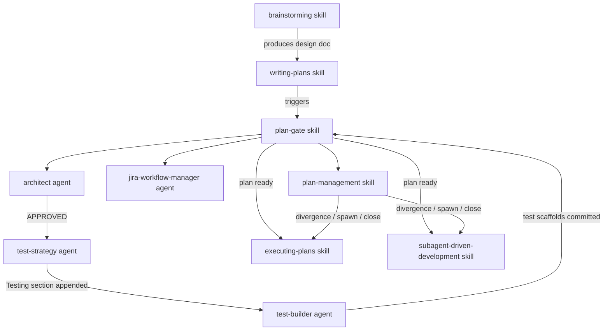

---
**Feature:** Planning & Plan Docs
**C4 Layer:** C3 Component
**Status:** Active
**Owner:** solo
**Last updated:** 2026-06-18
**Related plans:** plans/orchestration-layer-foundation/ (Phase 1B docs)
**Related ADRs:** _(none)_
**Key files:**
  - `skills/brainstorming/SKILL.md`, `skills/writing-plans/SKILL.md`, `skills/plan-gate/SKILL.md` — plan creation + gating
  - `skills/executing-plans/SKILL.md`, `skills/subagent-driven-development/SKILL.md` — execution
  - `skills/plan-management/SKILL.md` — TODO.md + plan-doc state (divergence / spawn-subplan / close-subplan)
  - `rules/plan-docs.md`, `rules/planning.md` — four-file tree + research-first protocol
---

# Planning & Plan Docs

## Context & Scope

The planning subsystem governs how L-sized work is designed, gated, executed, and maintained across sessions. It converts an intent or requirement into a durable, self-contained plan document tree that any future session can resume from a cold start without additional codebase scanning.

The subsystem serves the developer working in Claude Code. It applies whenever work is large enough (L-sized: ~15k+ tokens, multi-session, many files) to require a persistent record outside ephemeral session scratch pads. S- and M-sized tasks remain in `~/.claude/plans/` as session-scoped ephemera — the planning subsystem does not touch them.

**What it does:**

- Enforces a research-first protocol before drafting begins, so that every file path, function name, env var, and resource name in a plan comes from a real lookup rather than a guess.
- Produces a four-file plan tree (`design`, `plan`, `journal`, `handoff`) under `plans/<slug>/` in the repo, making plans durable across session boundaries and co-located with the code they describe.
- Gates every plan through an independent `architect` review (soundness + self-containment check), a `test-strategy` validation checkpoint, and optionally a `test-builder` pass before execution begins.
- Maintains the plan's accuracy during execution through atomic three-way writes (`plan-management:divergence`) and a single live entry-point (`handoff`) that any new session can open without loading the full plan.
- Manages sub-plan nesting (Form A for significant standalone sub-work; Form B for small additions appended to the parent) with a single `.claude/active-plan` pointer that is the authoritative "what is being worked on right now."
- Maintains `TODO.md` as a lightweight navigation registry of active plans — it holds pointers to plan docs, not duplicate task rows.

**What it does NOT do:**

- It does not manage S- or M-sized work. Those use plan-mode scratch output only.
- It does not replace the journal or handoff with session-scoped memory. `TodoWrite` is session-scoped and resets between conversations; the plan doc is the durable record.
- It does not auto-commit plan documents. All writes to plan artifacts are surfaced for user review.
- It does not create Jira tickets directly. Ticket creation is delegated to the `jira-workflow-manager` agent; `plan-management` then syncs the Task Reference table with the assigned keys.

---

## Building Block View

The planning subsystem is composed of skills, rules, and agents that each own a distinct phase of the plan lifecycle. No single file implements the whole; the system is the protocol these components share.



**Rules that govern the subsystem:**

- `rules/plan-docs.md` — the four-file tree structure, lifecycle events, and the `.claude/active-plan` marker.
- `rules/planning.md` — the research-first protocol (four phases: Orient, Research, Ask, Draft), sizing table, required plan-doc sections, architect gate invocation, test-strategy gate invocation.

**Key skills and agents** (full roster in `docs/reference/component-inventory.md`):

| Component | Type | Role |
|---|---|---|
| `brainstorming` | skill | Design-exploration phase; produces `<slug>-design.md`; surfaces ADR candidates |
| `writing-plans` | skill | Drafts the four-file plan tree from research output; self-containment threshold check |
| `plan-gate` | skill | Sequences the gates (architect → test-strategy → test-builder → Jira → TODO); triggered on `writing-plans` completion |
| `architect` | agent | Independent plan reviewer; returns BLOCKING / MINOR / LOOKS GOOD / VERDICT; max 3 rounds |
| `test-strategy` | agent | Post-architect validation; appends `## Testing` section to the plan doc |
| `test-builder` | agent | Pre-execution test-code writer; commits failing tests before implementation begins |
| `jira-workflow-manager` | agent | Creates Epic + Task tickets from the plan; fills Task Reference Jira Key column |
| `plan-management` | skill | Atomic divergence writes; sub-plan spawn/close; TODO.md registry maintenance |
| `executing-plans` | skill | Task-by-task execution with review checkpoints; invokes git-manager, systematic-debugging, test-runner |
| `subagent-driven-development` | skill | Parallel-agent execution for independent tasks; each subagent gets one task and a fresh context |

**Gate-map edges** for this subsystem (from `docs/reference/gate-map.md`):

- `plan-docs` → `brainstorming`, `writing-plans`, `plan-gate`, `plan-management`, `finishing-a-development-branch`, `systematic-debugging`
- `plan-gate` → `architect`, `test-strategy`, `test-builder`, `jira-workflow-manager`, `plan-management`, `executing-plans`, `writing-plans`
- `plan-management` → `brainstorming`, `writing-plans`, `executing-plans`, `subagent-driven-development`, `git-manager`, `jira-workflow-manager`, `doc-author`, `systematic-debugging`
- `writing-plans` → `executing-plans`, `subagent-driven-development`, `researcher`, `git-manager`, `finishing-a-development-branch`

---

## Runtime View

### Phase 1 — Design (brainstorming → writing-plans)

The entry point is the `brainstorming` skill. Before drafting a single line, the protocol requires four phases to complete in order:

1. **Orient** — Read `CODEBASE.md` (if `infra-init` has been run) and any related existing plan docs in `plans/`. These carry resolved decisions and exact file paths; do not re-derive them from the codebase.
2. **Research** — Use codebase-graph tools (`search_graph`, `query_graph`, `get_architecture`) for structural facts. Dispatch `researcher` agent instances in parallel for live infrastructure values (ARNs, SSM params, table names). Read source code only when implementation logic — not just symbol location — is needed.
3. **Ask** — Batch all remaining unknowns into one message. Each question must cite a real file, function, or system. Never trickle questions one at a time.
4. **Draft** — Every implementation step must be a concrete action against a real file or function. If any step cannot be written concretely, return to Phase 2.

`brainstorming` produces `plans/<slug>/<slug>-design.md` (frozen rationale; the "why we chose this" record). It is the only artifact that captures the pre-execution option space. It is not mutated after `writing-plans` runs.

`writing-plans` takes the design doc and produces the remaining three files in the plan tree: `<slug>-plan.md`, `<slug>-journal.md`, and `<slug>-handoff.md`. It sets `.claude/active-plan` to the new plan's path.

### Phase 2 — Gating (plan-gate)

`plan-gate` triggers on `writing-plans` completion and runs the following gate sequence in order:

```
architect → test-strategy → test-builder → jira-workflow-manager → plan-management
```

**Architect gate** — The `architect` agent receives the plan doc path and reviews for design soundness and self-containment. It returns a structured verdict:

- `BLOCKING` — issues that must be resolved before proceeding.
- `MINOR` / `LOOKS GOOD` — the gate passes; minor items are advisory.
- `APPROVED` — explicit approval; proceed to test-strategy.

Iteration rules: if architect surfaces a user-judgment question (not resolvable from available context), surface it to the user verbatim — do not resolve with assumptions. If the issue is a design flaw resolvable from context, resolve it, update the plan, and re-invoke. Maximum three rounds. If BLOCKING items remain after the third pass, surface to the user; do not attempt a fourth round.

**Test-strategy gate** — After APPROVED, the `test-strategy` agent appends a `## Testing` section to the plan doc. This section becomes the source the `jira-workflow-manager` copies into ticket descriptions. The section name must be exactly `## Testing`. Implementation must not begin without this section.

**Test-builder gate** — The `test-builder` agent writes failing test scaffolds and commits them via `git-manager` before any implementation code is written. This enforces the test-driven development principle at plan scope.

**Jira + TODO** — `jira-workflow-manager` creates the Epic and Task tickets; `plan-management` registers the plan in `TODO.md` as a pointer entry (plan doc path + Epic key). `TODO.md` holds navigation pointers, not duplicate task rows.

For `plan-type: test-suite-addition` plans (declared in plan frontmatter), the `test-builder` step is skipped — the plan's deliverable is itself a test suite.

### Phase 3 — Execution (executing-plans / subagent-driven-development)

With the plan gated and tickets created, execution proceeds task-by-task from the Task Reference table. Two execution modes are available:

- **`executing-plans`** — sequential, with review checkpoints between tasks. Used when tasks depend on one another or when each task's output must be verified before the next begins. Hooks: `git-manager` for commits, `systematic-debugging` on any failure, `test-runner` after implementation.
- **`subagent-driven-development`** — parallel dispatch; one fresh-context subagent per task. Used when Task Reference rows are independent. Each subagent receives the task spec, the architecture blueprint, and any stack hat directives. `plan-management` and `jira-workflow-manager` remain in the orchestrating context.

After each task: mark the Task Reference row ✅ in `<slug>-plan.md` and refresh the handoff status table. When Jira is enabled, invoke `jira-workflow-manager` to transition the ticket, then invoke `plan-management` with the ticket key and `status: completed` to sync `TODO.md`.

### Phase 4 — Maintenance (plan-management)

**Divergence** — When reality departs from the plan (architecture change, scope shift, discovered bug, test-mechanics change, debugging cascade), invoke `plan-management:divergence`. This is an atomic three-write:
1. Append a dated entry to `<slug>-journal.md` (append-only; never edit prior entries).
2. Edit the relevant section of `<slug>-plan.md` surgically.
3. Refresh `<slug>-handoff.md` to reflect current state.

All three writes go to the top-level plan tree, even when a sub-plan is active.

**Session resumption** — The session entry-point is always `<slug>-handoff.md`. Load it first; follow its pointers to load only the parts of `plan.md` and `journal.md` needed. Never preload the full plan doc, journal, or design at session start. The handoff is the single live file — continuously overwritten in place, never date-stamped.

### Phase 5 — Sub-plan nesting

When a task inside an L-sized plan grows into its own significant standalone effort:

- **Form A (significant, standalone, L-sized)** — invoke `plan-management:spawn-subplan`. The skill scaffolds `plans/<parent>/<child>/` with `<child>-design.md` and `<child>-plan.md` only. Journal and handoff always roll up to the top-level tree. `.claude/active-plan` is updated to point at the child plan. The child plan passes through `plan-gate` in sub-plan mode: architect + adherence-audit run; test-strategy, test-builder, Jira, and TODO registration are skipped (the parent plan owns those). When all child tasks are complete, invoke `plan-management:close-subplan` with structured closeout content (summary, key decisions, gotchas). The skill runs the ADR Promotion Scan, appends the closeout entry to the top-level journal, marks the parent task ✅, refreshes the top-level handoff, and reverts `.claude/active-plan` to the parent.

- **Form B (small addition)** — append a new dated and titled section to the parent plan doc. No new files. `plan-management:spawn-subplan` is not invoked; the parent journal and handoff continue to serve.

Sizing rule: Form A when the sub-plan is itself L-sized; Form B otherwise.

### Phase 6 — Completion

When all Task Reference rows in the top-level plan are ✅:

1. Invoke `plan-management:close-subplan` with closeout-summary, closeout-decisions, and closeout-gotchas. The skill writes the final journal entry, refreshes the handoff to terminal status, and clears `.claude/active-plan`.
2. Run the `finishing-a-development-branch` flow.

The ADR Promotion Scan runs at sub-plan (and top-level plan) close. Any `[adr-candidate]` journal tags are reviewed; promoted candidates become ADR files under `docs/explanation/adr/`; `doc-author` is then re-invoked in `backlink-only` mode to add accepted-ADR backlinks to the relevant feature-doc `## Decisions` sections.

---

## Dependencies

- **`architect` agent** — independent plan reviewer; required for all L-sized plans; invoked by `plan-gate`. Its question-surfacing behavior is the contract that prevents assumptions from silently entering a plan.
- **`test-strategy` agent** — appends the `## Testing` section; invoked by `plan-gate` after architect APPROVED; the section is the contract that `jira-workflow-manager` copies into ticket descriptions.
- **`test-builder` agent** — pre-execution test-code writer; invoked by `plan-gate`; commits failing tests via `git-manager` before implementation begins.
- **`jira-workflow-manager` agent** — Jira ticket creation and status transitions; invoked by `plan-gate` and by the orchestrating context at every task-completion event. When `jira.enabled: false` in `project.json`, this step is skipped entirely.
- **`researcher` agent** — single-question factual lookup agent; dispatched in parallel during Phase 1 research for live infrastructure values that the codebase graph cannot answer.
- **`git-manager` skill** — all git operations (branch, commit, push, PR); invoked by `executing-plans` and `subagent-driven-development`; never bypassed with raw git commands.
- **`systematic-debugging` skill** — required entry point on any test failure or unexpected behavior during execution; `executing-plans` hooks into it before any fix attempt.
- **`finishing-a-development-branch` skill** — post-completion integration flow; invoked after the plan tree is marked complete.
- **`doc-author` skill** — invoked by `plan-management:close-subplan` during the ADR Promotion Scan to add accepted-ADR backlinks to feature-doc `## Decisions` sections.
- **`rules/plan-docs.md`** — the four-file tree structure, `.claude/active-plan` semantics, and the lifecycle event table that governs when each `plan-management` mode is invoked.
- **`rules/planning.md`** — research-first protocol, sizing table, required plan-doc sections, architect gate invocation contract, test-strategy gate invocation contract.
- **`docs/reference/component-inventory.md`** — the generated, drift-checked roster of all 76 workflow components; the authoritative source for "what skills and agents exist."
- **`docs/reference/gate-map.md`** — the generated edge map of all 140 component dependencies; the authoritative source for "what calls what."

---

## Decisions

_(No accepted ADRs yet.)_

---

## Known Issues & Gotchas

- **The four-file tree applies to new plans only.** Existing in-flight plans that predate the four-file convention continue under their prior structure until they close naturally. No migration is required or expected.

- **`TodoWrite` resets between sessions.** `TodoWrite` is Claude Code's session-scoped in-memory task list. It is not the durable record — the plan doc's Task Reference table is. Both must be maintained independently during a session. A common mistake is treating a `TodoWrite` update as sufficient and skipping the `plan-management` invocation that writes to the plan doc.

- **Form-A sub-plans have no journal or handoff.** This is intentional and correct. `doc-author` and other tools that walk the plan tree for a journal file will get a not-found response; they proceed on design + plan only. Do not interpret a missing journal as a defect.

- **Architect review maximum is three rounds.** If BLOCKING issues remain after three passes, the correct action is to surface them to the user, not to attempt a fourth round. Repeated re-invocation without user input degrades plan quality by accumulating unresolved assumptions.

- **`## Decisions` is set at close, not at authoring time.** During plan execution, ADR candidates are marked with `[adr-candidate]` journal tags. The ADR Promotion Scan at `close-subplan` decides which become actual ADRs. Do not hand-add ADR backlinks to a feature-doc's `## Decisions` section during execution — the `doc-author` `backlink-only` pass at close is the only correct mechanism. Hand-editing risks a format mismatch that `docs-status` will flag as an ERROR.

- **`plan-management:divergence` is mandatory for scope changes during execution.** Silently overwriting plan sections without going through `divergence` breaks the journal's append-only history. The atomic three-write (journal + plan + handoff) is how the plan remains trustworthy across sessions. A plan whose journal does not match its `plan.md` sections is unreliable as a session-resumption artifact.

- **The Task Reference table is the durable progress record — not Jira.** When Jira is enabled, the Jira ticket being Done and the Task Reference row being ✅ are two records of the same fact. The plan doc row is canonical; Jira is the external notification. When Jira is disabled (`jira.enabled: false`), ✅ rows are the only record.

- **Sub-plan mode for `plan-gate` skips Jira + TODO registration.** When `plan-gate` runs against a Form-A sub-plan, it invokes architect + adherence-audit but skips test-strategy, test-builder, Jira ticket creation, and TODO.md registration. The parent plan owns all of those. Passing `mode: minimal` to `plan-gate` further skips adherence-audit, leaving only architect — for trivial sub-plan refinements.

- **Plan docs are in `plans/<slug>/` in the repo, not `~/.claude/plans/`.** `~/.claude/plans/` is Claude Code's session scratch pad — files there are ephemeral and not version-controlled. Only files under `plans/<slug>/` survive session boundaries and travel with the code. Note: `plans/` may be gitignored in some repo configurations, making plan docs working artifacts rather than committed deliverables. Refer to the repo's `.gitignore` to confirm.

---

## Observability

This is a markdown-and-instruction workflow with no runtime telemetry. There are no logs, metrics, or traces in the traditional sense. Observation happens through three durable artifacts:

- **`<slug>-journal.md` (append-only history)** — the primary audit trail. Every plan deviation, root cause, test-mechanics change, sub-plan event, and mid-execution decision that overrides a plan-time choice is recorded here with a date. Reading the journal from bottom to top gives the full session history for a plan. Entries are never edited; corrections appear as new dated entries that supersede prior ones.

- **`TODO.md` (navigation registry)** — the active-plans index. Each entry is a pointer to a plan doc path plus its Epic key (when Jira is enabled). `TODO.md` is updated by `plan-management` skill modes at the appropriate lifecycle events; it is not manually maintained. A plan's presence in `TODO.md` Active Plans means it is in progress; its presence in History means it is complete.

- **`git log`** — the commit history records each task's completion (conventional `type: description [PROJ-N]` format when Jira is enabled). Because `executing-plans` routes all commits through `git-manager`, the git log is an indirect observer of plan progress — each task commit corresponds to one Task Reference row being marked ✅.

To assess the current state of an in-flight plan without reading the full plan doc, read `<slug>-handoff.md` first. The handoff is the live entry-point: it shows the active task, the last divergence, and pointers to the specific plan and journal line ranges that matter for the current session.

---

## Glossary

**Active plan** — The plan currently being executed, identified by the relative path in `.claude/active-plan`. A single pointer; never more than one plan active at a time. Updated by `plan-management:spawn-subplan` (child) and `plan-management:close-subplan` (reverted to parent or cleared).

**Architecture Blueprint** — The factual, graph-derived section of a plan doc recording every file path, function signature, env var, and external resource name involved in the work. All values must come from real lookups; uncertain values are Open Questions.

**Design doc (`<slug>-design.md`)** — The pre-execution rationale produced by `brainstorming`. Captures the option space, the chosen approach, and the why. Frozen after `writing-plans` runs; loaded only when "why did we choose this" questions arise.

**Divergence** — Any departure from the plan during execution: an architecture change, scope shift, discovered bug, test-mechanics change, or debugging cascade. Must be recorded via `plan-management:divergence`, which atomically writes a journal entry, edits the plan, and refreshes the handoff.

**Form A sub-plan** — A significant standalone child plan housed in `plans/<parent>/<child>/` with `<child>-design.md` and `<child>-plan.md` only. Journal and handoff roll up to the top-level tree. Used when the sub-plan is itself L-sized.

**Form B sub-plan** — A small addition to an existing plan appended as a new section in the parent plan doc. No new files; no `spawn-subplan` invocation.

**Four-file plan tree** — The set of four sibling files under `plans/<slug>/`: `<slug>-design.md` (frozen rationale), `<slug>-plan.md` (north star, surgically mutable), `<slug>-journal.md` (append-only history), `<slug>-handoff.md` (live entry-point, overwritten in place).

**Handoff (`<slug>-handoff.md`)** — The live session entry-point. Holds current state: active task, last divergence pointer, open gotchas, and line-range pointers into the plan and journal. Single live file; continuously overwritten in place; never date-stamped.

**Journal (`<slug>-journal.md`)** — Append-only history file. Records divergences, decisions, debugging cascades, sub-plan events, and environment-specific workarounds. Entries are never edited; corrections are new dated entries. The audit trail for the full plan lifecycle.

**L-sized work** — Work estimated at ~15k+ tokens, spanning multiple sessions, touching many files. The sizing threshold at which a four-file plan tree is required. When in doubt, size up.

**Plan-gate** — The skill that sequences the review gates between `writing-plans` completion and execution start: architect → test-strategy → test-builder → Jira → TODO. Runs in sub-plan mode for Form-A sub-plans (skips test-strategy, test-builder, Jira, TODO).

**Plan-management** — The skill that owns all plan-doc state mutations during execution: `divergence` (atomic three-write), `spawn-subplan` (scaffolds Form-A child), `close-subplan` (rollup + ADR Promotion Scan + `.claude/active-plan` revert), and TODO.md registry maintenance.

**Research-first protocol** — The four-phase discipline (Orient → Research → Ask → Draft) that must complete before any plan is drafted. Ensures every concrete value in the plan comes from a real lookup rather than a guess.

**Self-containment test** — The readiness criterion for a plan doc: a model with an empty context window, receiving the plan with "execute this plan," should be able to proceed without additional research. If not, the plan is not done.

**Task Reference table** — The authoritative durable progress record inside `<slug>-plan.md`. Columns: #, Task, Size, Complexity, Scope, Jira Key. Rows are marked ✅ as tasks complete. The mechanism that keeps it current is `plan-management:divergence`.

**TODO.md** — The repo-level navigation registry of active plans. Holds pointer entries (plan doc path + Epic key); does not duplicate task rows. Updated by `plan-management` skill modes; never manually maintained.
