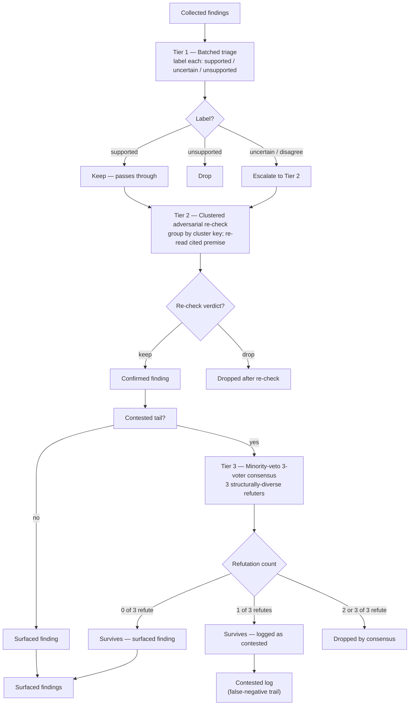
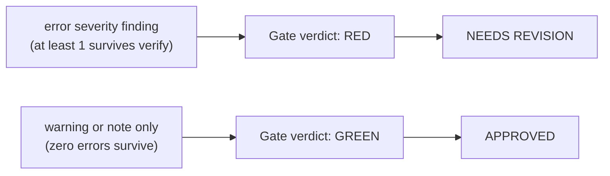

---
**Feature:** Quality & Review
**C4 Layer:** C3 Component
**Status:** Active
**Owner:** solo
**Last updated:** 2026-06-25
**Related plans:** plans/orchestration-layer-foundation/ (Phase 1B docs)
**Related ADRs:** ADR-0006 (tiered-adversarial verify standard)
**Key files:**
  - `skills/requesting-code-review/SKILL.md`, `skills/receiving-code-review/SKILL.md` — the review exchange
  - `skills/verification-before-completion/SKILL.md` — evidence-before-claims gate
  - `skills/systematic-debugging/SKILL.md` — mandatory pre-fix debugging discipline
  - `skills/review-workflow/SKILL.md` — acts on accumulated workflow friction
  - `skills/dispatching-parallel-agents/references/verify-protocol.md` — canonical tiered-adversarial verify protocol
  - `scripts/lib/verify.mjs` — dependency-free verify engine implementation
---

# Quality & Review

## Context & Scope

This feature covers the five skills that enforce quality discipline during development and drive continuous improvement of the workflow itself:

- `systematic-debugging` — structured root-cause process invoked on any test-runner FAILURE before any fix attempt
- `verification-before-completion` — evidence gate invoked before any "done / fixed / passing" claim
- `requesting-code-review` — frames and dispatches a code-reviewer subagent after task or feature completion
- `receiving-code-review` — governs how returned review feedback is evaluated, questioned, and acted on
- `review-workflow` — periodic triage of accumulated workflow-friction issues that feeds improvements back into the skill/rule/agent layer

These skills share a single concern: substituting evidence and structured process for assumption and intuition. They are the quality checkpoint layer of the workflow — not development tools, not planning tools.

**Scope boundaries.** This feature does not own testing infrastructure (`test-driven-development`, `test-strategy`, `test-builder`, `test-runner` are covered in `docs/explanation/features/testing-system.md`). It does not govern plan creation, task execution, or git operations. It does not handle Jira transitions. It is narrowly the layer that catches problems after implementation and feeds learnings back into the workflow.

This feature is also the **parent of the repo-wide tiered-adversarial verify standard** (ADR-0006): the canonical verify protocol (`skills/dispatching-parallel-agents/references/verify-protocol.md`) and its engine implementation (`scripts/lib/verify.mjs`) ensure that every fan-out's collected findings are adversarially verified before they are surfaced — across all six fan-out consumers (architect panel, `adherence-audit`, `requesting-code-review`, SDD, `librarian`, `orchestration-audit`).

## Building Block View

Full descriptions, trigger conditions, and allowed tools for each skill are listed in `docs/reference/component-inventory.md`. The following summarizes each component's structural role.

**`systematic-debugging`** (`skills/systematic-debugging/SKILL.md`)

A four-phase process skill: Phase 1 (root-cause investigation — reproduce, gather evidence, enumerate all hypotheses as a table), Phase 2 (pattern analysis — working vs. broken comparison), Phase 3 (hypothesis validation — confirm/deny each hypothesis before any fix), Phase 4 (implementation — fix all confirmed root causes in one pass, then invoke `plan-management:divergence` at the mandatory exit gate). The skill integrates with `dispatching-parallel-agents` when three or more hypotheses need simultaneous investigation. It integrates with `query_graph` / `trace_path` from the codebase-memory MCP for call-chain analysis when a codebase graph is present. Phase 4's exit gate requires a `plan-management:divergence` call tagged `[bug]` or `[debug-cascade]` before the session may declare debugging complete.

**`verification-before-completion`** (`skills/verification-before-completion/SKILL.md`)

A gate function, not a process: identify the command that proves the claim, run it fresh, read the full output, then and only then make the claim. The skill defines a table of claim types (tests pass, linter clean, build succeeds, bug fixed, agent completed, requirements met) and what constitutes sufficient vs. insufficient evidence for each. It applies before any commit, PR, task completion mark, or verbal assertion of success.

**`requesting-code-review`** (`skills/requesting-code-review/SKILL.md`)

Structures a review request: obtain `BASE_SHA` / `HEAD_SHA`, populate a templated prompt with implementation context and plan reference, and dispatch a code-reviewer subagent. The subagent receives precisely crafted context — not the session's history — to keep the reviewer focused on the work product. Mandatory after each task in subagent-driven development, after major features, and before merge to main. Requires tests passing before submission. The dispatched reviewer emits findings using the shared severity vocabulary (`error` / `warning` / `note`) and routes them through the tiered-adversarial verify protocol before surfacing.

**`receiving-code-review`** (`skills/receiving-code-review/SKILL.md`)

Governs the response pattern once review feedback arrives: read completely before reacting, restate the requirement in own words (or ask), verify the suggestion against codebase reality, evaluate technical soundness for this codebase, then respond or implement. Distinguishes trusted (human partner) from external reviewer feedback. Defines when to push back (suggestion breaks functionality, YAGNI, reviewer lacks context) and how (technical reasoning, not defensiveness). Forbids performative agreement ("You're absolutely right!"). Requires clarifying all unclear items before implementing any. Requires committing after all items from a single reviewer are addressed, not item by item.

**`review-workflow`** (`skills/review-workflow/SKILL.md`)

Periodic meta-skill that operates on accumulated `workflow-friction` GitHub issues in `TeamClyde/clydes_claude`. Multi-step process: load issues, group and surface merge candidates, run Explore scans per high-signal item (capped at three dispatches), size the fix (M-sized triggers `different-viewpoint`, minor tweaks do not), propose three angles (targeted / root-cause / structural), execute approved fixes via the correct routing table, run an adversarial review, commit via `git-manager`. Fixes are routed to `writing-skills`, `creating-tools`, or direct edits depending on the component type.

## Runtime View

The five skills compose in two distinct flows.

### Flow 1 — Test failure to verified fix

This is the mandatory path whenever a test-runner returns FAILURE. No shortcutting is permitted.

```
test-runner FAILURE (rule: rules/workflow-phases.md)
  → invoke systematic-debugging
      Phase 1: reproduce + gather evidence + enumerate hypothesis table
      Phase 2: pattern analysis (working vs. broken)
      Phase 3: confirm/deny each hypothesis
        (3+ hypotheses → dispatching-parallel-agents for parallel investigation)
      Phase 4: fix all confirmed root causes in one pass
        → invoke test-runner again
          → PASS: invoke verification-before-completion
                    (run full test command, read output, confirm 0 failures)
                  → invoke plan-management:divergence (exit gate, mandatory)
                    (tag: [bug] or [debug-cascade])
          → FAIL: if < 3 attempts, return to Phase 1
                  if ≥ 3 attempts, surface to user — do not attempt fix #4
```

### Flow 2 — Task/feature completion and review exchange

This is the mandatory path at task boundaries in subagent-driven development, after major features, and before merge.

```
implementation complete
  → invoke verification-before-completion
      (run tests, check exit code, confirm output — evidence before claim)
  → invoke requesting-code-review
      (obtain BASE_SHA / HEAD_SHA, dispatch code-reviewer subagent with plan context)
      code-reviewer returns findings (error / warning / note severity)
        → findings pass through tiered-adversarial verify protocol
            Tier 1: batched triage (supported / uncertain / unsupported)
            Tier 2: clustered adversarial re-check on escalated set
            Tier 3: minority-veto 3-voter consensus on contested tail only
  → invoke receiving-code-review
      (read all feedback before implementing any item)
      (clarify unclear items before acting on any)
      (verify each suggestion against codebase before implementing)
      (push back with technical reasoning when warranted)
      (implement all items from reviewer, then commit once)
  → verify again (verification-before-completion) after review changes
  → proceed to next task or merge
```

The following diagram shows the tiered-adversarial verify pipeline that runs inside Flow 2 between finding collection and surfacing.



### Flow 3 — Periodic workflow improvement

This flow is time-triggered (run when multiple friction issues have accumulated), not event-triggered by a task boundary.

```
workflow-friction issues accumulate in GitHub (via feedback skill)
  → invoke review-workflow periodically
      Step 1: fetch open workflow-friction issues
      Step 2: group by category, surface merge candidates, confirm with user
      Step 3: Explore scan per high-signal item (up to 3 dispatches)
      Step 3.5: size fix (M → different-viewpoint; minor → skip)
      Step 4: propose three angles (targeted / root-cause / structural)
      user approves fix direction
      Step 5: execute one fix at a time via routing table
      Step 6: adversarial review (check drift, contradiction, complexity, workflow-map)
      Step 7: commit via git-manager
      Step 8: close resolved GitHub issues, report summary
```

## Dependencies

**Internal — skills this feature invokes or is invoked by:**

- `plan-management` (skill) — `systematic-debugging` Phase 4 exit gate requires `plan-management:divergence` before declaring debugging complete; also called by `review-workflow` after executing fixes.
- `dispatching-parallel-agents` (skill) — invoked by `systematic-debugging` when three or more hypotheses need simultaneous investigation; also the home of the canonical tiered-adversarial verify protocol (`references/verify-protocol.md`) consumed by all fan-out-bearing skills in this feature.
- `test-driven-development` (skill) — `systematic-debugging` Phase 4 delegates failing-test creation to this skill.
- `different-viewpoint` (skill) — invoked by `review-workflow` when a fix is M-sized.
- `writing-skills` / `creating-tools` (skills) — invoked by `review-workflow` when a skill update or new skill is approved.
- `git-manager` (skill) — invoked by `review-workflow` to commit workflow improvements.
- `feedback` (skill) — upstream producer of `workflow-friction` GitHub issues that `review-workflow` consumes.

**Internal — agents invoked:**

- code-reviewer (agent) — dispatched by `requesting-code-review` to perform the actual diff review.

**External tools:**

- `codebase-memory MCP` (`query_graph`, `trace_path`, `search_code`, `search_graph`) — used inside `systematic-debugging` Phase 1 and Phase 3 for call-chain analysis when a codebase graph is present. Fallback to Grep/Read when no graph exists.
- `gh` CLI — used by `review-workflow` to fetch open issues and close resolved ones.

**Rules that govern this feature:**

- `rules/workflow-phases.md` — mandates `systematic-debugging` before any fix when test-runner returns FAILURE.
- `rules/plan-docs.md` — defines the `plan-management:divergence` requirement that `systematic-debugging`'s Phase 4 exit gate satisfies.
- `rules/integration-test-constraints.md` — governs whether a root cause found during `systematic-debugging` qualifies as a persistent constraint to append to `.claude/integration-test-constraints.md`.

## Decisions

- [ADR-0005](../adr/0005-orchestration-regulation-standard.md) — Repo-wide orchestration-regulation standard (Accepted)
- [ADR-0006](../adr/0006-tiered-adversarial-verify-standard.md) — Tiered-adversarial verify standard (Accepted)

## Known Issues & Gotchas

- **`systematic-debugging` exit gate is skipped outside a plan context.** When `.claude/active-plan` does not exist, `plan-management:divergence` cannot be called. The skill requires explicitly stating "No active plan — recording root cause in commit message only." Silently skipping without this declaration is a violation.

- **`verification-before-completion` applies to agent success reports.** An agent returning "success" is not sufficient verification. The skill requires independently checking the VCS diff or re-running the relevant command. Trusting agent self-reports is a documented failure mode.

- **`receiving-code-review` requires clarifying all unclear items before implementing any.** A common mistake is to implement the understood items immediately and ask about the unclear ones later. Later comments may contradict earlier ones; partial implementation on incomplete understanding routinely produces the wrong result.

- **`review-workflow` runs one fix at a time, never batched.** Batching fixes bypasses the adversarial review per fix and makes it impossible to isolate which change resolved which issue. The skill enforces sequential execution explicitly.

- **`systematic-debugging` caps fix attempts at three.** After three focused fixes fail, the skill requires surfacing the diagnosis to the user before any fourth attempt. "One more try" past this cap is a documented anti-pattern that indicates an architectural problem rather than a fixable symptom.

- **`requesting-code-review` requires tests to pass before submission.** Submitting a failing build for review wastes the reviewer's capacity on noise. The skill requires running and confirming tests before dispatching the subagent.

- **`review-workflow` defers L-sized fixes.** If an approved fix requires a plan doc, `review-workflow` does not execute it inline. It creates one via `brainstorming` instead. Inline execution of L-sized work without a plan bypasses architect review.

- **Tiered-adversarial verify is a sampling pass, not a proof.** A real finding can still slip through. The blind-canary recall harness (`scripts/recall/`) is the false-negative smoke signal. On a tier failure or timeout, that tier degrades to pass-through (stamped `degraded`), never a silent hang or silent loss.

- **Prose consumers of verify-protocol must use the repo-root-relative path.** Skills and agents outside `skills/dispatching-parallel-agents/` must cite the protocol as `skills/dispatching-parallel-agents/references/verify-protocol.md`, not a bare `references/…` path.

## Observability

Quality state in this workflow is not observed through dashboards or metrics endpoints — it is observed through the outputs of the skills themselves at the moments they are invoked.

**Test-runner classification** is the primary signal. A FAILURE classification is the mandatory trigger for `systematic-debugging`. A PASS classification, combined with `verification-before-completion` evidence (full command output, exit code 0, failure count confirmed), constitutes the evidence base for a completion claim.

**Verification evidence** is the artifact of `verification-before-completion`. The skill requires that the command output be read and its result stated explicitly alongside any completion claim. The absence of this evidence in a session — a completion claim without a preceding verification run — is itself an observable failure of the quality gate.

**Review findings** (using the shared severity vocabulary: `error` / `warning` / `note`) are the output of the code-reviewer subagent after the tiered-adversarial verify pass. The verdict per gate is `APPROVED` / `NEEDS REVISION`, computed `RED` if any `error`-severity finding survives verify. The disposition of each finding — fixed, pushed back with reasoning, or deferred — is observable in the session transcript and in commits. `error`-severity findings must be fixed before proceeding; `warning`-severity findings before proceeding to the next task.

The following diagram shows how per-finding severity rolls up to a gate verdict and its corresponding action label.



**Verify-protocol conformance** is enforced by the `verify:check` conformance guard wired into `npm test`. This guard asserts that `verify.mjs`'s `VERIFY_PROTOCOL` export deep-equals the canonical param block in `verify-protocol.md`, so the implementation and documentation cannot drift silently.

**Debugging exit gate** — `plan-management:divergence` tagged `[bug]` or `[debug-cascade]` — produces a durable journal entry that is observable in the plan journal and in the commit message when no active plan exists.

**Workflow improvement throughput** is observable via `review-workflow`'s summary step: N issues reviewed, M resolved (closed), K deferred. The GitHub issue count in `TeamClyde/clydes_claude` under the `workflow-friction` label is a lagging indicator of accumulated friction not yet acted on.

## Glossary

**Root cause** — The originating condition that produces an observed failure, as opposed to a symptom or proximate trigger. `systematic-debugging` requires identifying root cause before any fix; a fix applied to a symptom is explicitly classified as failure.

**Evidence before claims** — The governing principle of `verification-before-completion`: no statement of success, completion, or correctness without a freshly run command whose output confirms it.

**Hypothesis table** — The structured enumeration produced in `systematic-debugging` Phase 1 before any implementation file is read. Each row is a specific, falsifiable hypothesis with a probability and a confirming signal. The table is complete when every hypothesis is marked CONFIRMED / DENIED / UNRESOLVED.

**Performative agreement** — Responses such as "You're absolutely right!" that signal social accommodation rather than technical evaluation. Explicitly forbidden by `receiving-code-review`.

**YAGNI check** — Grep-based verification that a feature or endpoint suggested by a reviewer is actually used in the codebase before implementing or retaining it. "You Aren't Gonna Need It" — applied as a specific step in `receiving-code-review`.

**Workflow-friction issue** — A GitHub issue filed against `TeamClyde/clydes_claude` with the `workflow-friction` label, capturing a moment where a skill, rule, or agent produced friction in practice. The raw input to `review-workflow`.

**M-sized fix** — A fix that changes core logic or decision flow, adds or removes a step in a multi-step process, changes component interaction, or introduces a new behavior. Triggers `different-viewpoint` in `review-workflow` before proposal.

**Adversarial review** — The critical challenge pass after all fixes are executed in `review-workflow` that checks for fix drift, contradiction with the workflow map, unnecessary complexity, and whether `workflow-map.md` needs updating. Not optional.

**Exit gate** — The mandatory `plan-management:divergence` call at the end of `systematic-debugging` Phase 4. Declaring debugging complete without invoking it is a protocol violation. The gate ensures root cause and fix are journaled with a `[bug]` or `[debug-cascade]` tag before the session moves on.

**Severity** — Per-finding classification used by all review producers (`architect`, `adherence-audit`, code-reviewer): `error` (blocks gate — verdict goes RED), `warning` (advisory), `note` (informational). The prior per-tool vocabularies (`BLOCKING/MINOR/LOOKS-GOOD` for architect; `BLOCKING/WARNING/INFO` for adherence-audit) are retired in favor of this one shared vocabulary.

**Verdict** — Per-gate outcome computed from findings: `APPROVED` (GREEN — zero `error`-severity findings survive verify) or `NEEDS REVISION` (RED — one or more `error`-severity findings survive). Consumed by `plan-gate` and `rules/planning.md`.

**Tiered-adversarial verify** — The three-tier protocol (`skills/dispatching-parallel-agents/references/verify-protocol.md`) run against a fan-out's collected findings before surfacing: Tier 1 batched triage drops unsupported findings; Tier 2 clustered adversarial re-check re-examines the escalated set; Tier 3 minority-veto 3-voter consensus on the contested tail only (a finding survives iff ≥2 of 3 voters fail to refute). A lone refutation forces escalation to the `contested` log rather than a silent drop, guarding against agreeableness bias. Adopted by all six fan-out consumers.

**Contested log** — The `contested` annotation attached by the verify protocol to a finding that survived Tier 3 with at least one refutation. Provides the false-negative trail: a finding can survive verify and still be flagged as contested, ensuring visibility of dissent without silently discarding it.
