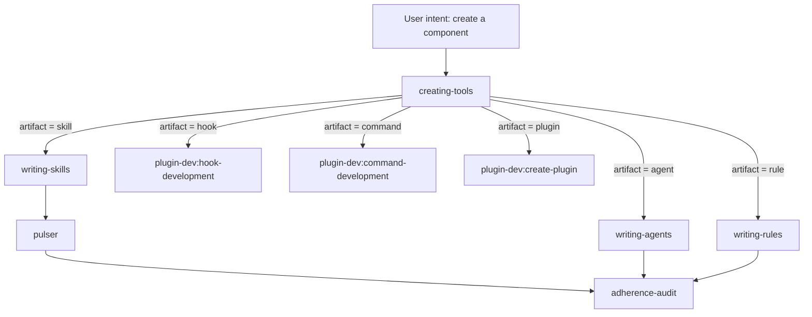

---
**Feature:** Tool Authoring
**C4 Layer:** C3 Component
**Status:** Active
**Owner:** solo
**Last updated:** 2026-06-18
**Related plans:** plans/orchestration-layer-foundation/ (Phase 1B docs)
**Related ADRs:** _(none)_
**Key files:**
  - `skills/creating-tools/skill.md` — the component-creation router
  - `skills/creating-tools/routing-table.md` — per-artifact routing details
  - `skills/writing-skills/skill.md`, `skills/writing-agents/skill.md`, `skills/writing-rules/skill.md` — the specialist authoring skills
  - `skills/pulser/skill.md`, `skills/adherence-audit/skill.md` — structural + semantic quality checks
  - `rules/plugin-lifecycle.md` — creating-tools routing + plugin conflict suppression
---

# Tool Authoring

## Context & Scope

Tool Authoring covers the creation, testing, and quality-gating of every workflow component in this repo: skills, agents, rules, hooks, commands, and plugins. "Tool" here means any artifact that shapes Claude's behavior — not application code.

The entry point for all component creation is the `creating-tools` skill. It acts as a pure router: it identifies the artifact type, applies a hard gate to resolve any ambiguity, then dispatches to the correct specialist. No artifact content is written by `creating-tools` itself.

After a component is authored by the appropriate specialist skill, two quality checks run in sequence: `pulser` for structural correctness (frontmatter validity, CSO compliance, description quality, token budget) and `adherence-audit` for semantic consistency (cross-references, invocation mismatches, convention conflicts, orphaned components).

This feature does **not** cover:

- Application code authoring (handled by `executing-plans` / `subagent-driven-development`).
- Plugin installation or vetting (handled by `vet-install`).
- Documentation authoring for Diátaxis quadrants (handled by `doc-author`).

## Building Block View

Five components participate, grouped into two layers.

**Orchestration layer (one component)**

`creating-tools` (`skills/creating-tools/skill.md`) — the sole entry point for any component-creation intent. Reads the user's request, determines artifact type via a mandatory clarification gate, and delegates to exactly one specialist per request. It produces zero content itself.

**Specialist authoring layer (three skills)**

`writing-skills` (`skills/writing-skills/skill.md`) — handles skill creation. Applies TDD adapted to process documentation: baseline pressure test (RED), write the skill (GREEN), close loopholes (REFACTOR), then Pulser structural eval. Internally delegates structural conventions to `plugin-dev:skill-development`.

`writing-agents` (`skills/writing-agents/skill.md`) — handles agent creation. Requires a bare baseline invocation (no system prompt) before any content is written. Documents actual failures verbatim, then writes the system prompt to address them. Delegates structural field conventions to `plugin-dev:agent-development`. Requires explicit `model:` selection; agents must describe their inputs and outputs, not triggering conditions.

`writing-rules` (`skills/writing-rules/skill.md`) — handles rule creation. Rules are always-on context injections, not on-demand skills. Authoring principle: short, scannable, single-concern, with decision tables over prose. No Pulser eval; testing is observational (2–3 live sessions). Supports two rule types: global (no frontmatter) and path-scoped (`paths:` frontmatter).

**Quality gate layer (two skills)**

`pulser` (`skills/pulser/skill.md`) — structural quality diagnostics. Evaluates a skill against Anthropic's 7 principles for effective skill authoring: description field format, CSO (Claude Search Optimization) compliance, token efficiency, keyword coverage, naming conventions, cross-reference hygiene, and example quality. Pulser is a floor check — a passing result means the skill is structurally correct, not that it works.

`adherence-audit` (`skills/adherence-audit/skill.md`) — semantic consistency checker. Audits all skills, agents, rules, and CLAUDE.md as a corpus. Finds: dead references, invocation mismatches (wrong tool for the component type), convention conflicts, priority conflicts (rule overrides skill silently), orphaned components, trigger gaps, and workflow gaps. Can also be scoped to a plan doc (Phase 9) to surface drift a proposed plan would introduce before execution begins.

## Runtime View

The typical flow for creating a new skill (the most common case):

1. User expresses component-creation intent. `creating-tools` fires via its broad trigger description.
2. `creating-tools` identifies the artifact type. If ambiguous, it asks exactly one clarifying question and waits for the answer. It never guesses and never routes to two destinations simultaneously.
3. `creating-tools` invokes `writing-skills` via the Skill tool.
4. `writing-skills` runs the RED phase: dispatches a subagent without the new skill loaded to document baseline failures verbatim. The Iron Law prohibits writing any skill content before this baseline is complete.
5. `writing-skills` runs the GREEN phase: writes `SKILL.md` targeting the documented failures.
6. `writing-skills` runs the REFACTOR phase: pressure scenarios via subagent close remaining loopholes.
7. `writing-skills` invokes `pulser`. Pulser checks frontmatter validity, description format, CSO compliance, token budget, and naming. Any structural finding must be resolved before the skill ships.
8. Optionally, `adherence-audit` is run across the full component corpus. It detects drift the new component introduces: dead references it would create, convention conflicts, or orphan status.

For agents, step 4 is a bare `Agent` tool dispatch (no agent definition file loaded). For rules, steps 4–6 are replaced by direct authoring (no TDD loop); testing is deferred to live observational sessions.

**Routing constraint.** When the user's intent resolves to a hook, command, or full plugin, `creating-tools` delegates directly to the corresponding `plugin-dev` sub-skill. These routes have no process wrapper — `plugin-dev` provides its own guided workflow.

## Dependencies

- `plugin-dev` plugin (Integrated state) — provides structural guidance for skills (`plugin-dev:skill-development`), agents (`plugin-dev:agent-development`), hooks, commands, and full plugins. Invoked internally by `writing-skills` and `writing-agents`; never invoked directly by the user when `plugin-dev` is in Integrated state.
- `pulser` CLI — external tool for static structural evaluation of skill files. Invoked by `writing-skills`. Requires `pulser` to be installed and accessible on `$PATH`.
- `rules/plugin-lifecycle.md` — always-on global rule that suppresses direct invocation of Integrated plugin skills. Both this rule file and `skills/creating-tools/skill.md` must be symlinked into `~/.claude/rules/` and `~/.claude/skills/` respectively for conflict suppression to be active.
- `skills/creating-tools/routing-table.md` — the per-artifact detail table consumed by `creating-tools` at decision time. Lists process skill, structure skill, eval mechanism, and notes for each artifact type.

## Decisions

_(No accepted ADRs yet.)_

## Known Issues & Gotchas

- **The coordinator constraint has no exceptions.** `creating-tools` must never write artifact content itself — not frontmatter, not a rule sentence, not a draft system prompt. The moment any content is written before delegating, the skill has been violated. The check is: "Did I invoke the delegated skill first?" If no, stop and invoke it.
- **Ambiguous compound requests ("I need a skill and a hook for it") are handled sequentially, not in parallel.** `creating-tools` processes one artifact type at a time. Two routing decisions are two sequential invocations of `creating-tools`, not a simultaneous fan-out.
- **The Iron Law applies to edits as well as new files.** Modifying an existing skill still requires a failing baseline test first. Adding a section, updating a description, or closing a loophole all require observing the failure before writing the fix.
- **Pulser is structural; `adherence-audit` is semantic.** A skill that passes Pulser may still introduce a dead reference, a convention conflict, or an invocation mismatch. Run `adherence-audit` after adding or modifying any component to catch cross-corpus drift.
- **`writing-agents` description conventions differ from `writing-skills`.** Agent `description:` fields must describe inputs and outputs, not triggering conditions. A trigger-condition description (starting with "Use when...") causes Claude to treat the agent as a skill and skip reading the system prompt. This is a common authoring mistake.
- **`plugin-lifecycle.md` requires both files to be symlinked.** Conflict suppression is soft enforcement — it depends on the rule being present in the system prompt. If `rules/plugin-lifecycle.md` is not symlinked into `~/.claude/rules/`, Integrated plugin skills can be triggered directly, bypassing `creating-tools`.
- **Observational testing for rules has no feedback loop.** Rules cannot fail a Pulser eval or a subagent pressure scenario. The only validation is running 2–3 real sessions that should trigger the rule and observing whether the constraint is followed. This means rule drift (a rule that reads as advisory despite using mandatory language) can go undetected for extended periods.
- **`adherence-audit` reports only — it never fixes.** Running the audit during a fix attempt contaminates the inventory built in Phase 1. The correct sequence is: run the audit, record findings, exit the audit, then address findings in a separate step.

## Observability

Authoring quality is observed through three signals:

- **Structural quality (`pulser`)**: Run after any skill is authored or edited. Pulser performs static lint against Anthropic's 7 skill-quality principles: description format, CSO compliance, token budget, naming conventions, keyword coverage, cross-reference hygiene, and example quality. Output is a pass/fail per principle with actionable findings. A skill that does not pass Pulser is not ready to ship.

- **Semantic consistency (`adherence-audit`)**: Run periodically and after any component is added or modified. `adherence-audit` reads the full component corpus and emits a tiered report (BLOCKING / WARNING / INFO) covering dead references, invocation mismatches, convention conflicts, priority conflicts, orphaned components, trigger gaps, and workflow gaps. When scoped to a plan doc, Phase 9 surfaces drift the plan would introduce before execution begins.

- **Component inventory** (`docs/reference/component-inventory.md`): Generated by `scripts/harvest-components.mjs` (`npm run harvest`). Provides a single-table view of all skills, agents, rules, and hooks — name, type, model (for agents), and description excerpt. The inventory is the canonical enumeration of what currently exists; `adherence-audit` uses it implicitly as its reference corpus. Do not edit by hand.

## Glossary

**Artifact / component** — Any file that shapes Claude's behavior in the workflow: a skill (`SKILL.md`), agent system prompt (`agents/<name>.md`), rule (`rules/<name>.md`), hook, or command. Distinct from application source code.

**Coordinator constraint** — The hard rule that `creating-tools` produces zero artifact content. It routes only. Any content written before the delegated skill is invoked is a violation.

**CSO (Claude Search Optimization)** — A set of conventions for making skills discoverable by future Claude instances: `description:` field limited to triggering conditions only (no workflow summary), rich keyword coverage, active-voice verb-first naming, and token-efficient bodies.

**Hard gate** — The mandatory ambiguity check in `creating-tools` before any routing decision is made. If the artifact type cannot be determined from the user's message, `creating-tools` asks exactly one clarifying question and waits. It does not guess.

**Integrated (plugin state)** — A plugin whose sub-skills are suppressed from direct invocation and must be accessed exclusively through `creating-tools`. Currently: `plugin-dev`. Contrast with Active (`skill-creator`), which may be invoked directly.

**Iron Law** — The inviolable constraint shared by `writing-skills` and `writing-agents`: no skill content before a failing baseline test; no system prompt before a bare baseline invocation. Applies to edits as well as new files.

**Pulser** — The structural quality CLI for skills. Evaluates a skill against Anthropic's 7 authoring principles. Pulser is a floor, not a ceiling: a passing result means the skill is structurally sound, not that it produces correct agent behavior.

**Pressure scenario** — A subagent dispatch designed to expose a specific failure mode: bad inputs, ambiguous instructions, scope-creep pressure, or authority-override attempts. The primary test mechanism for skills (RED phase) and agents (REFACTOR phase).

**Rule (global vs. path-scoped)** — Global rules have no frontmatter and load into every session. Path-scoped rules carry a `paths:` frontmatter block and load only when matching files are in scope. The choice determines whether a constraint fires universally or conditionally.
