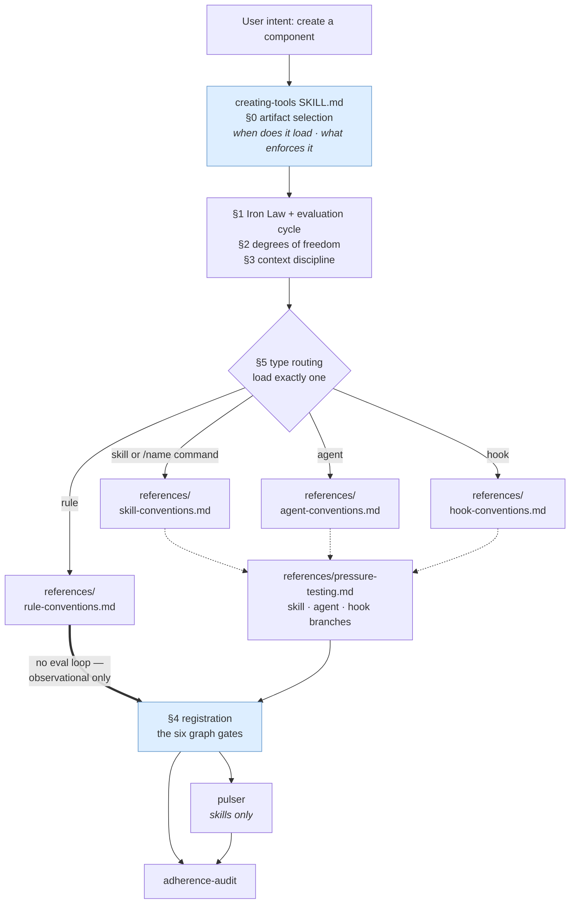
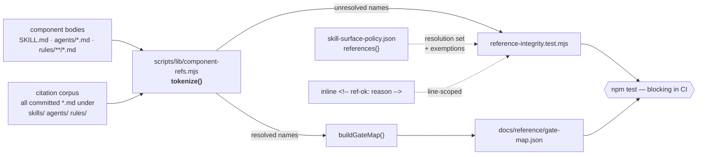
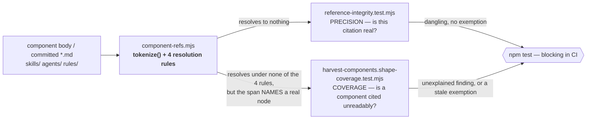
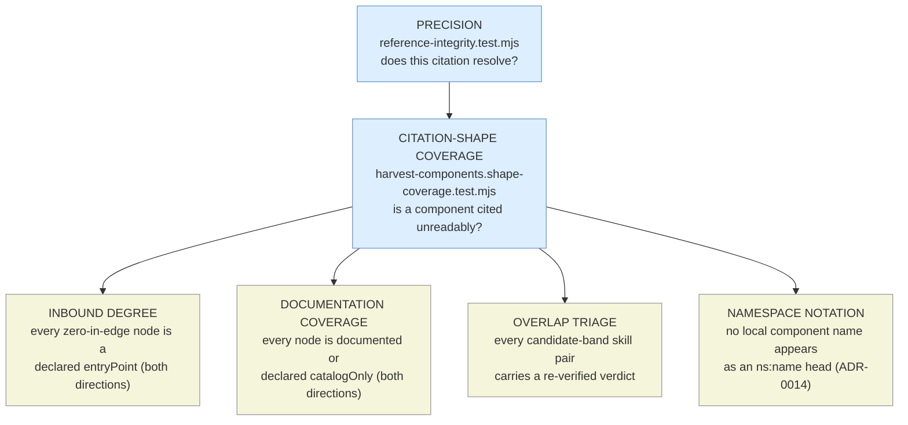

---
**Feature:** Tool Authoring
**C4 Layer:** C3 Component
**Status:** Active
**Owner:** solo
**Last updated:** 2026-08-14
**Related plans:** plans/orchestration-layer-foundation/ (Phase 1B docs); plans/component-reference-integrity/graph-integrity/ (citation-shape coverage; graph invariants); plans/authoring-layer-rewrite/ (the 2026-08-14 collapse to one skill)
**Related ADRs:** ADR-0013 (component-graph-invariants), ADR-0014 (namespace-convention)
**Key files:**
  - `skills/creating-tools/SKILL.md` — the authoring spine: artifact selection, the evaluation cycle, degrees of freedom, context discipline, the six registration gates, type routing
  - `skills/creating-tools/references/skill-conventions.md`, `agent-conventions.md`, `rule-conventions.md`, `hook-conventions.md` — per-type authoring mechanics, one file each
  - `skills/creating-tools/references/pressure-testing.md` — the shared RED-GREEN-REFACTOR technique, with skill / agent / hook branches
  - `skills/pulser/SKILL.md`, `skills/adherence-audit/SKILL.md` — structural + semantic quality checks
  - `scripts/creating-tools-self-containment.test.mjs` — the gate that keeps the directory copy-able
---

# Tool Authoring

## Context & Scope

Tool Authoring covers the creation, testing, and quality-gating of every workflow component in this repo: skills, agents, rules, hooks, commands, and plugins. "Tool" here means any artifact that shapes Claude's behavior — not application code.

The entry point for all component creation is the `creating-tools` skill, and since 2026-08-14 it is also the *only* one: it authors in place rather than dispatching. Its `SKILL.md` is a spine carrying what is true of every artifact type — how to pick the type, the evaluation-first cycle, how specific to make the instructions, what the always-on cost of a line is, and the six graph gates a new component has to satisfy. What differs by type lives in `references/`, one file each, loaded on demand.

The shape before this was a router plus three named specialists (`writing-skills`, `writing-agents`, `writing-rules`). It was collapsed for three measured reasons: the artifact-selection criteria lived *inside* `writing-rules`, so an author only met them after already deciding it was a rule; hooks had no authoring guidance at all despite being the enforcement mechanism this repo increasingly reaches for; and the router's own descriptions were the largest single cluster in the skill-overlap candidate band. One skill removes the routing decision rather than documenting it better.

After a component is authored, two quality checks run in sequence: `pulser` for structural correctness (frontmatter validity, CSO compliance, description quality, token budget) and `adherence-audit` for semantic consistency (cross-references, invocation mismatches, convention conflicts, orphaned components).

This feature does **not** cover:

- Application code authoring (handled by `executing-plans` / `subagent-driven-development`).
- Plugin installation or vetting (handled by `vet-install`).
- Documentation authoring for Diátaxis quadrants (handled by `doc-author`).

## Building Block View

Three components participate, plus five reference files owned by the first of them.

**Authoring layer (one skill, six files)**

`creating-tools` (`skills/creating-tools/SKILL.md`) — the sole entry point for any component-creation intent, and the only component the graph sees. Under 500 lines by constraint, because a skill whose own body violates the progressive-disclosure section it teaches is self-refuting — which is precisely how the previous version failed. Six sections:

- **§0 Artifact selection.** A four-row table keyed on the two things that actually distinguish the types: *when it loads* and *what enforces it*. Subject matter is not a signal. The hook row is the one this repo has direct evidence for — a 37% front-door bypass rate and 28 accumulated dead references were both correctly-written prose failing to hold.
- **§1 The Iron Law and the evaluation cycle.** No component without an observed failure first; baseline, three targeted pressure scenarios, minimal instructions, re-run. Claude A (the author) and Claude B (a cold instance) must be different, or the run is not evidence.
- **§2 Degrees of freedom.** High / medium / low, chosen by how fragile the task is rather than by house style. Absent from the previous version entirely.
- **§3 Context discipline.** Every line is a recurring cost, paid on every load. State what to do rather than why; write standing instructions rather than narrative; push anything consulted-not-followed one level down.
- **§4 Registration.** The six graph gates in the order that satisfies them, carrying **no paths** — the gates' own failure messages name their exact remediation, so a path written here could go stale and one read out of a failing assertion cannot.
- **§5 Type routing.** One line each into the five reference files.

The five reference files (`skills/creating-tools/references/`) carry what the spine deliberately does not. `skill-conventions.md` — frontmatter, size discipline, progressive disclosure, description and discoverability, the six-field packaging spec (a command is a skill with `disable-model-invocation: true`, not a separate type). `agent-conventions.md` — frontmatter plus the platform behaviors frontmatter alone does not predict: the two independent tool filters, what a subagent does *not* inherit, and a `permissionMode` the parent can silently override. `rule-conventions.md` — the always-on cost model, global vs. path-scoped, and why rule testing is observational with no eval loop. `hook-conventions.md` — the only non-Markdown artifact type, and new capability: event taxonomy, the stdin/exit-code contract, the house pattern, Windows specifics, testing, and `.claude/settings.json` wiring. `pressure-testing.md` — the shared RED-GREEN-REFACTOR mechanism with three branches, the hooks branch being a genuine unit test rather than a prose baseline.

A dedicated gate, `scripts/creating-tools-self-containment.test.mjs`, asserts that every path the directory reads resolves inside itself, so the skill survives being copied out of this repo. Outside paths are allowed only as declared *output* targets (where a new component gets written, plus the two concrete registration files an author edits), each carrying a written reason.

**Quality gate layer (two skills)**

`pulser` (`skills/pulser/SKILL.md`) — structural quality diagnostics. Evaluates a skill against Anthropic's 7 principles for effective skill authoring: description field format, CSO (Claude Search Optimization) compliance, token efficiency, keyword coverage, naming conventions, cross-reference hygiene, and example quality. Pulser is a floor check — a passing result means the skill is structurally correct, not that it works.

`adherence-audit` (`skills/adherence-audit/SKILL.md`) — semantic consistency checker. Audits all skills, agents, rules, and CLAUDE.md as a corpus. Finds: dead references, invocation mismatches (wrong tool for the component type), convention conflicts, priority conflicts (rule overrides skill silently), orphaned components, trigger gaps, and workflow gaps. Can also be scoped to a plan doc (Phase 9) to surface drift a proposed plan would introduce before execution begins.

```mermaid
graph TD
    U[User intent: create a component] --> S0["creating-tools SKILL.md<br/>§0 artifact selection<br/><i>when does it load · what enforces it</i>"]
    S0 --> S1["§1 Iron Law + evaluation cycle<br/>§2 degrees of freedom<br/>§3 context discipline"]
    S1 --> S5{"§5 type routing<br/>load exactly one"}
    S5 -->|skill or /name command| RS["references/<br/>skill-conventions.md"]
    S5 -->|agent| RA["references/<br/>agent-conventions.md"]
    S5 -->|rule| RR["references/<br/>rule-conventions.md"]
    S5 -->|hook| RH["references/<br/>hook-conventions.md"]
    RS -.-> PT["references/pressure-testing.md<br/>skill · agent · hook branches"]
    RA -.-> PT
    RH -.-> PT
    RR ==>|no eval loop —<br/>observational only| S4
    PT --> S4["§4 registration<br/>the six graph gates"]
    S4 --> PL[pulser<br/><i>skills only</i>]
    S4 --> AA[adherence-audit]
    PL --> AA

    style S0 fill:#ddeeff,stroke:#6699cc
    style S4 fill:#ddeeff,stroke:#6699cc
```

Everything above the §5 diamond is shared. Everything below it is the part that genuinely differs by artifact type — which is the whole argument for one skill instead of four: the previous shape put the selection criteria *downstream* of the routing decision they were supposed to inform.

## Runtime View

The typical flow for creating a new skill (the most common case):

1. User expresses component-creation intent. `creating-tools` fires via its broad trigger description, which now has to cover skill, agent, rule *and* hook intent from one string.
2. §0 fixes the artifact type on when it loads and what enforces it. If that genuinely cannot be determined, the skill asks one question rather than guessing — a wrong type costs a full rewrite and the question costs a turn.
3. §1's RED phase: dispatch a cold instance without the new skill loaded and record baseline failures verbatim. The Iron Law prohibits writing any content before this is done, and it binds edits as well as new files.
4. §1's GREEN phase: write the minimum guidance addressing the documented failures — not generic hardening for cases nobody observed, which is untested by construction and pure recurring cost.
5. §1's REFACTOR phase: three pressure scenarios aimed at the observed gaps, each new rationalization closed and re-verified. Technique in `references/pressure-testing.md`.
6. §4's registration walk: stage first (every gate enumerates through the git index, so an unstaged file is invisible rather than exempt), then give the component an inbound edge *or* declare it an entry point with a reason, then document it in the explanation layer, then regenerate the derived artifacts.
7. `pulser` checks frontmatter validity, description format, CSO compliance, token budget, and naming. Any structural finding is resolved before the skill ships.
8. Optionally, `adherence-audit` runs across the full component corpus, detecting drift the new component introduces: dead references, convention conflicts, orphan status.

For agents, step 3 is a bare `Agent` tool dispatch with no definition file loaded. For rules, steps 3–5 collapse into direct authoring against the always-on cost model; validation is observational — 2–3 live sessions that should trigger the rule — because there is no eval loop for a rule and inventing one is a documented mistake.

**Hooks take a different path at step 6, and the checklist branches for them explicitly.** A hook has no outbound edges and nothing dispatches it, so zero inbound edges is its correct steady state and it takes the entry-point-declaration branch rather than the citation branch. It also carries a registration step no other type has: it must be wired into `.claude/settings.json` against its triggering event, or it is a file that never runs.

**Two things deliberately have no route.** A command is not a separate artifact — the platform merged custom commands into skills, so it is authored as a skill carrying `disable-model-invocation: true`. Full-plugin authoring has no route at all, because this repo consumes plugins rather than authoring them.

## Reference Integrity

Component names are cited by name in prose throughout the corpus. Until a citation can be *resolved*, one that points at something real is indistinguishable from one that points at nothing — which is how 28 dead references accumulated while `adherence-audit` nominally checked for them at severity `error` the whole time. Authoring quality therefore splits into two layers, the same split `rules/install-vetting.md` draws for its Gate 3: a **deterministic** layer that blocks, and a **semantic** layer that advises.

**One definition of a citation, two consumers.** `scripts/lib/component-refs.mjs` is the single place this repo decides what counts as a citation. It is pure — strings and name sets in, tokens out — with corpus discovery, policy loading, and exemption logic left to its callers. That boundary is what lets one tokenizer serve two consumers reading two different corpora:

- `buildGateMap()` (`scripts/harvest-components.mjs`) tokenizes **component bodies** and turns the names that resolve into `docs/reference/gate-map.json` edges.
- `scripts/reference-integrity.test.mjs` tokenizes **every committed `*.md` under `skills/`, `agents/`, and `rules/`** and turns the names that resolve to nothing into a `npm test` failure.

Same scan, both answers. The older search-for-each-known-name approach could only ever answer the first question: a cited name absent from the inventory is never searched for, so it cannot be seen.

```mermaid
flowchart LR
  BODIES["component bodies<br/>SKILL.md · agents/*.md · rules/**/*.md"] --> TOK
  CORPUS["citation corpus<br/>all committed *.md under<br/>skills/ agents/ rules/"] --> TOK

  TOK["scripts/lib/component-refs.mjs<br/><b>tokenize()</b>"]

  TOK -->|"resolved names"| EDGES["buildGateMap()"]
  TOK -->|"unresolved names"| GATE["reference-integrity.test.mjs"]

  POLICY["skill-surface-policy.json<br/>references{}"] -.->|"resolution set<br/>+ exemptions"| GATE
  MARK["inline &lt;!-- ref-ok: reason --&gt;"] -.->|"line-scoped"| GATE

  EDGES --> ART["docs/reference/gate-map.json"]
  GATE --> CI{{"npm test — blocking in CI"}}
  ART --> CI
```

**Resolution is against committed state, never the working tree.** Both the gate and the invariant source their candidates from `git ls-files`. CI runners are stock images with no `~/.claude` and no gitignored scratch files, so anything resolved by probing the local filesystem is invisible to the CI that is supposed to enforce it — and a check that resolves differently from the job running it is worse than no check. The practical consequence for authors: a **machine-local skill must be declared** in `docs/reference/skill-surface-policy.json` → `references.localOnlySkills` to be citable at all. This is the same principle as `plugins.expected` — without a committed declaration there is nothing to diff and nothing to fail.

**A `ns:name` pair is a citation only when `ns` is declared.** `references.knownNamespaces`, the local skill set, `plugins.expected`, and `plugins.removed` together form a positive declaration of what a component namespace is. The inverse rule — "`ns` is not a known skill or plugin, therefore dead" — is not provable: measured over this corpus it reports 48 findings of which 17 are real, flagging `file:line`, `node:test`, `type:feat`, and CSS declarations as dead references. A positive list is diffable and cannot silently widen; the negative rule widens with every new colon anyone writes.

**Three exemption categories, deliberately not one.** Collapsing them would trade precision for a blanket:

| Category | Mechanism | Scope | Why |
|---|---|---|---|
| Historical ledger | `references.historicalLedgers` in policy | File | `plugins/registry.md` exists to name removed plugins, so its citations *must* stay dead. |
| Provenance | inline `<!-- ref-ok: reason -->` | Line (its own, or the next) | A doc that opens by recording what it was derived from cites the source by name. Blanket-exempting the whole file would stop checking a document that should be fully checked, so the exemption is line-scoped. **No live users as of 2026-08-14** — the two that had them (`hooks-reference.md`, `frontmatter-reference.md`) were deleted by the authoring-layer collapse and their content re-authored. The mechanism is retained: it is line-scoped and self-documenting, and deleting a working exemption tier because its last user went away would only mean re-inventing it under pressure. |
| Negative example | none — the citation is **fixed** | — | A ✅-Good example teaching a dead prefix keeps minting new dead references while the gate stays green. Exempting it would preserve the defect it teaches. |

Every policy exemption is keyed by the exempted thing and valued by the **reason** it is exempt, and a missing or empty reason fails `scripts/skill-surface.test.mjs`. That requirement is the entire mechanism preventing the exemption block from becoming the new place dead references hide.

**No silent drops.** A registry that can lose entries makes every check built on it unfalsifiable: if a skill loses its `SKILL.md` in a bad merge it vanishes from the inventory, and the gate then emits dozens of confident, precise, entirely wrong "dead reference" findings while the actual fault — one missing file — appears nowhere. `committedCandidateCounts()` asserts that every committed candidate produces a node. Its per-root filters **must mirror each scanner's own rules** rather than counting files globally: `.claude/hooks` holds 18 `.mjs` files but yields 10 hook nodes, because `scanHooks()` skips `*.test.mjs` on purpose. A global "files on disk == nodes" check fires 8 false positives there and teaches everyone to ignore it.

**The decidability boundary is permanent.** The deterministic layer checks namespaced references (`ns:name`) and *quoted* invocation slots — shapes whose intent is unambiguous. A bare backticked name in prose stays with the semantic layer forever: `` `code-reviewer` `` may be a citation, a role, a filename, or an English phrase, and no amount of rule-tightening decides that correctly. Unquoted `subagent_type:` in narrative prose is likewise not a dispatch. This is a deliberate precision-over-recall trade — the gate is only useful while every finding it emits is real.

**Precision and citation-shape coverage are two halves of one contract.** Everything above answers one question: *does this citation resolve to something real?* That question has a blind spot in exactly the opposite direction — a citation written in a shape the tokenizer cannot read emits no token at all, so it is never dangling, fails nothing, and the edge it should have produced simply does not exist. Precision alone is structurally incapable of noticing that a component went uncited because nobody could write a shape the resolver understood. `scripts/harvest-components.shape-coverage.test.mjs` asks the mirror question — *is a component cited in a shape we cannot see?* — by CONTAINMENT rather than resolution: a `backtick` span that resolves under none of the four rules below is split on `[./:#\s]`, and any segment (or contiguous slash-joined run of segments) that names a real node makes the span a candidate. Containment is deliberately weaker than resolution — it can be wrong about intent, since a span can name a component without citing it — and that weakness is the feature: it is the only way to see a shape nobody has written a resolution rule for yet. The two gates are not restatements of each other; each is blind to precisely what the other one sees, and together they are the completeness contract this repo makes about its own citation graph.

**The four declared resolution shapes**, applied in this fixed precedence order by `resolvedNames()` (`scripts/lib/component-refs.mjs`) — first non-null wins:

| Rule | Shape | Example |
|---|---|---|
| `backtickEdgeName` | exact backtick span | `` `writing-plans` `` |
| `pathEdgeName` | path form | `` `skills/writing-plans/SKILL.md` ``, `` `rules/doc-tools.md` `` |
| `colonEdgeName` | colon dispatch | `` `<name>:<mode>` `` — notation retired by [ADR-0014](../adr/0014-namespace-convention.md); the rule is kept as a guard |
| `suffixedEdgeName` | trailing separator | `` `integration-test-constraints.md` `` |

A span resolving under any of the four becomes a real `gate-map.json` edge, which is exactly what makes it invisible to the shape-coverage gate — coverage only ever examines spans none of the four already explained. What survives that filter is either a genuinely new citation shape (add a fifth rule) or a span that names a component without citing it (add a declared exemption to `SHAPE_COVERAGE_EXEMPTIONS`, with a reviewable reason, checked for staleness in both directions the same way the policy exemptions above are).

```mermaid
flowchart LR
  BODY["component body / committed *.md<br/>skills/ agents/ rules/"] --> TOK["component-refs.mjs<br/><b>tokenize() + 4 resolution rules</b>"]
  TOK -->|"resolves to nothing"| PREC["reference-integrity.test.mjs<br/>PRECISION — is this citation real?"]
  TOK -->|"resolves under none of the 4 rules,<br/>but the span NAMES a real node"| SHAPE["harvest-components.shape-coverage.test.mjs<br/>COVERAGE — is a component cited unreadably?"]
  PREC -->|"dangling, no exemption"| CI{{"npm test — blocking in CI"}}
  SHAPE -->|"unexplained finding, or a stale exemption"| CI
```

**Every claim about the corpus is generated or gated, never hand-authored.** Node and edge counts, the expected-diff set (`EXPECTED_NEW_EDGES` in `scripts/harvest-components.test.mjs`), and the exemption lists on both gates are code that runs against the live corpus on every `npm test`, not prose typed once and left to drift. `npm run harvest:check` byte-diffs `gate-map.json` against the committed artifact; the shape-coverage gate fails on a stale exemption exactly as loudly as it fails on an unexplained finding, and a duplicate exemption entry (same `from`/`to`, different reason) is caught by an assertion comparing the exemption array's length against its derived key-set size, so a silently-collapsed duplicate cannot hide as dead weight. If this document ever states a corpus count (a node total, an edge total), treat it as a snapshot of what the generator produced at write time, not a maintained fact — trust the check that regenerates it, not the prose that once reported it, if the two disagree.

## Graph Invariants

Precision and citation-shape coverage, above, each answer a question about one edge at a time: does this citation resolve, and is every component citable in a shape the tokenizer can read. Three further checks — two in `scripts/graph-integrity.test.mjs`, one in `scripts/graph-integrity.overlap.test.mjs` — ask about properties that only exist across the *whole* graph: is every unreached node an entry point on purpose, is every component actually documented, and is every lexically-similar skill pair either disambiguated or flagged for triage. All three follow the shape the `references` exemption block above already established: a declared list in `docs/reference/skill-surface-policy.json`, keyed by the exempted thing and valued by a reason, checked in **both directions** so a stale declaration fails exactly as loudly as a missing one.

**Inbound degree** (`scripts/graph-integrity.test.mjs`). A node with no inbound edge is either a defect — something should cite it and doesn't — or an entry point by design: a hook the harness dispatches, a skill the user types directly. The graph cannot tell those apart on its own, so `skill-surface-policy.json` → `entryPoints` declares the second set, grouped by invocation source (`harnessInvoked`, `userInvoked`). Re-measured 2026-08-14: 17 nodes with zero inbound edges, 17 declared across **three** groups — 7 harness-dispatched hooks, 7 user-invoked skills, and 3 always-on rules. The third group, `alwaysOnRules`, was added when the authoring-layer collapse retired the skill that had been citing three always-on rules as worked examples, removing the sole inbound edge of each. (They are enumerated with individual reasons in the policy file, not here — one of the three is also the sole `catalogOnly` entry described below, and naming it in this prose would silently invalidate that exemption. That is not a hypothetical: this paragraph named all three on its first draft and the coverage gate failed on exactly that.) Nothing dispatches a rule, so zero inbound edges is a rule's correct steady state rather than a missing citation; manufacturing a citation from the surviving authoring skill purely to quiet the gate was considered and declined, since aux files under `references/` produce no edge anyway and a citation written to keep a gate quiet is the prose-level enforcement this repo is moving away from. The forward direction alone would let the declaration rot into a hiding place: wire up a citation to a declared entry point and the exemption would silently outlive the fact it described. The reverse direction — every declared name must *still* have zero inbound edges, and must still name a real node — is what keeps `entryPoints` a live declaration rather than an append-only graveyard.

This is **local in-degree, not transitive reachability**, and the two are not the same property. A cluster of components citing only each other, with no path in from any real entry point, has in-degree ≥ 1 throughout and would pass silently — reciprocal citation is common in this corpus: 33 two-cycle pairs exist in the live edge set (re-measured 2026-08-14), one of them `install-vetting` ↔ `vet-security`. A true traversal is the stronger invariant, and its absence is a **known, deliberate deferral**, not an oversight: a BFS seeded from (declared entry points ∪ zero-in-degree nodes) reaches all 76 of 76 nodes today (re-run 2026-08-14, after the collapse), so no island exists yet — but only one two-cycle pair needs to lose its last inbound edge from outside to open one. It stays deferred because `entryPoints` is keyed to in-degree semantics — its entries *are* the zero-in-degree set — and the staleness half of the check above is inherently an in-degree property too; upgrading only the forward direction to "reachable from an entry point" would leave the two halves of one policy block asserting different things about what an entry point means. Redefining a declared entry point from "nothing cites it" to "root of a reachable region" is a plan change, not a review fix.

**Documentation coverage** (`scripts/graph-integrity.test.mjs`) implements the already-Accepted [ADR-0003](../adr/0003-generated-inventory-completeness-oracle.md), previously a point-in-time narrative audit (`docs/_coverage-audit.md`, written at 76 components); this makes the same check re-runnable and blocking. Every node must be named (word-boundary matched) in at least one committed `docs/explanation/**/*.md` file, or declared `catalogOnly` with a reason. Re-measured 2026-08-14: 75 of 76 nodes documented; the sole `catalogOnly` entry is a self-contained spellcheck-hygiene rule with no subsystem narrative to belong to — named in `skill-surface-policy.json` rather than here, since spelling it out in this prose would itself satisfy the coverage matcher and silently invalidate its own exemption. Checked bidirectionally, same as `entryPoints`: a `catalogOnly` entry naming a node that has since gained a documentation mention is stale and fails, exactly like one naming a node no longer in the graph.

`entryPoints` and `catalogOnly` answer two different questions about the same node and are not interchangeable: `entryPoints` says *nothing cites this in the graph, by design*; `catalogOnly` says *no `docs/explanation/` doc describes this, by design*. A component can legitimately sit in one, both, or neither.

**Overlap triage** (`scripts/graph-integrity.overlap.test.mjs`) is **declare-and-resolve, not detect-and-flag**. Every skill pair whose deduped, stop-worded description tokens exceed a declared Jaccard threshold (0.125) forms a *candidate band* — band membership is not itself a defect, it means two descriptions are lexically similar enough that a reader could plausibly confuse them. What fails is a band member carrying no recorded verdict in `skill-surface-policy.json` → `overlapVerdicts`. Re-measured 2026-08-14: 11 pairs in the band, all 11 carrying a recorded verdict — 10 `boundary` (one description names the other skill, or both name a common router; the gate **re-verifies this against the description text**, so the text is the proof and there is no separate evidence field to trust) and 1 `distinct`. The band shrank by exactly the three `writing-*` pairs, which is the clearest single measurement of what the collapse bought: those three were the largest resolved cluster in the band, and they are now gone rather than disambiguated (lexical coincidence, resolved by no textual clause). A verdict for a pair that has since fallen out of the band is stale and fails, the same staleness discipline as the two invariants above.

**Why detect-and-flag by similarity threshold does not work here — the principle, not just the outcome.** *Overlapping outputs are legitimate; overlapping triggers are not, because the trigger is where routing happens.* Two skills can produce similar-shaped artifacts without being confusable — what matters for the graph to gate is whether a reader would pick the wrong one **before either skill runs**, not whether their outputs later resemble each other. A pair earns a `boundary` verdict precisely *because* someone already noticed it was confusable and wrote a clause naming the sibling — and that clause adds shared vocabulary, raising the pair's similarity score in the same stroke that resolves it. Similarity therefore anti-correlates with "still needs disambiguation": the already-fixed pairs rank as the *most* similar, not the least, so no similarity threshold can separate a genuinely-confusable pair from an already-resolved one. See [ADR-0013](../adr/0013-component-graph-invariants.md) for the measured falsification. This is why the graph gates *routing ambiguity* — the trigger-selection moment — and never *output overlap*: gating on output similarity would flag correct designs, and a detector built on description similarity would flag the wrong pairs first.

**Namespace notation** (`scripts/reference-integrity.test.mjs`) enforces [ADR-0014](../adr/0014-namespace-convention.md): a local component name may never be the head of an `ns:name` token. `:` addresses the namespace axis and nothing else, so a component name in the head position is either a mode written as a namespace or a real foreign-namespace collision — both defects. Unlike the four checks above, its corpus is **repo-wide minus `plans/`**, not `CORPUS_ROOTS`: it asks a strictly narrower question (one membership test on the head, no resolution attempt), and 29 of the 70 sites the ADR retired lived in `docs/`, which `CORPUS_ROOTS` does not read at all. Measured 2026-08-11: 70 occurrences before the migration, 0 after; the only remaining component-headed tokens repo-wide are 2 in a committed leftover plan doc that records a past state. `colonEdgeName` (`scripts/lib/component-refs.mjs`) is deliberately **kept** even though nothing now feeds it — the check makes its input set *provably* empty, and the guard is what makes that emptiness *enforceable* if the check is ever relaxed. They are complements; do not remove one because the other exists.

```mermaid
flowchart TB
    A["PRECISION<br/>reference-integrity.test.mjs<br/>does this citation resolve?"] --> B["CITATION-SHAPE COVERAGE<br/>harvest-components.shape-coverage.test.mjs<br/>is a component cited unreadably?"]
    B --> C["INBOUND DEGREE<br/>every zero-in-edge node is a<br/>declared entryPoint (both directions)"]
    B --> D["DOCUMENTATION COVERAGE<br/>every node is documented or<br/>declared catalogOnly (both directions)"]
    B --> E["OVERLAP TRIAGE<br/>every candidate-band skill pair<br/>carries a re-verified verdict"]
    B --> F["NAMESPACE NOTATION<br/>no local component name appears<br/>as an ns:name head (ADR-0014)"]

    style A fill:#ddeeff,stroke:#6699cc
    style B fill:#ddeeff,stroke:#6699cc
    style C fill:#f5f5dc,stroke:#999
    style D fill:#f5f5dc,stroke:#999
    style E fill:#f5f5dc,stroke:#999
    style F fill:#f5f5dc,stroke:#999
```

Edge-local checks (top) establish that the graph's edges are trustworthy one at a time. Graph invariants (bottom) ask properties that only exist once the whole graph is in view — and each depends on the edge set being precise and complete first, which is why they were built second.

## Dependencies

- `scripts/lib/component-refs.mjs` — the citation tokenizer. Pure, stdlib-only, shared by `buildGateMap()` and the reference-integrity gate. Changing what counts as a citation means changing this file, and the equivalence test in `scripts/harvest-components.test.mjs` will report any edge the change moves.
- `scripts/graph-integrity.test.mjs` — the inbound-degree and documentation-coverage invariants. Reads the live graph via `buildGateMap()` and `docs/reference/skill-surface-policy.json` → `entryPoints` / `catalogOnly`.
- `scripts/graph-integrity.overlap.test.mjs` — the skill-overlap triage gate. Reads only skill descriptions (no edges) and `skill-surface-policy.json` → `overlapVerdicts`; split into its own file because the band computation shares no data with the two invariants above.
- `scripts/harvest-components.shape-coverage.test.mjs` — the citation-shape coverage gate, the recall counterpart to `scripts/reference-integrity.test.mjs`. Declares its exemptions in `SHAPE_COVERAGE_EXEMPTIONS`, guarded against a silently-duplicated `from`/`to` pair by an array-length-vs-derived-Set-size assertion.
- `docs/reference/skill-surface-policy.json` → `references` — the declared resolution set and exemptions the gate reads. Adding a machine-local skill or a known namespace is an edit here, with a reason string, in the same commit.
- `skills/creating-tools/references/*.md` — the five per-type authoring references the spine routes into. Owned locally rather than delegated: the plugin that once held frontmatter guidance was uninstalled 2026-08-06, and a cached plugin snapshot goes stale silently.
- `scripts/creating-tools-self-containment.test.mjs` — asserts every path the skill directory reads resolves inside itself, so the directory survives being copied out of this repo. Outside paths are permitted only as declared output/registration targets, each with a written reason.
- `pulser` CLI — external tool for static structural evaluation of skill files. Run after any skill is authored or edited. Requires `pulser` to be installed and accessible on `$PATH`.
- `docs/reference/authoring-layer-v1-archive.md` — the consolidated pre-collapse content of the three retired skills and their companions. The durable historical record; never read by the skill.

## Decisions

- [ADR-0013](../adr/0013-component-graph-invariants.md) — Component-graph invariants: declare-and-resolve over the citation graph, not detect-and-flag (Accepted)
- [ADR-0014](../adr/0014-namespace-convention.md) — Namespace notation: `:` addresses namespaces, and a mode is an argument (Accepted)

## Known Issues & Gotchas

- **The coordinator constraint is gone, and that is the point.** Until 2026-08-14 the hard rule was that `creating-tools` produced zero artifact content — it routed only, and writing so much as a frontmatter line before delegating was a violation. The collapse deleted the routing step, so there is nothing left to violate: the skill now authors in place. Do not reintroduce a "delegate first" check; there is no destination.
- **Compound requests are still handled one artifact at a time.** "I need a skill and a hook for it" is two components, each with its own baseline, its own reference file, and its own trip through the registration checklist — the hook branch in particular differs at §4. Sequentially, not as a fan-out. This survives the collapse because it was never about routing.
- **The trigger now has to carry four intents from one description.** One string must fire for skill, agent, rule *and* hook authoring, where four strings used to share the load. This is the single largest open risk of the collapse and it is being monitored rather than assumed away — a per-intent rollback is available if any one of the four stops firing reliably.
- **The Iron Law applies to edits as well as new files.** Modifying an existing skill still requires a failing baseline test first. Adding a section, updating a description, or closing a loophole all require observing the failure before writing the fix.
- **Pulser is structural; `adherence-audit` is semantic.** A skill that passes Pulser may still introduce a dead reference, a convention conflict, or an invocation mismatch. Run `adherence-audit` after adding or modifying any component to catch cross-corpus drift.
- **Agent and skill frontmatter differ in ways that fail silently.** Agents restrict tools with `tools:` and deny with `disallowedTools:` (camelCase); skills grant with `allowed-tools:` and restrict with `disallowed-tools:` (kebab-case). A key written for the wrong surface is dropped without an error, so the declaration reads as correct and does nothing — this is how an agent ships unrestricted. Diff declared frontmatter against what the runtime renders. Both surfaces want the same description shape: what the component is for, plus when to use it — never its internal steps.
- **Own the reference rather than suppressing the plugin that holds it.** Structural guidance for every artifact type now lives in this repo. The prior arrangement paid twice — a plugin's always-on skill listing, plus an always-on rule (`rules/plugin-lifecycle.md`) listing its skills as not-to-invoke — and the suppression was soft, so it drifted: the registry and the rule stated opposite lifecycle states for the same plugin for weeks. Both the plugin and the rule were removed 2026-08-06. A cached plugin snapshot also goes stale silently: the hook skill still asserted a settings.json format that has not worked for some time. See `plugins/registry.md` § plugin-dev.
- **Observational testing for rules has no feedback loop.** Rules cannot fail a Pulser eval or a subagent pressure scenario. The only validation is running 2–3 real sessions that should trigger the rule and observing whether the constraint is followed. This means rule drift (a rule that reads as advisory despite using mandatory language) can go undetected for extended periods.
- **`adherence-audit` reports only — it never fixes.** Running the audit during a fix attempt contaminates the inventory built in Phase 1. The correct sequence is: run the audit, record findings, exit the audit, then address findings in a separate step.
- **Editing a component body can legitimately move `gate-map.json`.** Adding or removing a backtick-quoted component name changes the edge set, and `npm run harvest:check` byte-diffs the artifact. Run `npm run harvest` and commit the regenerated `docs/reference/` files in the *same* commit, or CI fails on drift. This is expected behavior, not a fault — resolving a dead citation can add a real edge that the dead reference had been suppressing.
- **Never resolve a dead reference by creating the thing it points at.** Three review lenses dispatched agent types that did not exist. The fix was to dispatch `general-purpose` and carry the role in the `[role: ...]` prompt marker — not to add `agents/code-reviewer.md`, which would have made the citation resolve by contradicting the multi-lens design it belongs to. Making a broken pointer valid is not the same as making it correct.
- **A citation to a machine-local skill needs a declaration.** Anything resolved by probing `~/.claude` is invisible to CI. If a component legitimately cites a skill that does not live in this repo, add it to `references.localOnlySkills` with a reason in the same commit, or the gate will report it as dead — correctly, from CI's point of view.

## Observability

Authoring quality is observed through five signals:

- **Reference integrity (`scripts/reference-integrity.test.mjs`)**: Runs under `npm test`, blocking in CI. Fails when any citation in a committed `*.md` under `skills/`, `agents/`, or `rules/` resolves to nothing, reporting each as `file:line  ref` with the reason. This is the deterministic floor beneath `adherence-audit`'s Dead References lens — same class of finding, different force. An audit finding is advisory by construction, which is how dead references survived while a skill nominally checking for them existed the whole time; a `npm test` failure is a blocking fact.

- **Citation-shape coverage (`scripts/harvest-components.shape-coverage.test.mjs`)**: Runs under `npm test`, blocking in CI. Fails when a component is cited in a shape none of the four resolution rules can read and no declared exemption explains it, or when a declared exemption's finding no longer occurs (stale). This is the recall counterpart to reference integrity above — together the two gates report on the citation graph's completeness from both directions, precision and coverage, as one contract.

- **Structural quality (`pulser`)**: Run after any skill is authored or edited. Pulser performs static lint against Anthropic's 7 skill-quality principles: description format, CSO compliance, token budget, naming conventions, keyword coverage, cross-reference hygiene, and example quality. Output is a pass/fail per principle with actionable findings. A skill that does not pass Pulser is not ready to ship.

- **Semantic consistency (`adherence-audit`)**: Run periodically and after any component is added or modified. `adherence-audit` reads the full component corpus and emits a tiered report (BLOCKING / WARNING / INFO) covering dead references, invocation mismatches, convention conflicts, priority conflicts, orphaned components, trigger gaps, and workflow gaps. When scoped to a plan doc, Phase 9 surfaces drift the plan would introduce before execution begins.

- **Component inventory** (`docs/reference/component-inventory.md`): Generated by `scripts/harvest-components.mjs` (`npm run harvest`). Provides a single-table view of all skills, agents, rules, and hooks — name, type, model (for agents), and description excerpt. The inventory is the canonical enumeration of what currently exists; `adherence-audit` uses it implicitly as its reference corpus. Do not edit by hand.

## Glossary

**Artifact / component** — Any file that shapes Claude's behavior in the workflow: a skill (`SKILL.md`), agent system prompt (`agents/<name>.md`), rule (`rules/<name>.md`), hook, or command. Distinct from application source code.

**Citation** — A reference to a component by name in prose or in a dispatch. What counts as one is defined in exactly one place, `scripts/lib/component-refs.mjs`: a namespaced `ns:name` pair whose `ns` is declared, or a *quoted* `skill:` / `subagent_type:` invocation slot. A bare backticked name is not a citation for gate purposes — see **Decidability boundary**.

**Coordinator constraint** — *Retired 2026-08-14.* The former hard rule that `creating-tools` produced zero artifact content and routed only. It existed because authoring lived in three downstream skills; with those retired there is no delegation step and the constraint has no referent. Kept in the glossary so a reader meeting the phrase in an older document knows it is historical.

**Decidability boundary** — The permanent line between the deterministic and semantic layers. Shapes whose intent is unambiguous (declared namespaces, quoted dispatch slots) are checked by a blocking test; shapes that are not (a bare backticked name, which may be a citation, a role, a filename, or ordinary English) stay with `adherence-audit` forever. Widening the deterministic layer past this line trades real findings for false positives, and a gate that emits false positives teaches its readers to ignore it.

**CSO (Claude Search Optimization)** — A set of conventions for making skills discoverable by future Claude instances: `description:` field limited to triggering conditions only (no workflow summary), rich keyword coverage, active-voice verb-first naming, and token-efficient bodies.

**Hard gate** — The ambiguity check in `creating-tools` §0, before any authoring begins. If the artifact type cannot be determined from the user's message, the skill asks exactly one clarifying question and waits. It does not guess: a wrong type costs the author a full rewrite, and the question costs one turn. Unchanged by the collapse — what it gates is now the choice of reference file rather than the choice of skill to dispatch.

**Integrated (plugin state)** — A plugin whose sub-skills are suppressed from direct invocation and must be accessed exclusively through `creating-tools`. **No plugin currently holds this state**, and the always-on rule that enforced it was deleted with the last one. Retained in the lifecycle vocabulary (`plugins/registry.md`) as a legal transition, not a current fact.

**Iron Law** — The inviolable constraint in `creating-tools` §1: no component content before an observed failure. For a skill that means a failing baseline pressure run; for an agent, a bare baseline invocation with no system prompt loaded. Applies to edits as well as new files, and has no size exemption — "it is only a small addition" is where it is broken most often.

**Pulser** — The structural quality CLI for skills. Evaluates a skill against Anthropic's 7 authoring principles. Pulser is a floor, not a ceiling: a passing result means the skill is structurally sound, not that it produces correct agent behavior.

**Pressure scenario** — A subagent dispatch designed to expose a specific failure mode: bad inputs, ambiguous instructions, scope-creep pressure, or authority-override attempts. The primary test mechanism for skills (RED phase) and agents (REFACTOR phase).

**Rule (global vs. path-scoped)** — Global rules have no frontmatter and load into every session. Path-scoped rules carry a `paths:` frontmatter block and load only when matching files are in scope. The choice determines whether a constraint fires universally or conditionally.
