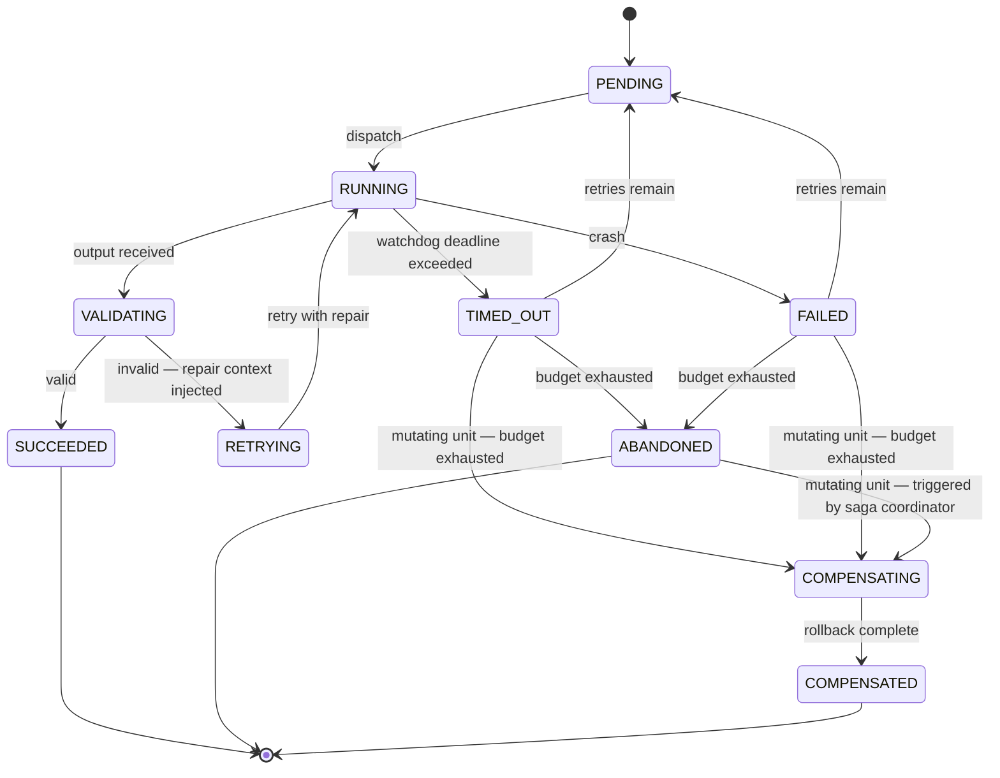
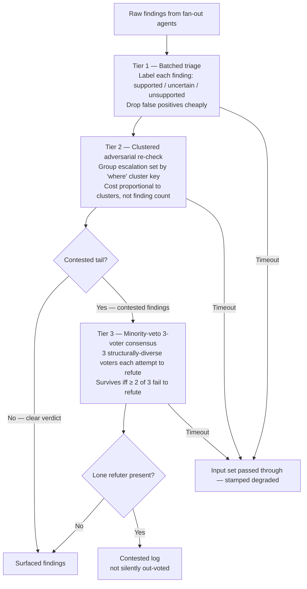

# Orchestration Layer — The Regulation Design ("The Third Leg")

> **Status:** Design dossier — captured research + rationale. *The Orchestration & Regulation Campaign (Waves 1–5, 2026-06-19 → 2026-06-25) has SHIPPED all §9 items 1–7 and the Wave-5 tiered-adversarial verify layer; item 8 (compensation for mutating units) remains designed-not-built. See §9 for status annotations.*
> **Created:** 2026-06-18
> **Revised:** 2026-06-19 — folded in SagaLLM's `COMPENSATING` terminal (§5/§6.7), the falsification
> harnesses REALM-Bench + τ²-bench/`pass^k` (§6.7/§9), enriched source notes (§6.6), and a new open
> question on irreversible side effects (§10).
> **Revised:** 2026-06-25 — campaign-close deltas: §9 items 1–7 annotated SHIPPED; Wave-5 tiered-adversarial verify layer (ADR-0006) added to §9; ADR-0006 link added to the §9 decision-record block.
> **Purpose:** Preserve the full reasoning, research, and design for a fail-successfully
> orchestration layer so a future session (or future-you) can build it without re-deriving
> any of it. The ultimate goal is to build this *into this repo* as a proper orchestration
> layer.
> **Related:** the active planning artifact `plans/orchestration-layer-foundation/` (gitignored,
> ephemeral); friction issue **#76** (the deep-research deadlock that started this); the
> auto-memory `project_orchestration_third_leg`. This document is the durable, self-contained
> source of truth — read it first.

A note on how to read this: §1–§5 are the *concept* (what we're building and why). §6–§8 are the
*evidence* (research findings, a worked example, tool constraints). §9 is the *build spec*. §10 is
*open questions*. §11 is a *glossary* — if any term is unfamiliar, jump there; the doc is written
to be self-contained.

---

## Table of Contents

1. [The core problem: determinate meets indeterminate](#1-the-core-problem)
2. [The conceptual model: three legs](#2-the-conceptual-model-three-legs)
3. [Why a third leg is forced into existence (the transformer grounding)](#3-why-a-third-leg-is-forced)
4. [The third leg, precisely: STATE + a RETURN PATH](#4-the-third-leg-precisely)
5. [The operational form: a per-unit lifecycle state machine](#5-the-operational-form)
6. [Research findings (deep-research output, distilled)](#6-research-findings)
7. [Worked example: the deep-research harness](#7-worked-example)
8. [Known Claude Code tool constraints](#8-known-tool-constraints)
9. [What to build (the spec for future-you)](#9-what-to-build)
10. [Open questions](#10-open-questions)
11. [Glossary](#11-glossary)
12. [Provenance](#12-provenance)

---

## 1. The core problem

Software has always been **deterministic**: given the same input it does the same thing, exactly,
every time. Reality is **not** deterministic. This is the oldest flaw in software — a rigid,
exact machine meets a messy, variable world, and it breaks at every edge case it didn't anticipate.

LLM agents introduce something new: **indeterminacy *inside* the software.** An LLM given the same
prompt can return different output each time; it can misread, skip, stall, or produce a confident
wrong answer. So we now have a deterministic substrate (our code) driving a non-deterministic one
(the agents), and **the seam between them is where the system breaks.**

The orchestration layer *is* that seam. The problem this document addresses:

> **How do you get a deterministic *guarantee* out of non-deterministic *components* — so the
> combined system doesn't break (freeze, lose work, or silently emit garbage) when the two meet?**

Note the goal is **not** to remove indeterminacy (that would kill the cognition that makes agents
useful). The goal is to *tolerate and harness* it while still delivering reliable behavior.

**The trigger.** This investigation started when a `deep-research` workflow **deadlocked** (friction
issue **#76**): one agent hung at a synchronization barrier and froze the entire run. That deadlock
was the *symptom* — the visible moment the system seized for lack of the thing this document names.
#76 is not the target; the target is the whole class of determinate↔indeterminate failures.

---

## 2. The conceptual model: three legs

A useful metaphor, and the spine of the whole design:

| Leg | Is | Properties |
|-----|----|-----------|
| **Bones** | **Code** (hooks, workflow scripts, the harness skeleton) | Rigid, deterministic, exact control flow. The scaffold. |
| **Muscle** | **LLM agents** | Does the heavy lifting; judgment; **non-deterministic**. The work. |
| **The third leg** | **(this document)** | Neither structure nor work. Keeps the system from seizing when the other two meet. |

The investigation spent considerable effort hunting for what the third leg *is*. The path —
recorded so you don't repeat the dead ends:

- **"Fat"** (a third tissue — reserve, cushioning, signaling). Right *instinct* (the system needs a
  third kind of stuff), wrong *details*. Biologically, fat is **connective tissue — the same category
  as bone** (passive storage/structure). It cannot regulate. The body's actual regulator is a
  *different* tissue type (nervous/endocrine). So "fat" pointed at the passive half only.
- **"Buffer / reactance"** (the EE framing). Closer: a capacitor/inductor is a genuine *third class*
  of circuit element (stores and returns energy, vs. the resistor that only dissipates). But again
  this is the **passive** element; active regulation in a circuit needs an op-amp **with feedback**.
- **Resolution:** the third leg is **not a single passive thing**, and it is **not purely passive.**
  It is a small *family* with two halves:
  - a **passive substance** (the only genuinely-new material), and
  - an **active return path** (built from code + cognition, "bent backward").

See §4 for the precise statement.

### What was explicitly rejected (and why)

- **Timeouts / slack / loose-coupling *alone*** — these merely *loosen* the existing forward link
  (make the muscle looser). They prevent the freeze but **lose the work** (see §7, run 1). Necessary,
  not sufficient.
- **A pure "control plane" as more code** — a supervisor is just deterministic code (± cognition)
  pointed at the system. It's a *recombination* of the existing two legs, not a new kind. (It is,
  however, where the *active* members live — see §4.)

---

## 3. Why a third leg is forced into existence

This is grounded in how transformers actually work, because it explains *why* the passive leg is
not optional.

Four facts about an LLM agent:

1. **Everything it works with is one flat pile of tokens** (the context window). If it isn't in the
   window, it doesn't exist for that pass.
2. **It reads the whole window at once, by relevance** (attention), not sequentially. Relevance is
   *computed* fresh every pass, not stored.
3. **The window is finite and re-scanned in full every pass.**
4. **It is amnesiac by construction.** Between calls it remembers *nothing*. Each subagent has its
   own private window in its own sealed room. The *only* way information crosses from one agent (or
   one moment in time) to another is for some non-cognitive process to **materialize it as tokens
   and place it into the other's window.**

Fact 4 is load-bearing:

> The muscle has judgment but **no state** — it cannot remember, only re-read. Therefore coordination
> can **never** be muscle-to-muscle. It must be **muscle → (external store) → muscle.** A persistent,
> external, re-readable store is not a nice-to-have; it is the **only physically possible coordination
> channel** between stateless agents.

That store is the passive third leg. It is distinct *in kind* because it is the only **passive**
element in the system: bones *execute*, muscle *cognizes*, the store merely *persists*.

---

## 4. The third leg, precisely

The third leg has two halves. Keep them distinct.

### 4a. Passive half = STATE

In the EE sense, **the state of a system is the energy stored in its passive (reactive) elements** —
the capacitor's voltage, the flywheel's spin *are* the state variables. The software analogue:

> **The passive leg is the system's externalized, persisted *state* — the distilled current
> condition, held outside and across all the active processes.**

Critically, this is **not** "memory/context" in the naive sense (the whole transcript). A capacitor
stores *one number* that summarizes everything about the past that still matters — not the full
history of every electron. Likewise:

> **State = the state *variables* (the few values that determine what happens next), NOT the
> transcript.**

A combinational (stateless) system — only sources and resistors — has no memory, no dynamics, no
ride-through; it is brittle by construction. *That is code + LLM with no third leg.* Adding state
gives the system history-dependence and the ability to ride through a transient.

Already half-present in this repo: `.claude/active-plan` (one path = the "what am I working on" state
variable), the plan doc's Task Reference ✅ column (completion state), the journal, and the gate-map
(the system's *model of itself* — see Conant–Ashby in §11).

### 4b. Active half = a RETURN PATH (feedback)

Code flows forward (input→process→output, toward the task). Cognition flows forward (prompt→answer).
The third thing is the **backward arrow**: output *sensed* and fed back to modulate behaviour. This
is **feedback / regulation / a closed loop** — the system acting on itself.

Every member of the **regulatory family** is an instance of "route information about what just
happened back into what happens next":

| Member | Role |
|--------|------|
| **Buffer** | Hold finished work so producers/consumers needn't be synchronized; decouple in time |
| **Sensor / observability** | *Measure* state — you cannot correct what you cannot sense (the member #76 lacked) |
| **Governor** | Sense error vs. an invariant, correct toward it |
| **Redundancy / quorum** | Replicate the unreliable worker, reconcile to a reliable result |
| **Supervisor / restart** | Watch for death/hang, restart or abandon gracefully |

The active half is built from **code + cognition, bent backward.** By **Ashby's Law of Requisite
Variety** (§11), regulating a *cognitive* (high-variety) worker may require a *cognitive* regulator —
i.e., the governor is sometimes itself an LLM (an LLM-as-judge/critic). So "distinct in kind from
cognition" is only partly true: distinct *role*, partly shared *substance*.

### 4c. The two halves are duals

You cannot have one without the other:

- Feedback is **impossible** without a stored value to compare against (the setpoint + the state
  estimate live in the passive store).
- A store that **nothing reads back** is a dead-letter log, not regulation.

> **The passive store is the *noun*; the return path is the *verb* that acts on it.**

A hard rule that falls out of this: **pair every store with a reader.** If you add state that no
control loop consumes, you've built a logging sink, not a third leg.

---

## 5. The operational form

A **state machine** is the concrete assembly of all of the above. It is the device that lets a
deterministic skeleton host non-deterministic work:

- **States + transitions are deterministic** → bone.
- **What happens *inside* a state (the work) is non-deterministic** → muscle.
- **The persisted current-state is inert and external** → the passive leg.
- **Transition logic ("given state + sensed event, go where?") reads sensed events** → the return path.

### The per-unit lifecycle FSM (the membrane around each indeterministic call)

Wrap **each** `agent()`/tool call in its own little machine. This is the core primitive and the #76
fix. *(Corrected version — `VALIDATING` feeds a repair-retry, not a terminal failure; see §6.3.)*

```
                  ┌──────────┐
        ┌────────►│ PENDING  │◄───────────────┐ retry-with-repair (budget remains)
        │         └────┬─────┘                │
        │              │ dispatch             │
        │         ┌────▼─────┐                │
        │         │ RUNNING  │  ← LLM works here (non-deterministic)
        │         └────┬─────┘                │
        │   ┌──────────┼───────────┐          │
        │ output    deadline      crash       │
        │ received  exceeded        │         │
        │   │          │            │         │
        │ ┌─▼────────┐ │            │         │
        │ │VALIDATING│ │            │         │
        │ └─┬──────┬─┘ │            │         │
        │ pass   fail  │            │         │
        │   │      └───┼────────────┼─────────┤   (validation failure = a CONTROL SIGNAL,
        │   │          │            │         │    not a dead end → loop back with the
        │ ┌─▼───────┐ ┌▼─────────┐ ┌▼──────┐  │    reason injected as repair context)
        │ │SUCCEEDED│ │TIMED_OUT │ │FAILED │  │
        │ └─────────┘ └────┬─────┘ └───┬───┘  │
        │  persist          └──────────┴──────┘ budget remains? → retry; else ↓
        │  result                          ┌──────────┐
        │  to store                        │ABANDONED │ (gracefully give up; quorum
        │                                  └──────────┘  may already be met without it)
```

The same machine rendered for tooling that can display Mermaid. Read-only units stop at `ABANDONED`;
mutating units add the `COMPENSATING → COMPENSATED` branch shown below.



**Terminal states:** `SUCCEEDED`, `ABANDONED` (read-only units), and `COMPENSATED` (state-mutating
units that failed and rolled back — see *Compensation* below). Each transition's *effect* is one
regulatory member:

| Transition | Member |
|---|---|
| `PENDING → RUNNING` | scheduler / dispatch |
| `RUNNING → VALIDATING` | **sensor** (output arrived) |
| `VALIDATING → SUCCEEDED` + persist | **buffer** (capture state) |
| `VALIDATING → (repair) → PENDING` | **governor** (validation as feedback — see §6.3) |
| `RUNNING → TIMED_OUT` (watchdog) | **governor/sensor** — *the member #76 lacked* |
| `RUNNING → FAILED` (crash) | **supervisor** (sense death) |
| `FAILED/TIMED_OUT → PENDING` (retries left) | **supervisor** (restart) |
| `→ ABANDONED` | **supervisor** (graceful give-up) |
| `→ COMPENSATING` (mutating unit, non-`SUCCEEDED` terminal) | **compensator** (saga rollback — §6.7) |
| `COMPENSATING → COMPENSATED` | **compensator** (effect reversed: non-lossy *and* consistent) |

### Compensation: the missing terminal for state-mutating units

The lifecycle above is complete for a **read-only** unit (the deep-research example, §7): abandoning a
straggler loses nothing because it mutated nothing. The moment a unit performs a **side effect** —
writes a file, creates a branch, transitions a ticket, sends a message — a non-`SUCCEEDED` terminal
leaves the system **half-committed and inconsistent**. The watchdog buys *liveness*; it does not buy
*consistency*.

The fix is the **Saga pattern** (SagaLLM, §6.7): pair each mutating forward step `T_i` with a
**compensating action `C_i`** that reverses it, and add a `COMPENSATING → COMPENSATED` branch so a
failed/abandoned mutating unit unwinds its own effect instead of stranding it. At the *saga* level (a
fan-out of mutating units), a unit hitting a non-`SUCCEEDED` terminal triggers the compensations of
its already-committed predecessors **in reverse dependency order** (`C_{j-1}, C_{j-2}, … C_1`). This is
the state-mutating analogue of "the buffer makes the give non-lossy": **compensation makes the give
*consistent*.**

> **Rule:** classify every orchestrated unit as **read-only** or **mutating**. A read-only unit needs
> only `ABANDONED`; a mutating unit needs a `C_i` and the `COMPENSATED` terminal. Deep-research is
> entirely read-only — which is why §7 never needed this — but the general primitive must carry it,
> and some effects have no clean inverse (§10 Q6).

### Why this kills #76

Two properties, both falling straight out of the machine:

1. **The barrier waits on a *quorum of terminal states*, not on every unit reaching `SUCCEEDED`.**
   A watchdog forces any over-deadline `RUNNING` unit to `TIMED_OUT → ABANDONED`. One straggler can
   never hold the loop.
2. **`SUCCEEDED` persists its output immediately.** Abandoning a straggler therefore loses nothing —
   the buffer makes the give *non-lossy*. (Slack alone bends; the store is what makes bending safe.)

### Durability & resume

Because state is external and transitions are deterministic, a crashed run reloads the store and
continues from the last terminal states. Use **step-memoization** for this, not deterministic-replay
(§6.1).

---

## 6. Research findings

A `deep-research` run (adversarially verified; see §7 for how, and the caveats) produced these. They
**confirmed** the design above and **sharpened** one part of it.

### 6.1 Durability: use step-memoization, not deterministic-replay

**Durable execution** = a workflow that survives a crash and resumes without redoing finished work.
Two ways to build it:

- **Deterministic replay (Temporal-style):** on resume, re-run the workflow code from the top,
  skipping side-effects by reading a recorded log. Requires the code path to be *identical* every
  run — which **breaks on non-determinism** (LLM calls, randomness, time). Also the log grows
  unbounded (Temporal caps ~50k events / 50MB).
- **Step-memoization (Inngest-style):** store each step's result keyed by id; on resume, skip steps
  that already have a stored result. Never re-runs the whole function; doesn't care if a step was
  unpredictable, because it saved the *result*, not the *path*.

> **Because LLM calls are non-deterministic, use step-memoization.** Deterministic replay literally
> breaks on the thing that makes agents useful. *(Confidence: high.)*

This *is* the passive state store from §4a — the research told us which flavor to build.

### 6.2 Model each call as a discrete, independently-retriable, persisted step

Each `agent()` call = one durable step: run once, persist output by id, on resume read the persisted
output. **Trap:** the non-deterministic part (the LLM call) **must live *inside* the saved step**, so
its variable output is captured once. If it leaks outside a saved step, resume re-rolls the dice and
corrupts everything downstream. *(Confidence: high.)* This is the per-unit FSM of §5.

### 6.3 Validation = a control signal feeding repair-retry, NOT a terminal gate

**This is the one finding that *changed* the design.** The naive design validates output and routes
pass→`SUCCEEDED` / fail→`FAILED` (a yes/no gate). That is wrong for two reasons:

1. **A gate catches only *detectable* faults** — malformed output, missing fields, crashes, timeouts.
   It **cannot** catch *wrong-but-plausible* output (a confident hallucination that passes every
   schema check). ~75% of multi-agent failures are **silent semantic errors** that throw no
   exception. A schema check gives **false confidence**: it certifies the *shape*, never the *truth*.
2. **Throwing a failed result away wastes it.** Feed the failure back as information ("invalid
   because X") and **retry with that correction injected** — validation as a *proofreader who hands
   the draft back*, not a *bouncer*.

> **The `VALIDATING` state routes failures to `RETRYING` with repaired context, reaching `ABANDONED`
> only after the retry budget is spent.** Validation *is* the sensor + comparator of the return path —
> the passive store holds state; validation is the active read that closes the loop. *(Confidence:
> high; best-sourced finding.)*

**Where guards give false confidence (the explicit list):**
- Schema validation / self-consistency catch only detectable faults; silent semantic failures need
  active validation.
- Validators have a **non-zero false-negative floor** and a false-rejection (over-retry) risk →
  thresholds must be tuned.
- **Durable-execution guards** give false confidence: durability prevents *losing* work, not work
  being *wrong*. ~42% of failures are specification failures and ~37% inter-agent coordination —
  neither is touched by durability.

### 6.4 Hand-roll the FSM; adopt heavy infra only for hard crash-resumability

Heavy durable-execution frameworks (Temporal, Inngest, etc.) are industrial infrastructure for
long-running, cross-machine, mission-critical workflows. For short Claude Code runs where re-running
is cheap, that's overkill — **hand-roll a minimal FSM + a persisted step-result map.**

> **Durability ≠ regulation.** A framework gives you the *passive* half (persistence/resume) for
> free. The *active* half — timeout, barrier, retry, abandon — you build **regardless**. Adopting
> Temporal would **not** have fixed #76, because the hang was never a durability problem.
> *(Confidence: medium — synthesis.)*

### 6.5 Caveats (respect these)

- **Refuted numbers — do not cite.** The verifiers *refuted* the headline statistics from the primary
  self-healing paper ("reduces silent failures to 0.0%"; "98.8% vs 94.5% task success"). Only the
  *qualitative direction* survives (validation-in-the-loop helps; targeted recovery plausibly beats
  uniform retry). Treat as architecture guidance, not measured guarantees.
- **Vendor docs.** Findings 6.1/6.2 rest partly on Inngest's own marketing docs — treat
  step-memoization as *one validated pattern*, not the only correct one.
- **Preprints.** Strongest sources are 2025–2026 arXiv preprints, not independently replicated; this
  is a fast-moving area.
- **The research GAP.** The run found **almost no evidence** on the fan-out barrier mechanics we care
  most about (quorum thresholds, hedged requests, supervisor-restart policy) and **none** on XState,
  AWS Step Functions, LangGraph, Restate, or Erlang/OTP supervision trees. That knowledge is largely
  unwritten where web search reaches — **but we answered it empirically ourselves** (§7).

### 6.6 Useful sources

- Inngest — durable execution / step memoization: `inngest.com/docs/learn/how-functions-are-executed`,
  `…/versioning`
- Temporal (by contrast) — durable execution / deterministic replay: `temporal.io/blog/what-is-durable-execution`
- LangGraph persistence: `docs.langchain.com/oss/python/langgraph/persistence`
- Azure Durable Task for AI agents (two-pattern model): `learn.microsoft.com/azure/durable-task/sdks/durable-task-for-ai-agents`
- Validation-in-the-loop (primary): arXiv `2606.01416`; corroborating:
  - `2505.18585` (**RvLLM**, NeurIPS 2025) — a domain-expert constraint-spec language (**ESL**) plus a
    two-stage *interpret → reason* loop that issues a **follow-up query** to the LLM when it derives new
    knowledge. A concrete instance of §6.3 validation-as-a-control-signal. *(Caveat: the "self-
    consistency can't catch violations" point belongs to `2601.00481`, not RvLLM — don't conflate.)*
  - `2503.11951` (**SagaLLM**, VLDB 2025) — the Saga pattern for LLM planning: **compensating
    transactions**, **independent** validation agents (self-validation rejected on a Gödel-incompleteness
    argument), and a three-part external state model (`S_A` application / `S_O` operation / `S_D`
    dependency). The source for the `COMPENSATING` terminal (§5, §6.7). Qualitative results only — §6.5.
  - `2511.14435` (Watchdogs and Oracles), `2503.18666` (AgentSpec)
- Silent-failure / MAS reliability: arXiv `2601.00481` (~75% silent semantic failures; LLM-judge
  attribution diverges across judge models)
- Falsification harnesses (added 2026-06-19, see §6.7): REALM-Bench `2502.18836`
  (`github.com/genglongling/REALM-Bench`); τ²-bench `2506.07982` (`github.com/sierra-research/tau2-bench`)

### 6.7 Follow-up research (2026-06-19): compensation + falsification harnesses

A later targeted-search pass — direct source review, **not** the original deep-research run (§12) —
added two things the first sweep missed.

**(a) SagaLLM supplies the missing `COMPENSATING` terminal.** The §5 FSM terminates cleanly for
read-only units but leaves a **state-mutating** unit half-committed on failure. SagaLLM (`2503.11951`)
is the named pattern: forward step `T_i` ↔ compensating action `C_i`; a failure runs the predecessors'
compensations in reverse dependency order; validation is done by **independent** agents (self-
validation rejected, Gödel-style) over an external three-part state model. Folded into §5.
*(Confidence: high on the pattern; SagaLLM reports only qualitative results — respect §6.5.)*

**(b) Two off-the-shelf harnesses answer the §9 "not vibes" success-test.**

| Harness | What it gives us | Maps to |
|---|---|---|
| **REALM-Bench** (`2502.18836`) | A runnable **fault-injection** rig — machine breakdowns, delay propagation, stochastic delays, material unavailability, traffic — over 14 problems split **static (10) vs dynamic-disruption (5)**. Metrics: *Disruption Adaptation* (replanning speed + recovery), *Solution Robustness* (degradation under stress), Constraint Satisfaction, Coordination. Pass@1 / Pass@5. Open-source. | §9 "inject stalls/crashes, measure whether invariants hold." Its dynamic-disruption set **is** the fault-injection suite. |
| **τ²-bench** (`2506.07982`) | A **dual-control** (Dec-POMDP) env where a tool-using *simulated user* also mutates shared state; scoring compares **final DB state to a goal**, so spurious side effects are penalized. Its τ-bench lineage's **`pass^k`** = P(success in *all k of k* trials) is the cleanest **reliability-under-non-determinism** metric. | §9 "returns valid shape / makes progress / degrades gracefully," and the *reliability* half of the harness. |

*Two corrections to the framing that prompted this pass:* "disruptions / abstain-from-problems" is
**REALM-Bench**, not τ²-bench (τ²-bench is a coordination benchmark with no explicit abstain action);
and the self-consistency critique traces to `2601.00481`, not RvLLM (§6.6). The `pass^k` metric is the
single most useful import — it is exactly "does the invariant hold *every* run, not just once."

---

## 7. Worked example: the deep-research harness

The `deep-research` harness is a near-perfect specimen of the system this document critiques, which
makes it the ideal first thing to fix.

### Its structure
`Scope` (1 agent) → `pipeline`(Search → URL-dedup → Fetch+extract) → `Verify` (3-vote adversarial,
**one hard barrier**) → `Synthesize` (1 agent). Each `agent()` uses a `schema:` (forces structured
output, runtime re-prompts on shape mismatch). A `null` agent result is treated as abstain (verify)
or drop (fetch). Verify "survives" a claim only on ≥2 valid votes with <2 refuting (a quorum rule).

### Mapped to the three legs
- **Bones:** the JS script (phase order, pipeline/parallel structure, dedup, ranking, quorum math).
- **Muscle:** every `agent()` call.
- **State:** mostly *ephemeral* in-memory variables during the run; the only durable state is the
  Workflow tool's journal (`resumeFromRunId` = step-memoization, inherited from the runtime, not owned
  by the harness).
- **Return path:** **almost entirely absent.** It is an **open-loop** (feedforward) system: scope →
  fan out → collect → synthesize → done. **#76 was that open loop seizing.**

### Per-call FSM, as actually implemented
A degenerate `RUNNING → { SUCCEEDED | null }`. No `VALIDATING`-with-repair, no `RETRYING`, no
`TIMED_OUT` (originally), no `ABANDONED`-after-budget. The two ends exist; the regulating middle —
the return path — does not.

### What it does well
- **Adversarial multi-vote verification** is genuine *semantic* validation (skeptics attack content),
  the deep kind §6.3 demands.
- **Quorum tolerance** is a real redundancy member.
- **`pipeline` for search→fetch** has no barrier, so one slow fetch doesn't block others. Brittleness
  is concentrated in the one **hard verify barrier** — exactly where it deadlocked.

### Its gaps (vs. §5/§6)
- Open-loop: no return path. **Verify is used as a terminal gate, not a repair loop** — a refuted or
  abstained claim is discarded, never sent back to seek better evidence (the §6.3 anti-pattern).
- No per-agent timeout originally (the #76 cause).
- No supervisor/restart; no retry of abstained/timed-out work.
- State is ephemeral within a run.

### The experiment (empirical proof of the design)

Two runs, after adding a feature-detected per-agent timeout (`withTimeout(agent)→null`) and putting
the high-count leaf agents on haiku:

| | Run 1 | Run 2 |
|---|---|---|
| Config | 25 claims × 3 votes (~75 agents at one barrier), 150s timeout | **5 claims × 3 votes (15 — under the ~16 concurrency cap)**, 240s timeout |
| Deadlock? | **No** (cured) | **No** |
| Timeouts | 23 | 4 |
| Outcome | Completed but **empty** (1/12 adjudicated; synthesis timed out) | **Completed with a real report** (3/5 confirmed) |

**Lessons:**
- **Liveness fixed by the timeout alone** — no freeze in either run. The minimal change cured #76.
- **But a bare timeout is lossy.** Run 1 cascaded: `Promise.race` frees the *await* but **not the
  concurrency slot** — orphaned timed-out agents kept holding slots, starving the rest. The bare
  timeout (the rejected "slack") gives liveness, not non-lossiness — *exactly as the design predicts.*
- **Run 2 worked because of the full pattern:** keeping the fan-out **under the concurrency cap** (no
  queue to starve) **plus 3-vote quorum** that absorbed the residual ~1-abstain-per-claim. Even under
  the cap there's a *baseline* per-agent flakiness (tool bugs, §8) that never reaches zero — so
  **redundancy is load-bearing, not optional.**

> **The empirical result: watchdog-timeout + quorum-redundancy + fan-out-under-the-cap = a working
> fail-successfully barrier.** We answered the fan-out-fault-tolerance question (the §6.5 research
> gap) by *living* it.

**Caveat for the future build:** `Promise.race` is *fake* abandonment — it stops *waiting* on the
agent but does not *kill* it or free its slot. Real preemption needs runtime support (see §8); from
inside a script the only mitigation is keeping the fan-out small enough that slot starvation can't
set in.

---

## 8. Known Claude Code tool constraints

A web check (GitHub `anthropics/claude-code`) confirmed #76 is a **known, actively-tracked gap in the
tool itself** — not our config, and **not the model** (it freezes on Opus too). Root causes live
*below* the workflow script, so script-level fixes are **blast-radius reduction, not cures.**

| Issue | What it is | Implication for us |
|---|---|---|
| **#49150** | `Task()` has no timeout → orchestrator hangs indefinitely, *especially on Windows* | This *is* #76. We're on Windows. Watchdog must be self-imposed. |
| **#37521** | Subagent freezes on **Opus 4.6** too — no timeout/error/recovery | The freeze is **not** a model/haiku problem. Don't "fix" it by upgrading the model. |
| **#68502** | HTTP 529 overload: parallel subagents hard-fail, no backoff; "fan-out steps fail first" | Keep concurrent fan-out low to avoid load-shedding. |
| **#14124** | Parallel subagents freeze on SQLite lock contention (`__store.db`) | Another reason to keep fan-out modest. |
| **#59962 / #20236** | Completed subagent work left stuck `in_progress`; `TaskOutput` hangs after completion | State-reconciliation is unreliable; don't trust "still running" naively. |
| concurrency cap | `agent()` capped at `min(16, cpu_cores − 2)` | Keep a fan-out batch ≤ the cap so nothing queues (the queued-timer cascade). |

Two takeaways:
1. **`setTimeout`/`clearTimeout` *are* available** in the workflow sandbox (`hasTimer: true`), so a
   script *can* self-impose timeouts. (Note: `Date.now`/`Math.random`/`new Date()` are banned to keep
   runs resumable.)
2. The community is asking Anthropic for **exactly our regulatory family** — timeout, watchdog,
   monitoring, abort, retry-with-backoff, graceful degradation, configurable concurrency,
   state-reconciliation. Our first-principles "third leg" is, item-for-item, the tool's own missing
   feature set. Some of this may eventually ship in the runtime, reducing what we must hand-build.

---

## 9. What to build (the spec for future-you)

> **Decision records:**
> - [ADR-0004](adr/0004-fail-successfully-fanout-primitive.md) (Accepted, 2026-06-19) adopts the
>   minimal first cut of this primitive — `scripts/lib/fail-successfully.mjs` (`withWatchdog` +
>   `runUnit` FSM + `quorumBarrier`) — as the repo standard for agent fan-outs. Built and
>   `node`-tested during the Phase 2 audit, where it degraded gracefully under a 200-agent
>   mass-failure instead of deadlocking.
> - [ADR-0005](adr/0005-orchestration-regulation-standard.md) (Accepted, 2026-06-23) codifies the
>   repo-wide regulation standard: one fan-out front-door (`dispatching-parallel-agents` over
>   `scripts/lib/dispatch.mjs`), one severity/verdict/enforcement taxonomy (`error`/`warning`/`note`
>   + `RED`/`GREEN` + hard/soft), one decision layer (`operating-model` skill), and surgical
>   hook-hardening as a compliance safety-net. Closes the taxonomy gap ADR-0004 flagged.
> - [ADR-0006](adr/0006-tiered-adversarial-verify-standard.md) (Accepted, 2026-06-25) adopts the
>   tiered-adversarial verify protocol as the repo-wide standard for verifying fan-out findings
>   before surfacing: `scripts/lib/verify.mjs` (dependency-free, bundled into both engine
>   `.workflow.mjs`), `skills/dispatching-parallel-agents/references/verify-protocol.md` (canonical
>   doc + machine-readable JSON param block), and the `verify:check` conformance guard (wired into
>   `npm test`). The blind-canary recall harness (`scripts/recall/`) is its false-negative smoke
>   signal.
>
> **Campaign status (2026-06-25):** Items 1–7 below are SHIPPED across Waves 1–5 of the
> Orchestration & Regulation Campaign. Item 8 (compensation for mutating units) is designed-not-built
> — the design in §5/§6.7 stands; build it when the first mutating consumer (a harness that writes
> files, branches, or tickets) needs it. The "spec for future-you" framing below remains accurate for
> item 8 and for any reader coming to this design fresh.

The deliverable is a **reusable orchestration primitive**: the per-unit lifecycle FSM (§5) plus the
regulatory family (§4b), with the validation-as-feedback correction (§6.3). Suggested order, smallest
useful first:

1. ✅ **SHIPPED** — **Per-unit lifecycle FSM** wrapping each `agent()`/tool call: `PENDING → RUNNING →
   VALIDATING → {SUCCEEDED | RETRYING(repair) | TIMED_OUT} → ABANDONED`. (`scripts/lib/fail-successfully.mjs`)
2. ✅ **SHIPPED** — **Watchdog (per-step timeout).** Feature-detect `setTimeout`; on timeout → terminal
   state, never a frozen await. (Accept that script-level timeout is non-preemptive; pair with #4.)
3. ✅ **SHIPPED** — **Quorum/partial barrier.** Wait on a quorum of *terminal* states, not
   all-`SUCCEEDED`. Redundancy is load-bearing (§7).
4. ✅ **SHIPPED** — **Fan-out under the concurrency cap.** Batch so a single `parallel()` stays ≤
   `min(16, cores−2)`; nothing should queue behind a saturated pool. (`dispatching-parallel-agents`
   front-door, `scripts/lib/dispatch.mjs`)
5. ✅ **SHIPPED** — **Durable step-result store** (step-memoization, §6.1): persist each step's output
   by id; resume reads it instead of re-invoking. Make state an *explicit, harness-owned* store (not
   ephemeral variables), with distilled state variables (§4a), not transcripts.
6. ✅ **SHIPPED** — **Validation-as-feedback (§6.3):** route `VALIDATING` failures to `RETRYING` with
   the reason injected as repair context; `ABANDONED` only after the retry budget. Use *semantic*
   validation (LLM-judge / adversarial), not just schema — and remember the judge is itself fallible
   (§6.3, §11 Ashby). (Wave 5: the tiered-adversarial verify protocol — see below.)
7. ✅ **SHIPPED** — **Supervisor / observability:** sense hangs/deaths; log abandons and timeouts so
   the run is inspectable (you cannot regulate what you cannot sense).
8. **Designed-not-built** — **Compensation for mutating units (§6.7, SagaLLM):** classify each unit
   read-only vs. mutating; give every mutating unit a compensating action `C_i` and a
   `COMPENSATING → COMPENSATED` branch so a failed/abandoned mutation unwinds instead of stranding.
   Read-only fan-outs (deep-research) skip this; any harness that writes files, branches, or tickets
   needs it (irreversibility caveat: §10 Q6).

**Wave 5 addition — tiered-adversarial verify layer (ADR-0006, 2026-06-25).** Item 6's semantic
validation is now a fully specified, conformance-guarded primitive rather than a free-form
implementation note. The three tiers: (1) a batched triage pass labels each finding
`supported`/`uncertain`/`unsupported` and drops false positives cheaply; (2) a clustered adversarial
re-check groups the escalation set by `where` cluster key so cost is proportional to clusters (not
findings); (3) a minority-veto 3-voter consensus runs only on the contested tail — three
structurally-diverse voters independently attempt to *refute*; a finding survives iff ≥2 of 3 fail to
refute, and a lone refuter forces the survivor into the `contested` log rather than silently
out-voting it. Graceful degradation: each tier falls back to its input set on timeout, stamped
`degraded`. Per-consumer asymmetric profiles carry the cost/confidence trade-off (e.g.,
`code-review` = guard-false-positive; `web-research` = guard-unsupported). All six fan-out consumers
(architect panel, `adherence-audit`, `requesting-code-review`, SDD, `librarian`, `orchestration-audit`)
route their verify through this protocol. The blind-canary recall harness (`scripts/recall/`) provides
the false-negative smoke signal. Governed by ADR-0006.

The three-tier flow as a rendered diagram:



**First refactor target:** the `deep-research` harness (§7) — turn its terminal verify *gate* into a
repair *loop*, give each step a real lifecycle, and make its state an explicit store.

**Success test (the falsification harness, not vibes):** **fault injection vs. stated invariants** —
deliberately inject stalls, invalid/hallucinated outputs, and crashes, and measure whether the
system's deterministic invariants still hold (it completes, returns valid shape, makes progress,
degrades gracefully). "Reduce metaphor to a measurable guarantee." This is the difference between a
design and an architecture. **Two existing harnesses operationalize this (§6.7):** REALM-Bench for
disruption-injection + replanning-recovery metrics, and τ²-bench's `pass^k` (succeed in *all k of k*
trials) for reliability-under-non-determinism. Build the in-house fault-injection rig, but validate
against these so the "measurable guarantee" is comparable to published numbers.

**Repo integration:** this overlaps the `orchestration-layer-foundation` plan's **Phase 2**
("fail-successfully" + per-edge hard/soft gate classification). When building, reconcile with that
plan rather than duplicating it. The build itself is an **L-sized** effort → it should go through
`brainstorming` → `writing-plans` → `plan-gate` (architect review) before execution, per repo
workflow.

---

## 10. Open questions

1. **Fan-out barrier numbers.** What concrete quorum thresholds (proceed at N-of-M), timeout values,
   and hedged-request triggers are right? We have an empirical *pattern* (§7) but not tuned numbers,
   and the literature didn't supply them (§6.5). **Update:** REALM-Bench (§6.7) is a way to *tune*
   these empirically — sweep thresholds/timeouts against its dynamic-disruption set and read the
   Disruption-Adaptation / Robustness curves instead of guessing.
2. **Framework comparison unmade.** XState, AWS Step Functions, LangGraph, Restate, Erlang/OTP
   supervision trees got zero surviving evidence — a real comparison for *this* use case is still
   owed if "adopt" is ever reconsidered over "hand-roll."
3. **Real preemption needs runtime support.** From a script you can stop *waiting* on an agent but not
   *kill* it (free its slot). Either keep fan-out small forever, or wait for Anthropic to ship
   abortable subagents (§8). Decide which.
4. **Tuning the `VALIDATING` guard.** How to balance the validator's false-negative floor against
   over-retry, and which self-consistency / LLM-as-judge configuration minimizes false confidence.
5. **Does the active regulator have to be an LLM?** Ashby's requisite variety (§11) implies a
   high-variety (cognitive) worker may need a cognitive regulator — but LLM-judges are themselves
   unstable across judge models (§6.5). How much regulation can a *cheap, deterministic* governor do?
6. **Irreversible side effects.** Compensation (§5, §6.7) assumes every mutation has an inverse `C_i` —
   but some don't (a sent email, a non-idempotent external call). The saga-safe options are then:
   make the effect *idempotent*, *defer the commit* to a single pivot transaction at the end, or
   accept a *dirty-compensation log* and reconcile out of band. Which units in this workflow are truly
   irreversible, and which pattern each takes, is unresolved.

---

## 11. Glossary

- **Determinate / deterministic** — same input → same output, exactly, every time. Code.
- **Indeterminate / non-deterministic** — output varies run-to-run. LLMs, reality.
- **Open-loop (feedforward)** — output is produced and never measured/corrected. Brittle to surprise.
- **Closed-loop (feedback)** — output is sensed and fed back to adjust behaviour. The "return path."
- **State (EE sense)** — the values stored in a system's passive elements that determine its future
  behaviour. *Not* the full history — the distilled current condition.
- **FSM (finite state machine)** — a system defined by a set of states and the deterministic
  transitions between them, driven by events.
- **Durable execution** — a workflow that survives crashes and resumes without redoing finished work.
- **Step-memoization** — durability by storing each step's result and skipping completed steps on
  resume (the "checklist on the fridge"). Tolerates non-determinism.
- **Deterministic replay** — durability by re-running the code from the top and replaying recorded
  side-effects (the "re-cook the recipe"). Breaks on non-determinism.
- **Idempotent** — safe to run more than once with the same effect; what lets retry be safe.
- **Quorum / partial barrier** — proceed once *enough* (N-of-M) results are in, rather than waiting
  for all. Tolerates stragglers.
- **Hedged request** — launch a duplicate of a slow task and take whichever finishes first; trades
  cost for tail-latency.
- **Supervisor** — a process whose only job is to watch workers and restart/abandon them on
  failure (cf. Erlang/OTP "let it crash" + supervision trees).
- **Saga / compensating transaction** — a multi-step operation kept consistent without locks: each
  forward step `T_i` has an inverse `C_i`; on failure the committed steps are undone in reverse order.
  The state-mutating analogue of rollback (SagaLLM, §6.7).
- **pass^k** — reliability metric: the probability an agent succeeds in *all k of k* independent
  trials, not just one. Penalizes non-determinism directly (τ-bench lineage, §6.7).
- **Dual-control environment** — an evaluation setting (Dec-POMDP) in which both the agent *and* a
  simulated user take tool actions on shared state; the score compares final state to a goal, so
  spurious side effects are penalized (τ²-bench, §6.7).
- **Schema validation** — checking output *shape* (fields/types). Shallow: catches malformed, not
  wrong-but-plausible.
- **LLM-as-judge** — using an LLM to evaluate another LLM's output (semantic validation). Deep but
  itself fallible/unstable across judge models.
- **Requisite variety (Ashby's Law)** — "only variety can absorb variety": a regulator must be at
  least as rich as the disturbances it controls. Implies regulating a cognitive worker may need a
  cognitive regulator.
- **Conant–Ashby theorem** — "every good regulator of a system must contain a model of that system."
  Why the gate-map / state store doubles as the system's self-model.
- **Concurrency cap** — the workflow runtime runs at most `min(16, cpu_cores − 2)` agents at once;
  excess queue.

---

## 12. Provenance

This document distills a single design session (2026-06-18). The reasoning trail and adversarial
challenges were captured in Phoenix-checklist sweeps at `plans/phoenix/` (gitignored, ephemeral —
their substance is folded into this doc). The deep-research experiment used a timeout-hardened copy
of the `deep-research` harness (runs `wf_916c0a9f`, then `wf_1b59f2e6`). Key facts also recorded in
the auto-memory `project_orchestration_third_leg`. The active (ephemeral) planning artifact is
`plans/orchestration-layer-foundation/`; this committed document is the durable source of truth and
should be kept current as the build proceeds.

A follow-up targeted-research pass (2026-06-19) folded in SagaLLM's compensation terminal (§5) and the
REALM-Bench / τ²-bench falsification harnesses (§6.7). Those findings come from direct source review
(arXiv abstracts + the benchmarks' repositories), not the original deep-research run, and the two
attribution corrections noted in §6.7 were applied to keep the dossier accurate.
