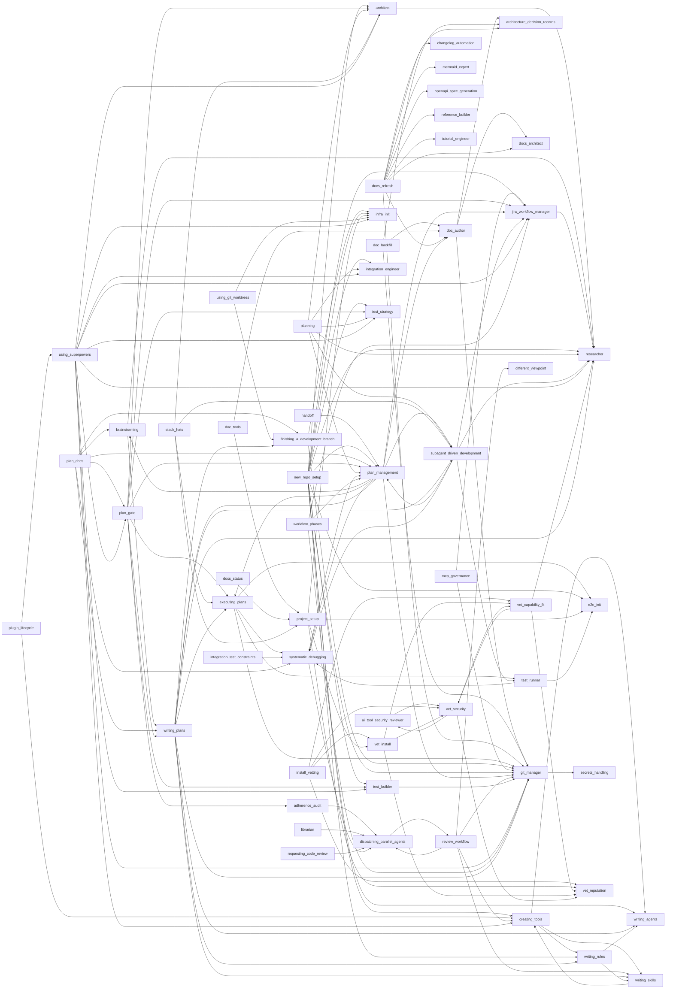

# Gate Map (generated)

> First-cut: explicit references only. Human-curated enforcement tiers live in the orchestration explainer.

## Edges

| From | To |
|------|----|
| adherence-audit | dispatching-parallel-agents |
| ai-tool-security-reviewer | vet-security |
| architect | researcher |
| brainstorming | researcher |
| brainstorming | writing-plans |
| creating-tools | writing-agents |
| creating-tools | writing-rules |
| creating-tools | writing-skills |
| dispatching-parallel-agents | review-workflow |
| doc-author | architecture-decision-records |
| doc-author | docs-architect |
| doc-author | git-manager |
| doc-backfill | architecture-decision-records |
| doc-backfill | doc-author |
| doc-backfill | git-manager |
| doc-tools | doc-author |
| doc-tools | project-setup |
| docs-refresh | architecture-decision-records |
| docs-refresh | changelog-automation |
| docs-refresh | doc-author |
| docs-refresh | docs-architect |
| docs-refresh | git-manager |
| docs-refresh | mermaid-expert |
| docs-refresh | openapi-spec-generation |
| docs-refresh | reference-builder |
| docs-refresh | tutorial-engineer |
| docs-status | project-setup |
| executing-plans | e2e-init |
| executing-plans | git-manager |
| executing-plans | systematic-debugging |
| executing-plans | test-runner |
| finishing-a-development-branch | git-manager |
| finishing-a-development-branch | infra-init |
| git-manager | secrets-handling |
| handoff | plan-management |
| install-vetting | vet-capability-fit |
| install-vetting | vet-install |
| install-vetting | vet-reputation |
| install-vetting | vet-security |
| integration-test-constraints | systematic-debugging |
| jira-workflow-manager | researcher |
| librarian | dispatching-parallel-agents |
| mcp-governance | git-manager |
| mcp-governance | jira-workflow-manager |
| new-repo-setup | architect |
| new-repo-setup | creating-tools |
| new-repo-setup | e2e-init |
| new-repo-setup | git-manager |
| new-repo-setup | infra-init |
| new-repo-setup | integration-engineer |
| new-repo-setup | jira-workflow-manager |
| new-repo-setup | plan-management |
| new-repo-setup | researcher |
| new-repo-setup | test-builder |
| new-repo-setup | test-strategy |
| new-repo-setup | writing-agents |
| new-repo-setup | writing-rules |
| plan-docs | brainstorming |
| plan-docs | finishing-a-development-branch |
| plan-docs | plan-gate |
| plan-docs | plan-management |
| plan-docs | systematic-debugging |
| plan-docs | writing-plans |
| plan-gate | adherence-audit |
| plan-gate | architect |
| plan-gate | executing-plans |
| plan-gate | jira-workflow-manager |
| plan-gate | plan-management |
| plan-gate | test-builder |
| plan-gate | test-strategy |
| plan-gate | writing-plans |
| plan-management | brainstorming |
| plan-management | doc-author |
| plan-management | executing-plans |
| plan-management | git-manager |
| plan-management | jira-workflow-manager |
| plan-management | subagent-driven-development |
| plan-management | systematic-debugging |
| plan-management | writing-plans |
| planning | architect |
| planning | integration-engineer |
| planning | plan-management |
| planning | researcher |
| planning | subagent-driven-development |
| planning | test-strategy |
| plugin-lifecycle | creating-tools |
| plugin-lifecycle | using-superpowers |
| project-setup | e2e-init |
| project-setup | infra-init |
| project-setup | vet-install |
| project-setup | vet-reputation |
| requesting-code-review | dispatching-parallel-agents |
| review-workflow | creating-tools |
| review-workflow | different-viewpoint |
| review-workflow | dispatching-parallel-agents |
| review-workflow | git-manager |
| review-workflow | writing-skills |
| stack-hats | architect |
| stack-hats | executing-plans |
| stack-hats | project-setup |
| stack-hats | subagent-driven-development |
| subagent-driven-development | jira-workflow-manager |
| subagent-driven-development | plan-management |
| subagent-driven-development | researcher |
| subagent-driven-development | systematic-debugging |
| subagent-driven-development | test-runner |
| systematic-debugging | dispatching-parallel-agents |
| systematic-debugging | plan-management |
| test-builder | git-manager |
| test-runner | e2e-init |
| test-runner | systematic-debugging |
| using-git-worktrees | finishing-a-development-branch |
| using-git-worktrees | infra-init |
| using-superpowers | architect |
| using-superpowers | creating-tools |
| using-superpowers | git-manager |
| using-superpowers | infra-init |
| using-superpowers | integration-engineer |
| using-superpowers | jira-workflow-manager |
| using-superpowers | plan-gate |
| using-superpowers | researcher |
| using-superpowers | test-builder |
| using-superpowers | test-strategy |
| vet-capability-fit | researcher |
| vet-capability-fit | vet-reputation |
| vet-capability-fit | vet-security |
| vet-install | vet-capability-fit |
| vet-install | vet-reputation |
| vet-install | vet-security |
| vet-security | ai-tool-security-reviewer |
| vet-security | vet-capability-fit |
| vet-security | vet-reputation |
| workflow-phases | git-manager |
| workflow-phases | jira-workflow-manager |
| workflow-phases | plan-management |
| writing-plans | executing-plans |
| writing-plans | finishing-a-development-branch |
| writing-plans | git-manager |
| writing-plans | researcher |
| writing-plans | subagent-driven-development |
| writing-plans | writing-agents |
| writing-plans | writing-rules |
| writing-plans | writing-skills |
| writing-rules | writing-agents |
| writing-rules | writing-skills |
| writing-skills | creating-tools |
