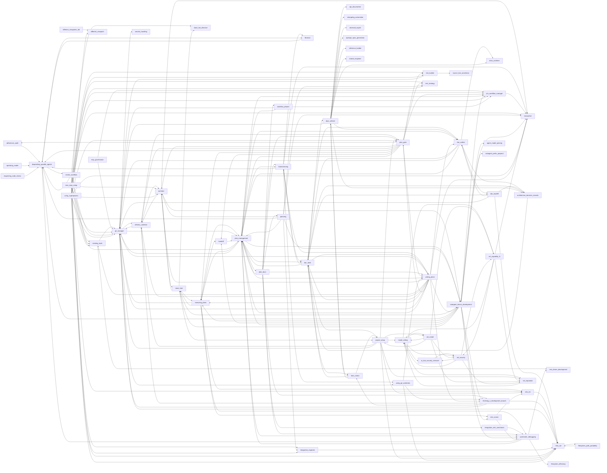

# Gate Map (generated)

> First-cut: explicit references only. Human-curated enforcement tiers live in the orchestration explainer.

```mermaid
flowchart LR
  adherence_audit --> dispatching_parallel_agents
  ai_tool_security_reviewer --> vet_security
  architect --> delivery_cadence
  architect --> researcher
  architect --> stack_hats
  architect --> subagent_driven_development
  architecture_decision_records --> doc_tools
  brainstorming --> dispatching_parallel_agents
  brainstorming --> doc_tools
  brainstorming --> librarian
  brainstorming --> researcher
  brainstorming --> using_git_worktrees
  brainstorming --> writing_plans
  creating_tools --> git_manager
  creating_tools --> test_driven_development
  delivery_cadence --> architect
  delivery_cadence --> git_manager
  delivery_cadence --> plan_gate
  different_viewpoints_lite --> different_viewpoint
  dispatching_parallel_agents --> librarian
  dispatching_parallel_agents --> review_workflow
  doc_author --> architecture_decision_records
  doc_author --> doc_backfill
  doc_author --> doc_tools
  doc_author --> docs_architect
  doc_author --> git_manager
  doc_author --> plan_management
  doc_backfill --> architecture_decision_records
  doc_backfill --> doc_author
  doc_backfill --> git_manager
  doc_backfill --> infra_init
  doc_tools --> architecture_decision_records
  doc_tools --> brainstorming
  doc_tools --> doc_author
  doc_tools --> doc_backfill
  doc_tools --> docs_refresh
  doc_tools --> docs_status
  doc_tools --> plan_management
  doc_tools --> project_setup
  doc_tools --> writing_plans
  docs_refresh --> api_documenter
  docs_refresh --> architecture_decision_records
  docs_refresh --> changelog_automation
  docs_refresh --> doc_author
  docs_refresh --> docs_architect
  docs_refresh --> docs_status
  docs_refresh --> git_manager
  docs_refresh --> mermaid_expert
  docs_refresh --> openapi_spec_generation
  docs_refresh --> reference_builder
  docs_refresh --> tutorial_engineer
  docs_status --> doc_tools
  docs_status --> docs_refresh
  docs_status --> project_setup
  e2e_init --> infra_init
  executing_plans --> e2e_init
  executing_plans --> git_manager
  executing_plans --> handoff
  executing_plans --> plan_management
  executing_plans --> stack_hats
  executing_plans --> systematic_debugging
  executing_plans --> test_runner
  filesystem_path_portability --> infra_init
  finishing_a_development_branch --> delivery_cadence
  finishing_a_development_branch --> docs_status
  finishing_a_development_branch --> git_manager
  finishing_a_development_branch --> infra_init
  git_manager --> delivery_cadence
  git_manager --> infra_init
  git_manager --> plan_management
  git_manager --> secrets_handling
  git_manager --> using_git_worktrees
  git_manager --> writing_plans
  handoff --> plan_management
  infra_init --> filesystem_path_portability
  install_vetting --> ai_tool_security_reviewer
  install_vetting --> vet_capability_fit
  install_vetting --> vet_install
  install_vetting --> vet_reputation
  install_vetting --> vet_security
  integration_engineer --> infra_init
  integration_test_constraints --> systematic_debugging
  jira_workflow_manager --> researcher
  librarian --> dispatching_parallel_agents
  mcp_governance --> git_manager
  mcp_governance --> jira_workflow_manager
  new_repo_setup --> architect
  new_repo_setup --> creating_tools
  new_repo_setup --> e2e_init
  new_repo_setup --> git_manager
  new_repo_setup --> infra_init
  new_repo_setup --> integration_engineer
  new_repo_setup --> jira_workflow_manager
  new_repo_setup --> plan_management
  new_repo_setup --> researcher
  new_repo_setup --> stack_hat_directive
  new_repo_setup --> test_builder
  new_repo_setup --> test_strategy
  operating_model --> dispatching_parallel_agents
  plan_docs --> brainstorming
  plan_docs --> finishing_a_development_branch
  plan_docs --> integration_test_constraints
  plan_docs --> plan_gate
  plan_docs --> plan_management
  plan_docs --> planning
  plan_docs --> systematic_debugging
  plan_docs --> workflow_phases
  plan_docs --> writing_plans
  plan_gate --> adherence_audit
  plan_gate --> architect
  plan_gate --> delivery_cadence
  plan_gate --> dispatching_parallel_agents
  plan_gate --> executing_plans
  plan_gate --> handoff
  plan_gate --> jira_workflow_manager
  plan_gate --> plan_management
  plan_gate --> test_builder
  plan_gate --> test_strategy
  plan_gate --> writing_plans
  plan_management --> brainstorming
  plan_management --> doc_author
  plan_management --> doc_tools
  plan_management --> executing_plans
  plan_management --> git_manager
  plan_management --> jira_workflow_manager
  plan_management --> plan_docs
  plan_management --> subagent_driven_development
  plan_management --> systematic_debugging
  plan_management --> writing_plans
  planning --> architect
  planning --> dispatching_parallel_agents
  planning --> integration_engineer
  planning --> plan_management
  planning --> researcher
  planning --> subagent_driven_development
  planning --> test_strategy
  project_setup --> delivery_cadence
  project_setup --> e2e_init
  project_setup --> git_manager
  project_setup --> infra_init
  project_setup --> install_vetting
  project_setup --> plan_gate
  project_setup --> vet_install
  project_setup --> vet_reputation
  requesting_code_review --> dispatching_parallel_agents
  review_workflow --> creating_tools
  review_workflow --> different_viewpoint
  review_workflow --> dispatching_parallel_agents
  review_workflow --> git_manager
  stack_hats --> architect
  stack_hats --> executing_plans
  stack_hats --> project_setup
  stack_hats --> stack_hat_directive
  stack_hats --> subagent_driven_development
  subagent_driven_development --> agent_model_pinning
  subagent_driven_development --> dispatching_parallel_agents
  subagent_driven_development --> executing_plans
  subagent_driven_development --> finishing_a_development_branch
  subagent_driven_development --> handoff
  subagent_driven_development --> jira_workflow_manager
  subagent_driven_development --> plan_management
  subagent_driven_development --> researcher
  subagent_driven_development --> stack_hats
  subagent_driven_development --> subagent_prefix_prepend
  subagent_driven_development --> systematic_debugging
  subagent_driven_development --> test_runner
  systematic_debugging --> dispatching_parallel_agents
  systematic_debugging --> filesystem_efficiency
  systematic_debugging --> plan_management
  systematic_debugging --> test_driven_development
  test_builder --> git_manager
  test_builder --> source_text_assertions
  test_runner --> e2e_init
  test_runner --> systematic_debugging
  using_git_worktrees --> finishing_a_development_branch
  using_git_worktrees --> infra_init
  using_git_worktrees --> writing_plans
  using_superpowers --> architect
  using_superpowers --> creating_tools
  using_superpowers --> git_manager
  using_superpowers --> infra_init
  using_superpowers --> integration_engineer
  using_superpowers --> jira_workflow_manager
  using_superpowers --> plan_gate
  using_superpowers --> researcher
  using_superpowers --> test_builder
  using_superpowers --> test_strategy
  vet_capability_fit --> install_vetting
  vet_capability_fit --> researcher
  vet_capability_fit --> vet_reputation
  vet_capability_fit --> vet_security
  vet_install --> install_vetting
  vet_install --> project_setup
  vet_install --> vet_capability_fit
  vet_install --> vet_reputation
  vet_install --> vet_security
  vet_reputation --> install_vetting
  vet_security --> ai_tool_security_reviewer
  vet_security --> install_vetting
  vet_security --> vet_capability_fit
  vet_security --> vet_reputation
  workflow_phases --> git_manager
  workflow_phases --> jira_workflow_manager
  workflow_phases --> plan_management
  writing_plans --> architect
  writing_plans --> creating_tools
  writing_plans --> delivery_cadence
  writing_plans --> doc_author
  writing_plans --> doc_tools
  writing_plans --> executing_plans
  writing_plans --> finishing_a_development_branch
  writing_plans --> git_manager
  writing_plans --> plan_gate
  writing_plans --> plan_management
  writing_plans --> researcher
  writing_plans --> subagent_driven_development
```

## Edges

| From | To |
|------|----|
| adherence-audit | dispatching-parallel-agents |
| ai-tool-security-reviewer | vet-security |
| architect | delivery-cadence |
| architect | researcher |
| architect | stack-hats |
| architect | subagent-driven-development |
| architecture-decision-records | doc-tools |
| brainstorming | dispatching-parallel-agents |
| brainstorming | doc-tools |
| brainstorming | librarian |
| brainstorming | researcher |
| brainstorming | using-git-worktrees |
| brainstorming | writing-plans |
| creating-tools | git-manager |
| creating-tools | test-driven-development |
| delivery-cadence | architect |
| delivery-cadence | git-manager |
| delivery-cadence | plan-gate |
| different-viewpoints-lite | different-viewpoint |
| dispatching-parallel-agents | librarian |
| dispatching-parallel-agents | review-workflow |
| doc-author | architecture-decision-records |
| doc-author | doc-backfill |
| doc-author | doc-tools |
| doc-author | docs-architect |
| doc-author | git-manager |
| doc-author | plan-management |
| doc-backfill | architecture-decision-records |
| doc-backfill | doc-author |
| doc-backfill | git-manager |
| doc-backfill | infra-init |
| doc-tools | architecture-decision-records |
| doc-tools | brainstorming |
| doc-tools | doc-author |
| doc-tools | doc-backfill |
| doc-tools | docs-refresh |
| doc-tools | docs-status |
| doc-tools | plan-management |
| doc-tools | project-setup |
| doc-tools | writing-plans |
| docs-refresh | api-documenter |
| docs-refresh | architecture-decision-records |
| docs-refresh | changelog-automation |
| docs-refresh | doc-author |
| docs-refresh | docs-architect |
| docs-refresh | docs-status |
| docs-refresh | git-manager |
| docs-refresh | mermaid-expert |
| docs-refresh | openapi-spec-generation |
| docs-refresh | reference-builder |
| docs-refresh | tutorial-engineer |
| docs-status | doc-tools |
| docs-status | docs-refresh |
| docs-status | project-setup |
| e2e-init | infra-init |
| executing-plans | e2e-init |
| executing-plans | git-manager |
| executing-plans | handoff |
| executing-plans | plan-management |
| executing-plans | stack-hats |
| executing-plans | systematic-debugging |
| executing-plans | test-runner |
| filesystem/path-portability | infra-init |
| finishing-a-development-branch | delivery-cadence |
| finishing-a-development-branch | docs-status |
| finishing-a-development-branch | git-manager |
| finishing-a-development-branch | infra-init |
| git-manager | delivery-cadence |
| git-manager | infra-init |
| git-manager | plan-management |
| git-manager | secrets-handling |
| git-manager | using-git-worktrees |
| git-manager | writing-plans |
| handoff | plan-management |
| infra-init | filesystem/path-portability |
| install-vetting | ai-tool-security-reviewer |
| install-vetting | vet-capability-fit |
| install-vetting | vet-install |
| install-vetting | vet-reputation |
| install-vetting | vet-security |
| integration-engineer | infra-init |
| integration-test-constraints | systematic-debugging |
| jira-workflow-manager | researcher |
| librarian | dispatching-parallel-agents |
| mcp-governance | git-manager |
| mcp-governance | jira-workflow-manager |
| new-repo-setup | architect |
| new-repo-setup | creating-tools |
| new-repo-setup | e2e-init |
| new-repo-setup | git-manager |
| new-repo-setup | infra-init |
| new-repo-setup | integration-engineer |
| new-repo-setup | jira-workflow-manager |
| new-repo-setup | plan-management |
| new-repo-setup | researcher |
| new-repo-setup | stack-hat-directive |
| new-repo-setup | test-builder |
| new-repo-setup | test-strategy |
| operating-model | dispatching-parallel-agents |
| plan-docs | brainstorming |
| plan-docs | finishing-a-development-branch |
| plan-docs | integration-test-constraints |
| plan-docs | plan-gate |
| plan-docs | plan-management |
| plan-docs | planning |
| plan-docs | systematic-debugging |
| plan-docs | workflow-phases |
| plan-docs | writing-plans |
| plan-gate | adherence-audit |
| plan-gate | architect |
| plan-gate | delivery-cadence |
| plan-gate | dispatching-parallel-agents |
| plan-gate | executing-plans |
| plan-gate | handoff |
| plan-gate | jira-workflow-manager |
| plan-gate | plan-management |
| plan-gate | test-builder |
| plan-gate | test-strategy |
| plan-gate | writing-plans |
| plan-management | brainstorming |
| plan-management | doc-author |
| plan-management | doc-tools |
| plan-management | executing-plans |
| plan-management | git-manager |
| plan-management | jira-workflow-manager |
| plan-management | plan-docs |
| plan-management | subagent-driven-development |
| plan-management | systematic-debugging |
| plan-management | writing-plans |
| planning | architect |
| planning | dispatching-parallel-agents |
| planning | integration-engineer |
| planning | plan-management |
| planning | researcher |
| planning | subagent-driven-development |
| planning | test-strategy |
| project-setup | delivery-cadence |
| project-setup | e2e-init |
| project-setup | git-manager |
| project-setup | infra-init |
| project-setup | install-vetting |
| project-setup | plan-gate |
| project-setup | vet-install |
| project-setup | vet-reputation |
| requesting-code-review | dispatching-parallel-agents |
| review-workflow | creating-tools |
| review-workflow | different-viewpoint |
| review-workflow | dispatching-parallel-agents |
| review-workflow | git-manager |
| stack-hats | architect |
| stack-hats | executing-plans |
| stack-hats | project-setup |
| stack-hats | stack-hat-directive |
| stack-hats | subagent-driven-development |
| subagent-driven-development | agent-model-pinning |
| subagent-driven-development | dispatching-parallel-agents |
| subagent-driven-development | executing-plans |
| subagent-driven-development | finishing-a-development-branch |
| subagent-driven-development | handoff |
| subagent-driven-development | jira-workflow-manager |
| subagent-driven-development | plan-management |
| subagent-driven-development | researcher |
| subagent-driven-development | stack-hats |
| subagent-driven-development | subagent-prefix-prepend |
| subagent-driven-development | systematic-debugging |
| subagent-driven-development | test-runner |
| systematic-debugging | dispatching-parallel-agents |
| systematic-debugging | filesystem/efficiency |
| systematic-debugging | plan-management |
| systematic-debugging | test-driven-development |
| test-builder | git-manager |
| test-builder | source-text-assertions |
| test-runner | e2e-init |
| test-runner | systematic-debugging |
| using-git-worktrees | finishing-a-development-branch |
| using-git-worktrees | infra-init |
| using-git-worktrees | writing-plans |
| using-superpowers | architect |
| using-superpowers | creating-tools |
| using-superpowers | git-manager |
| using-superpowers | infra-init |
| using-superpowers | integration-engineer |
| using-superpowers | jira-workflow-manager |
| using-superpowers | plan-gate |
| using-superpowers | researcher |
| using-superpowers | test-builder |
| using-superpowers | test-strategy |
| vet-capability-fit | install-vetting |
| vet-capability-fit | researcher |
| vet-capability-fit | vet-reputation |
| vet-capability-fit | vet-security |
| vet-install | install-vetting |
| vet-install | project-setup |
| vet-install | vet-capability-fit |
| vet-install | vet-reputation |
| vet-install | vet-security |
| vet-reputation | install-vetting |
| vet-security | ai-tool-security-reviewer |
| vet-security | install-vetting |
| vet-security | vet-capability-fit |
| vet-security | vet-reputation |
| workflow-phases | git-manager |
| workflow-phases | jira-workflow-manager |
| workflow-phases | plan-management |
| writing-plans | architect |
| writing-plans | creating-tools |
| writing-plans | delivery-cadence |
| writing-plans | doc-author |
| writing-plans | doc-tools |
| writing-plans | executing-plans |
| writing-plans | finishing-a-development-branch |
| writing-plans | git-manager |
| writing-plans | plan-gate |
| writing-plans | plan-management |
| writing-plans | researcher |
| writing-plans | subagent-driven-development |
