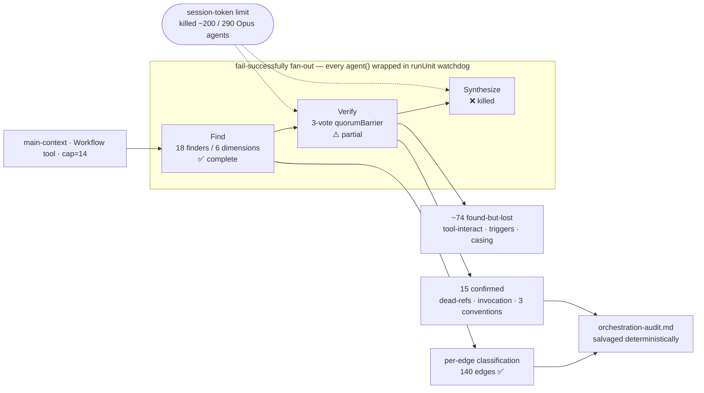
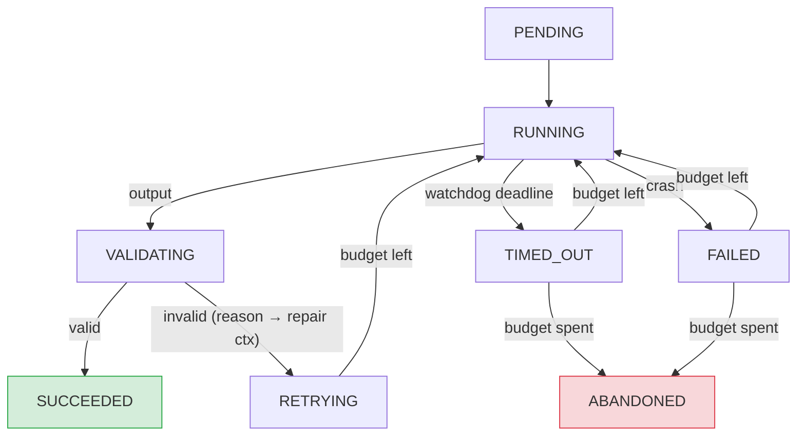
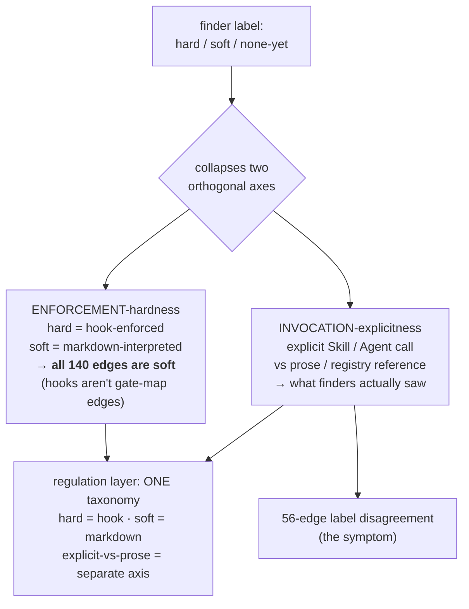
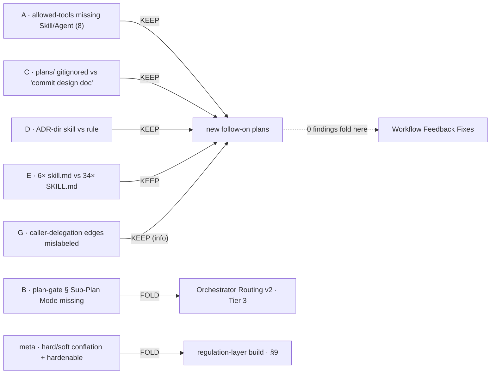

# Orchestration Audit

> Generated by the fail-successfully fan-out audit (`scripts/orchestration-audit.workflow.mjs`)
> against `docs/reference/gate-map.json` (140 edges) + `component-inventory.json` (76 components).
> **Diagnose + triage only** — every fix flows out as a scoped follow-on plan.
> Run: `wf_e1556a7c-cbe`, 2026-06-19. **Partial run** — see *Run & coverage* below.

## Run & coverage (read first)

The audit ran as a skill/main-context-orchestrated Workflow fan-out wrapped in the
`fail-successfully` primitive (`scripts/lib/fail-successfully.mjs`). It **completed without
deadlocking** even though a mid-run **session-token limit killed ~200 of its 290 agents** — the
watchdog + quorum barrier turned a catastrophic mass-failure into partial results instead of the
#76-class freeze it was built to prevent. That is the primitive's first real validation.

**What that means for coverage:**

| Dimension | Find | Verify (3-vote quorum) | In this report |
|---|---|---|---|
| dead-refs | ✅ | ✅ | confirmed |
| invocation | ✅ | ✅ | confirmed |
| conventions | ✅ | ⚠️ partial (3 of N verified before the limit) | confirmed subset |
| tool-interact | ✅ | ❌ verify killed by session limit | **found-but-lost** (overlaps invocation findings) |
| triggers | ✅ | ❌ verify killed by session limit | **found-but-lost** (re-run needed) |
| casing | ✅ | ❌ verify killed | **recovered directly** (below) |
| per-edge classification | ✅ | n/a | full 140 (deduped from finders) |

The unverified findings were dropped by the quorum filter (their votes returned null), so the
**~74 unconfirmed findings are not recoverable from the run output** — a cheaper re-run (haiku
finders/verify, batched verify, see *Cost lesson*) would recover triggers + tool-interact. The
per-edge classification (finders' `edgeClassifications`) **did** survive in full.

**Cost lesson (the reason for the limit):** the `agent()` calls were not pinned to a model, so all
290 ran on the inherited session model (Opus 4.8); and the verify stage spawns 3 votes per finding,
so ~89 findings → ~267 verify agents. Both are fixed for any future run by pinning
`model: 'haiku'` on finders/verify + `model: 'sonnet'` on synthesize, and batching verify
(one agent reviews ~10 findings) — turning ~267 verify agents into ~9.

**Why it didn't deadlock — the per-unit FSM (`runUnit`) that wrapped every agent.** A mass failure
drove ~200 units to `TIMED_OUT`/`FAILED` → `ABANDONED`; because `runUnit` always reaches a terminal
state and `quorumBarrier` proceeds on a *quorum of terminal states* (not all-`SUCCEEDED`), the run
finished on the survivors instead of waiting forever. Captured `SUCCEEDED` values made abandoning
non-lossy.

## Subagent-hook verification (load-bearing — Phase 2 Task 1)

**Verified: hooks DO fire for subagent tool calls.** Per the official Claude Code hooks docs
([code.claude.com/docs/en/agent-sdk/hooks](https://code.claude.com/docs/en/agent-sdk/hooks),
*Intercept and control agent behavior with hooks*):

> "`agent_id` and `agent_type` are populated when the hook fires inside a subagent."

`PreToolUse`/`PostToolUse` fire for subagent calls and carry `agent_id`/`agent_type` to
distinguish them from main-thread calls; `SubagentStop` fires when a subagent finishes. (Not
documented: whether a subagent's frontmatter `Stop` auto-converts to `SubagentStop`.)

**Consequence for `hardenable`:** the salvaged *"subagent hook bypass"* premise is **false**. Hard
gates (`PreToolUse` exit-2 / `PostToolUse`) **can** police subagent execution, so the hard-gate
design space is *wider* than assumed — matured edges that run inside subagents remain
hook-hardening candidates. This is a direct input to the regulation-layer build.

## Per-edge classification — result

140 canonical edges, fully covered (0 default-filled). Distribution after deduping the 316 finder
classifications to the 140 unique edges:

- **enforcement:** 98 soft · 19 hard · 23 none-yet
- **maturity:** 114 matured · 26 settling
- **hardenable:** 91 no · 32 already · 17 yes
- **confidence:** 122 high · 16 medium · 2 low

**Meta-finding — the hard/soft axis is being conflated.** Finders disagreed on the enforcement
label for **56 of 140 edges** (list below). The disagreement is systematic: the gate-map records
*component→component markdown references*, and by the executor-spectrum
(`docs/explanation/features/orchestration-gating.md`, ADR-0002) **every such edge is *soft*** — it
is an instruction an LLM interprets, not a hook the runtime enforces. The finders' "hard" label
actually meant *"explicit named `Skill{}`/`Agent{}` invocation"* (vs "soft" = prose/registry
reference) — an **invocation-explicitness** axis, not an **enforcement-hardness** axis. True hard
gates (hooks) are not gate-map edges at all. The regulation layer needs one unambiguous taxonomy:
*hard = hook-enforced; soft = markdown-interpreted; the explicit-vs-prose distinction is a separate,
orthogonal axis.* The 32 "already"/17 "yes" hardenable edges are the **matured explicit-invocation
edges** — the candidate set for hook-backed hardening, now feasible because hooks reach subagents.

### Edges with conflicting finder enforcement labels (56)

- `creating-tools->writing-skills` — hard / soft
- `doc-author->architecture-decision-records` — soft / none-yet
- `doc-backfill->architecture-decision-records` — soft / none-yet
- `doc-backfill->git-manager` — hard / soft
- `doc-tools->doc-author` — soft / none-yet
- `docs-refresh->architecture-decision-records` — hard / soft
- `docs-refresh->git-manager` — soft / none-yet
- `docs-refresh->openapi-spec-generation` — hard / soft
- `docs-refresh->tutorial-engineer` — soft / hard
- `docs-status->project-setup` — none-yet / soft
- `jira-workflow-manager->researcher` — soft / hard
- `new-repo-setup->architect` — soft / none-yet
- `new-repo-setup->creating-tools` — soft / none-yet
- `new-repo-setup->integration-engineer` — soft / none-yet
- `new-repo-setup->plan-management` — soft / none-yet
- `new-repo-setup->researcher` — soft / none-yet
- `new-repo-setup->test-builder` — soft / none-yet
- `new-repo-setup->test-strategy` — soft / none-yet
- `new-repo-setup->writing-agents` — soft / none-yet
- `new-repo-setup->writing-rules` — soft / none-yet
- `plan-gate->executing-plans` — hard / soft
- `plan-gate->test-strategy` — soft / hard
- `plan-management->doc-author` — soft / hard
- `plan-management->jira-workflow-manager` — soft / none-yet
- `plan-management->subagent-driven-development` — soft / none-yet
- `plan-management->systematic-debugging` — soft / none-yet
- `planning->plan-management` — soft / hard
- `planning->test-strategy` — soft / hard
- `project-setup->infra-init` — hard / soft
- `review-workflow->creating-tools` — hard / soft
- `review-workflow->writing-skills` — hard / soft
- `stack-hats->project-setup` — soft / none-yet
- `subagent-driven-development->researcher` — soft / none-yet
- `subagent-driven-development->systematic-debugging` — soft / hard
- `test-builder->git-manager` — none-yet / hard
- `test-runner->systematic-debugging` — soft / hard
- `using-git-worktrees->finishing-a-development-branch` — soft / none-yet
- `using-superpowers->architect` — soft / none-yet
- `using-superpowers->creating-tools` — soft / none-yet
- `using-superpowers->git-manager` — none-yet / soft
- `using-superpowers->infra-init` — soft / none-yet
- `using-superpowers->integration-engineer` — soft / none-yet
- `using-superpowers->test-builder` — soft / none-yet
- `using-superpowers->test-strategy` — soft / none-yet
- `vet-capability-fit->vet-reputation` — soft / none-yet
- `vet-capability-fit->vet-security` — soft / none-yet
- `vet-install->vet-capability-fit` — hard / soft
- `vet-install->vet-reputation` — hard / soft
- `vet-security->ai-tool-security-reviewer` — hard / soft
- `vet-security->vet-capability-fit` — soft / none-yet
- `vet-security->vet-reputation` — soft / none-yet
- `writing-plans->executing-plans` — none-yet / soft
- `writing-plans->finishing-a-development-branch` — soft / none-yet
- `writing-plans->subagent-driven-development` — soft / none-yet
- `writing-plans->writing-agents` — soft / none-yet
- `writing-plans->writing-skills` — soft / none-yet

## Confirmed findings (15, 3-vote quorum)

### Dead references (2) — a designed mode that was never written into the skill

Both cite `plan-gate § Sub-Plan Mode`, **which does not exist** in `skills/plan-gate/SKILL.md`
(its body is Steps 1–6, with no sub-plan-mode section and no mention of `adherence-audit`):

- `rules/plan-docs.md:30` → cites `plan-gate/skill.md § Sub-Plan Mode` + claims adherence-audit /
  test-strategy / test-builder behavior runs there.
- `skills/writing-plans/SKILL.md:321` (+ `:171`) → same dead anchor; `:171` lists `adherence-audit`
  as a plan-gate step the skill body does not contain.

> **Validated live this session:** Phase 2's own plan-gate ran in "sub-plan mode" with
> adherence-audit — assembled from these scattered references, **not** from a plan-gate SKILL.md
> section, because that section doesn't exist. The audit caught a drift we were already living.

### Invocation (10) — `allowed-tools` omits the tool the skill invokes with

Each skill prescribes a `Skill{}`/`Agent{}` call its frontmatter `allowed-tools` does not grant
(names/casing/args are all correct — only the capability declaration is missing):

| Source | Prescribes | `allowed-tools` gap |
|---|---|---|
| `skills/review-workflow/skill.md:9` | `Skill{different-viewpoint}` (:106), `Skill{git-manager}` (:187), creating-tools/writing-skills (:137,211) | no `Skill` |
| `skills/systematic-debugging/SKILL.md:4` | `dispatching-parallel-agents` (:163,216), mandatory `Skill{plan-management}` (:244) | no `Skill`/`Agent` |
| `skills/plan-management/SKILL.md:11` | `git-manager` + `doc-author` in close-subplan (:270,281) | no `Skill` |
| `skills/executing-plans/SKILL.md:4` | `Skill{systematic-debugging}` (:59), `pulser` Bash (:66) | no `Skill`/`Bash` |
| `skills/docs-refresh/SKILL.md:4` | `Skill{openapi-spec-generation/doc-author/adr/changelog}` routes | no `Skill` (has `Task` not `Agent`) |
| `skills/using-superpowers/SKILL.md:147` | lists `git-manager` (a skill) under an "agents" table header | mislabels skill as agent |
| `skills/doc-author/SKILL.md:123` | *explicitly does NOT invoke* git-manager (caller commits) | **correct by design** — not a defect |

> **Caveat (needs confirmation before fixing):** whether `allowed-tools` actually *restricts* a
> skill whose instructions run in the main context (which already holds all tools), or is advisory.
> If enforced → these block real invocations. If advisory → doc-hygiene. The fix plan must resolve
> this first.

### Conventions (3)

- `skills/architecture-decision-records/SKILL.md:332-340` — teaches ADRs under `docs/adr/`; rule
  `rules/doc-tools.md` mandates `docs/explanation/adr/NNNN-<slug>.md`. **Hierarchy-resolved** (rule
  > skill; doc-tools.md:77 makes this explicit) but the upstream skill text is stale.
- `skills/changelog-automation/SKILL.md` (+ openapi/mermaid/reference/tutorial/docs-architect) —
  unmodified upstream specialists; generic conventions not yet reconciled with the workflow's, but
  reached only via the `docs-refresh` router → **latent drift, no active conflict.**
- `rules/planning.md:73` — **commit contradiction.** planning.md says `plans/` is gitignored and
  plan docs are "not committed deliverables"; `brainstorming/SKILL.md:68,228` and
  `writing-plans/SKILL.md:257-260,285` instruct *committing* the design/plan docs.
  **Hierarchy-resolved** (rule wins → don't commit) but the skills carry stale commit steps.
  (Matches the known `feedback_plan_commit_steps` observation; lived this session — brainstorming's
  "commit the design doc" step was correctly skipped because `plans/` is gitignored.)

### Casing (recovered directly — git-authoritative)

**6 of 40 skills use lowercase `skill.md`**; the other 34 use `SKILL.md`:
`adherence-audit`, `creating-tools`, `different-viewpoint`, `different-viewpoints-lite`,
`writing-agents`, `writing-rules`. On the case-insensitive Windows FS this is invisible, but on a
case-sensitive CI (Linux/macOS) a reference with the wrong casing is a **broken path** — and
several findings above cite lowercase `…/skill.md` for skills git tracks as `SKILL.md`
(e.g. `review-workflow`), so the inconsistency compounds the dead-reference risk. Standardize to
one casing (recommend `SKILL.md`, the 34-file majority).

## Triaged fix list (fold / supersede / keep)

| # | Finding | Disposition | Target / rationale |
|---|---|---|---|
| A | `allowed-tools` omits invoked `Skill`/`Agent` (8 edges) | **keep** | New follow-on "allowed-tools hygiene sweep" — but first confirm whether allowed-tools is enforced for skills-in-main-context. Highest-volume finding. |
| B | `plan-gate § Sub-Plan Mode` cited but absent; adherence-audit not in plan-gate body | **fold** | → **Orchestrator Routing v2** Tier 3 ("plan-gate parallel dispatch with soft-gate adherence-audit") — that item adds adherence-audit to plan-gate; writing the missing section belongs there. |
| C | `plans/` gitignored vs brainstorming/writing-plans "commit the design doc" | **keep** | New follow-on; aligns with `feedback_plan_commit_steps`. Strip/repair the commit steps or add a carve-out in planning.md. |
| D | ADR-dir: skill (`docs/adr/`) vs rule (`docs/explanation/adr/`) | **keep** | Doc-hygiene: reconcile the upstream `architecture-decision-records` skill text (hierarchy already resolves behavior). |
| E | 6 skills use `skill.md` vs 34 `SKILL.md` | **keep** | New follow-on: standardize casing → `SKILL.md`; repairs latent case-sensitive-CI dead refs. |
| F | Upstream specialists' generic conventions unreconciled | **keep (low)** | Informational; revisit if any specialist is wired into automation. |
| G | gate-map labels caller-delegation edges (doc-author→git-manager, test-builder→git-manager) as invocations | **keep (info)** | Mark caller-delegation ("does NOT invoke; caller commits") distinctly in `orchestration-gating.md` so the edge isn't misread as a direct call. |
| — | 56-conflict hard/soft axis + hardenable-given-hooks | **fold** | → regulation-layer build (`orchestration-regulation-layer.md §9`): define one enforcement taxonomy; matured explicit-invocation edges are the hook-hardening candidates. |

**Supersede:** none — no finding obsoletes an existing backlog item.

**Cross-check vs. the two named backlogs:** only **B** maps onto an existing sub-item (Orchestrator
Routing v2 Tier 3). Nothing maps onto **Workflow Feedback Fixes** (#61/49/54/50/55/48/56/57). The
two directly-relevant Backlog items ("Workflow orchestration for review agents"; "Post-execution
code-review gate") are unaffected — this audit *is* an instance of the former's inversion pattern.

## Per-edge classification table (generated, 140 edges)

> `enforcement`/`hardenable` here use the finders' *invocation-explicitness* sense (see the
> meta-finding). Read alongside it: all are markdown-soft by the executor-spectrum.

| from | to | enforcement | maturity | hardenable | conf | note |
|------|----|-------------|----------|------------|------|------|
| ai-tool-security-reviewer | vet-security | soft | matured | no | medium |  |
| architect | researcher | soft | matured | no | high |  |
| brainstorming | researcher | soft | matured | no | high |  |
| brainstorming | writing-plans | hard | matured | already | high |  |
| creating-tools | writing-agents | soft | matured | yes | high |  |
| creating-tools | writing-rules | soft | matured | yes | high |  |
| creating-tools | writing-skills | soft | matured | already | high | conflict: hard/soft |
| doc-author | architecture-decision-records | none-yet | matured | no | high | conflict: soft/none-yet |
| doc-author | docs-architect | soft | matured | no | high |  |
| doc-author | git-manager | none-yet | matured | no | high |  |
| doc-backfill | architecture-decision-records | none-yet | settling | no | high | conflict: soft/none-yet |
| doc-backfill | doc-author | soft | matured | no | high |  |
| doc-backfill | git-manager | soft | matured | yes | medium | conflict: hard/soft |
| doc-tools | doc-author | soft | matured | no | high | conflict: soft/none-yet |
| doc-tools | project-setup | soft | matured | no | high |  |
| docs-refresh | architecture-decision-records | soft | matured | no | high | conflict: hard/soft |
| docs-refresh | changelog-automation | soft | matured | no | high |  |
| docs-refresh | doc-author | soft | matured | no | high |  |
| docs-refresh | docs-architect | soft | matured | no | high |  |
| docs-refresh | git-manager | none-yet | matured | no | high | conflict: soft/none-yet |
| docs-refresh | mermaid-expert | soft | settling | yes | high |  |
| docs-refresh | openapi-spec-generation | soft | matured | no | high | conflict: hard/soft |
| docs-refresh | reference-builder | soft | matured | no | high |  |
| docs-refresh | tutorial-engineer | soft | settling | yes | high | conflict: soft/hard |
| docs-status | project-setup | soft | matured | no | high | conflict: none-yet/soft |
| executing-plans | e2e-init | soft | matured | no | high |  |
| executing-plans | git-manager | soft | matured | yes | high |  |
| executing-plans | systematic-debugging | hard | matured | already | high |  |
| executing-plans | test-runner | hard | matured | already | high |  |
| finishing-a-development-branch | git-manager | soft | matured | yes | high |  |
| finishing-a-development-branch | infra-init | none-yet | settling | no | medium |  |
| git-manager | secrets-handling | soft | matured | no | high |  |
| handoff | plan-management | soft | matured | already | high |  |
| install-vetting | vet-capability-fit | soft | matured | no | high |  |
| install-vetting | vet-install | soft | matured | no | high |  |
| install-vetting | vet-reputation | soft | matured | no | high |  |
| install-vetting | vet-security | soft | matured | no | high |  |
| integration-test-constraints | systematic-debugging | soft | settling | no | high |  |
| jira-workflow-manager | researcher | soft | matured | no | high | conflict: soft/hard |
| mcp-governance | git-manager | soft | matured | yes | high |  |
| mcp-governance | jira-workflow-manager | soft | matured | yes | high |  |
| new-repo-setup | architect | none-yet | settling | no | high | conflict: soft/none-yet |
| new-repo-setup | creating-tools | soft | matured | no | high | conflict: soft/none-yet |
| new-repo-setup | e2e-init | soft | settling | yes | medium |  |
| new-repo-setup | git-manager | soft | matured | no | high |  |
| new-repo-setup | infra-init | soft | matured | no | high |  |
| new-repo-setup | integration-engineer | soft | matured | no | high | conflict: soft/none-yet |
| new-repo-setup | jira-workflow-manager | soft | matured | no | high |  |
| new-repo-setup | plan-management | soft | matured | no | high | conflict: soft/none-yet |
| new-repo-setup | researcher | soft | matured | no | high | conflict: soft/none-yet |
| new-repo-setup | test-builder | soft | matured | already | high | conflict: soft/none-yet |
| new-repo-setup | test-strategy | soft | matured | no | high | conflict: soft/none-yet |
| new-repo-setup | writing-agents | soft | matured | no | high | conflict: soft/none-yet |
| new-repo-setup | writing-rules | soft | matured | already | high | conflict: soft/none-yet |
| plan-docs | brainstorming | none-yet | matured | no | high |  |
| plan-docs | finishing-a-development-branch | soft | matured | no | high |  |
| plan-docs | plan-gate | soft | matured | already | high |  |
| plan-docs | plan-management | soft | matured | no | high |  |
| plan-docs | systematic-debugging | soft | matured | no | high |  |
| plan-docs | writing-plans | soft | matured | already | high |  |
| plan-gate | architect | hard | matured | already | high |  |
| plan-gate | executing-plans | hard | matured | already | high | conflict: hard/soft |
| plan-gate | jira-workflow-manager | soft | matured | already | high |  |
| plan-gate | plan-management | hard | matured | already | high |  |
| plan-gate | test-builder | hard | matured | already | high |  |
| plan-gate | test-strategy | hard | matured | already | high | conflict: soft/hard |
| plan-gate | writing-plans | none-yet | matured | no | high |  |
| plan-management | brainstorming | soft | matured | no | high |  |
| plan-management | doc-author | hard | settling | already | high | conflict: soft/hard |
| plan-management | executing-plans | none-yet | settling | no | low |  |
| plan-management | git-manager | soft | matured | no | high |  |
| plan-management | jira-workflow-manager | none-yet | matured | no | high | conflict: soft/none-yet |
| plan-management | subagent-driven-development | soft | matured | no | high | conflict: soft/none-yet |
| plan-management | systematic-debugging | none-yet | matured | no | medium | conflict: soft/none-yet |
| plan-management | writing-plans | soft | settling | no | medium |  |
| planning | architect | hard | matured | already | high |  |
| planning | integration-engineer | soft | matured | no | high |  |
| planning | plan-management | soft | matured | already | high | conflict: soft/hard |
| planning | researcher | soft | matured | no | high |  |
| planning | subagent-driven-development | soft | matured | no | medium |  |
| planning | test-strategy | hard | matured | already | high | conflict: soft/hard |
| plugin-lifecycle | creating-tools | soft | matured | no | high |  |
| plugin-lifecycle | using-superpowers | soft | matured | no | high |  |
| project-setup | e2e-init | soft | matured | yes | high |  |
| project-setup | infra-init | hard | matured | already | high | conflict: hard/soft |
| project-setup | vet-install | soft | matured | already | high |  |
| project-setup | vet-reputation | soft | matured | no | high |  |
| review-workflow | creating-tools | hard | matured | already | high | conflict: hard/soft |
| review-workflow | different-viewpoint | soft | settling | yes | high |  |
| review-workflow | git-manager | soft | matured | already | high |  |
| review-workflow | writing-skills | hard | matured | already | high | conflict: hard/soft |
| stack-hats | architect | soft | matured | no | high |  |
| stack-hats | executing-plans | soft | matured | no | high |  |
| stack-hats | project-setup | soft | matured | no | high | conflict: soft/none-yet |
| stack-hats | subagent-driven-development | soft | matured | no | high |  |
| subagent-driven-development | jira-workflow-manager | soft | matured | already | high |  |
| subagent-driven-development | plan-management | hard | settling | already | high |  |
| subagent-driven-development | researcher | none-yet | settling | no | low | conflict: soft/none-yet |
| subagent-driven-development | systematic-debugging | hard | matured | already | high | conflict: soft/hard |
| subagent-driven-development | test-runner | hard | matured | already | high |  |
| systematic-debugging | dispatching-parallel-agents | soft | settling | no | high |  |
| systematic-debugging | plan-management | soft | settling | yes | medium |  |
| test-builder | git-manager | hard | matured | already | high | conflict: none-yet/hard |
| test-runner | e2e-init | soft | matured | no | high |  |
| test-runner | systematic-debugging | hard | matured | already | high | conflict: soft/hard |
| using-git-worktrees | finishing-a-development-branch | soft | matured | no | high | conflict: soft/none-yet |
| using-git-worktrees | infra-init | soft | matured | no | high |  |
| using-superpowers | architect | none-yet | settling | no | high | conflict: soft/none-yet |
| using-superpowers | creating-tools | soft | matured | no | high | conflict: soft/none-yet |
| using-superpowers | git-manager | none-yet | settling | yes | medium | conflict: none-yet/soft |
| using-superpowers | infra-init | soft | matured | already | high | conflict: soft/none-yet |
| using-superpowers | integration-engineer | soft | matured | no | high | conflict: soft/none-yet |
| using-superpowers | jira-workflow-manager | soft | matured | no | high |  |
| using-superpowers | plan-gate | soft | matured | no | high |  |
| using-superpowers | researcher | soft | matured | no | high |  |
| using-superpowers | test-builder | soft | matured | no | high | conflict: soft/none-yet |
| using-superpowers | test-strategy | none-yet | settling | no | high | conflict: soft/none-yet |
| vet-capability-fit | researcher | soft | matured | no | high |  |
| vet-capability-fit | vet-reputation | none-yet | settling | no | high | conflict: soft/none-yet |
| vet-capability-fit | vet-security | none-yet | settling | no | high | conflict: soft/none-yet |
| vet-install | vet-capability-fit | soft | matured | already | medium | conflict: hard/soft |
| vet-install | vet-reputation | soft | matured | no | high | conflict: hard/soft |
| vet-install | vet-security | soft | matured | no | high |  |
| vet-security | ai-tool-security-reviewer | soft | matured | no | high | conflict: hard/soft |
| vet-security | vet-capability-fit | none-yet | settling | no | high | conflict: soft/none-yet |
| vet-security | vet-reputation | none-yet | settling | no | high | conflict: soft/none-yet |
| workflow-phases | git-manager | soft | matured | yes | high |  |
| workflow-phases | jira-workflow-manager | soft | matured | yes | high |  |
| workflow-phases | plan-management | soft | matured | no | medium |  |
| writing-plans | executing-plans | soft | matured | no | medium | conflict: none-yet/soft |
| writing-plans | finishing-a-development-branch | none-yet | settling | no | medium | conflict: soft/none-yet |
| writing-plans | git-manager | soft | matured | yes | high |  |
| writing-plans | researcher | soft | matured | no | high |  |
| writing-plans | subagent-driven-development | soft | matured | no | high | conflict: soft/none-yet |
| writing-plans | writing-agents | none-yet | settling | no | medium | conflict: soft/none-yet |
| writing-plans | writing-rules | none-yet | settling | no | medium |  |
| writing-plans | writing-skills | none-yet | settling | no | medium | conflict: soft/none-yet |
| writing-rules | writing-agents | soft | matured | no | high |  |
| writing-rules | writing-skills | soft | matured | no | high |  |
| writing-skills | creating-tools | soft | matured | no | high |  |
