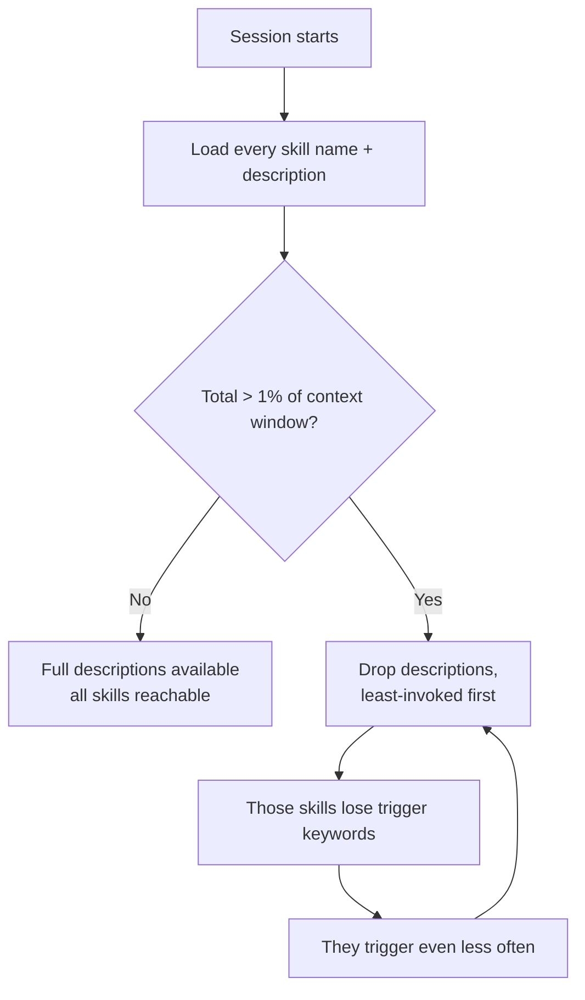

# Skill Surface Standard

The target this repo's installed surface aims at, and the mechanism that makes it matter.
`docs/reference/skill-surface-policy.json` declares the current surface;
`scripts/skill-surface.test.mjs` fails `npm test` on drift. This file explains what to aim for.

Verified against [code.claude.com/docs/en/skills](https://code.claude.com/docs/en/skills)
on 2026-08-06.

## The mechanism

Every skill's `name` + `description` + `when_to_use` loads at session start, whether or not the
skill is used. Bodies load on trigger; the **listing** is the always-on cost.

Two caps apply:

| Cap | Value | Setting that changes it |
|---|---|---|
| Total listing budget | **1% of the model's context window** | `skillListingBudgetFraction`, or `SLASH_COMMAND_TOOL_CHAR_BUDGET` for a fixed char count |
| Per-entry text | **1,536 chars** — truncated mid-sentence beyond it | `skillListingMaxDescChars` |

The overflow behavior is the part worth internalizing:

> When the listing overflows, Claude Code drops descriptions starting with the skills you invoke
> **least**.

A rarely-used skill loses its trigger keywords, which makes it harder to invoke, which keeps it
rarely used. Overflow is self-reinforcing, and it degrades silently — nothing errors. **Overlap
evicts your own skills.**

## Where this repo sits

Measured 2026-08-06, after removing `superpowers`, `feature-dev`, `skill-creator`, `plugin-dev`,
and moving `marketing-skills` to project scope:

| | Value |
|---|---|
| Local skills | 42 |
| Local description chars | 12,749 (~3,200 tokens) |
| Largest single entry | 654 chars — comfortably under the 1,536 cap |
| Entries over the cap | 0 |
| User-scope plugins | 8 |
| Plugin always-on cost | ~4,084 tokens (was ~16,202) |

Against the budget:

| Model context | Listing budget | Local skills alone | Verdict |
|---|---|---|---|
| 1M | ~40,000 chars | 12,749 (32%) | comfortable, room for plugins |
| 200K | ~8,000 chars | 12,749 (159%) | **overflows before a single plugin loads** |

This is the standard's central point: **there is no absolute "clean" number — only a ratio against
the model you actually run.** The surface that is comfortable on a 1M-context model overflows on a
200K one. Published rules of thumb (commonly ~15–25 skills at 200K, ~75–125 at 1M) follow directly
from the same 1% arithmetic; they are not independent advice.

## The standard

1. **A plugin is the unit of cost, and it is the expensive one.** A plugin's entire skill listing
   loads in every session in every repo it is scoped to. `marketing-skills` was 47 skills and
   ~12,006 tokens — 4.5× this repo's whole local skill set, for one plugin. Audit plugins before
   skills; the leverage is not close.
2. **Scope narrowly.** `--scope project` costs other repos nothing. User scope is for genuinely
   cross-project tools. Verify what you got: `marketing-skills` sat at user scope for seven weeks
   while the registry claimed project.
3. **Install for a capability nothing local covers.** Overlap is the failure mode, not size.
   `superpowers` and `feature-dev` were removed because every skill had a local equivalent —
   they were pure eviction pressure.
4. **Own the reference, don't suppress the plugin.** Reaching 3 useful skills out of 8 by paying
   for all 8 plus an always-on rule listing the other 5 as forbidden is worse than copying the 3
   references locally. A cached plugin snapshot also goes stale invisibly — see
   `plugins/registry.md` § plugin-dev.
5. **Declare the surface so drift fails a test.** Plugin state is machine-local
   (`~/.claude/plugins/installed_plugins.json`) with no repo representation, so without a
   committed declaration there is nothing to diff. Every prior cleanup here regressed unnoticed.
6. **Keep each entry well under 1,536 chars,** front-loading trigger keywords — truncation takes
   the tail, which is where keywords usually end up.

## When the surface is over budget

In order of leverage:

1. **Remove or re-scope a plugin.** Largest single lever by an order of magnitude.
2. **Set low-priority local skills to `"name-only"`** in `skillOverrides` — they stay invocable by
   name and stop consuming description budget. **This does not work on plugin skills**: the
   platform states plugin skills are unaffected by `skillOverrides`, and the only levers there are
   `claude plugin disable` and uninstall. Writing an override for a plugin skill produces a
   silently-ignored config.
3. **Trim descriptions at the source.** Key use case first.
4. **Raise `skillListingBudgetFraction`** — last resort. It buys headroom by spending context that
   the actual work would otherwise use.

## Related

- `docs/reference/skill-surface-policy.json` — the declared surface, enforced under `npm test`
- `plugins/registry.md` — per-plugin lifecycle state and removal rationale
- `plugins/history.md` — the audit trail of installs, scope corrections, and removals
