# Brainstorming Ideas Into Designs

Help turn ideas into fully formed designs and specs through natural collaborative dialogue.

Start by understanding the current project context, then ask questions one at a time to refine the idea. Once you understand what you're building, present the design and get user approval.

<HARD-GATE>
Do NOT invoke any implementation skill, write any code, scaffold any project, or take any implementation action until you have presented a design and the user has approved it. This applies to EVERY project regardless of perceived simplicity.
</HARD-GATE>

## Anti-Pattern: "This Is Too Simple To Need A Design"

Every project goes through this process. A todo list, a single-function utility, a config change — all of them. "Simple" projects are where unexamined assumptions cause the most wasted work. The design can be short (a few sentences for truly simple projects), but you MUST present it and get approval.

## Checklist

You MUST create a task for each of these items and complete them in order:

1. **Explore project context** — read project.json → read codebase-entry file if set → read plan doc if one exists → stop (see Orientation Protocol in using-superpowers)
1.5. **Establish branch context** (new top-level design work only) — ensure a fresh isolated branch exists before design begins, so design and early work never land on the previous epic's branch. See the Establish Branch Context section below. SKIP entirely for sub-plans, for continuing an active in-progress plan, and when already on a fresh feature branch whose `claude.expectedBranch` is unset or points to a non-completed plan.
2. **Offer visual companion** (if topic will involve visual questions) — this is its own message, not combined with a clarifying question. See the Visual Companion section below.
3. **Dispatch light-research subagent** — `subagent_type: general-purpose`, `model: haiku`; append result to Research appendix. Skip if `[skip-research]` in info dump. See Research Bookends section below.
4. **User gate — review light research** — "Light research complete. Review before I ask questions?" Wait for user input before proceeding.
5. **Ask clarifying questions** — one at a time, understand purpose/constraints/success criteria
6. **Dispatch deep-research subagent** — `subagent_type: general-purpose`, `model: haiku`; append result to Research appendix. Skip if `[skip-research]` in info dump. See Research Bookends section below.
7. **User gate — review deep research** — "Deep research complete. Review before I draft the design?" Wait for user input before proceeding.
8. **Propose 2-3 approaches** — with trade-offs and your recommendation
9. **Present design** — in sections scaled to their complexity, get user approval after each section
10. **Ask the ADR-candidate question** — Before writing the design doc, ask the user: "Is this an ADR candidate? (yes/no — captured in plan journal for promotion at sub-plan close)"
    - If yes: when writing the design doc in Step 12, include `[adr-candidate]` in the design doc's frontmatter or in a clearly-marked section so `writing-plans` can propagate the tag to the journal's initial entry.
    - If no: continue normally; no tag added.
    - The user's answer is one sentence — if they're unsure, default to "yes" (low cost; trivially declined later at plan-close).
    - ADRs are orthogonal to C4 layer — any plan may produce zero or more ADRs regardless of which C4 layer it operates at. Answer this question independently of Step 10.5's layer classification.
10.5. **Classify C4 layer(s) internally + draft Docs Affected** — INTERNAL STEP, no user prompt.

    Based on the brainstorming context (the user's info dump, your clarifying questions, and the user's answers), classify which C4 abstraction layer(s) this plan operates at:

    - **C1 System Context** — new external actor or upstream system mentioned
    - **C2 Containers** — new service / binary / deployment unit mentioned
    - **C3 Components** — new or modified module / feature / component mentioned
    - **None** — refactor / cleanup / bug-fix only, no doc impact

    Multi-layer plans are valid (e.g., C2 + C3 for a new service that also has internal components).

    **Per classification, scan existing docs:**

    - C1 or C2 detected → Read `docs/explanation/architecture.md` (if it exists).
    - C3 detected → Scan `docs/explanation/features/*.md`. For each existing file, match by name/concept similarity to the work being planned. Mark matches as candidates for `UPDATE`.

    **Draft the Docs Affected list:**

    For each existing match: `- <path> — UPDATE — <one-line change-summary>`.
    For each proposed new feature-doc: `- <path> — NEW — <one-line description>`.
    For C1/C2 work touching architecture.md: `- docs/explanation/architecture.md — UPDATE — <one-line>`.

    **Edge case — `[adr-candidate]` tagged in Step 10 AND classification = None:**

    Insert an inline NOTE in the design draft asking the user to confirm or adjust:

    > NOTE: This plan was tagged `[adr-candidate]` in Step 10 but classified as no-doc-impact in Step 10.5. ADRs hang off feature-docs or architecture.md. Reconsider Docs Affected before approving the design.

    **Output:** The Docs Affected list is carried forward into Step 12 (write design doc) as a required section. No user prompt during this step — the user reviews the Docs Affected section when the design draft is presented.
12. **Write design doc** — save to `plans/<slug>/<slug>-design.md` and commit; merge Research appendix into the doc. The design doc MUST include a `## Docs Affected` section — output of Step 10.5. Lists which feature-docs / architecture.md this plan affects, with C4 layer tagging and per-entry action (`UPDATE` or `NEW`). Drives close-subplan's doc-author serial pass.
13. **Spec self-review** — quick inline check for placeholders, contradictions, ambiguity, scope (see below)
14. **User reviews written spec** — ask user to review the spec file before proceeding
15. **Transition to implementation** — invoke writing-plans skill to create implementation plan

## Process Flow

```dot
digraph brainstorming {
    "Orient to repo context" [shape=box];
    "Step 1.5 — new top-level design work?\n(skip for sub-plan / continued plan)" [shape=diamond];
    "Establish branch context\nwip/<provisional-slug> off fresh main\n(confirm first)" [shape=box];
    "Visual questions ahead?" [shape=diamond];
    "Offer Visual Companion\n(own message, no other content)" [shape=box];
    "[skip-research] in info dump?" [shape=diamond];
    "Dispatch light-research subagent\n(general-purpose, haiku)\nAppend to Research appendix" [shape=box];
    "User reviews light research?\n'Light research complete.\nReview before I ask questions?'" [shape=diamond];
    "Ask clarifying questions" [shape=box];
    "Dispatch deep-research subagent\n(general-purpose, haiku)\nAppend to Research appendix" [shape=box];
    "User reviews deep research?\n'Deep research complete.\nReview before I draft the design?'" [shape=diamond];
    "Propose 2-3 approaches" [shape=box];
    "Present design sections" [shape=box];
    "User approves design?" [shape=diamond];
    "Step 10.5 — internal C4 classification\nDraft Docs Affected list" [shape=box];
    "Write design doc\n(merge Research appendix)" [shape=box];
    "Spec self-review\n(fix inline)" [shape=box];
    "User reviews spec?" [shape=diamond];
    "Invoke writing-plans skill" [shape=doublecircle];

    "Orient to repo context" -> "Step 1.5 — new top-level design work?\n(skip for sub-plan / continued plan)";
    "Step 1.5 — new top-level design work?\n(skip for sub-plan / continued plan)" -> "Establish branch context\nwip/<provisional-slug> off fresh main\n(confirm first)" [label="yes — fire"];
    "Step 1.5 — new top-level design work?\n(skip for sub-plan / continued plan)" -> "Visual questions ahead?" [label="no — skip"];
    "Establish branch context\nwip/<provisional-slug> off fresh main\n(confirm first)" -> "Visual questions ahead?";
    "Visual questions ahead?" -> "Offer Visual Companion\n(own message, no other content)" [label="yes"];
    "Visual questions ahead?" -> "[skip-research] in info dump?" [label="no"];
    "Offer Visual Companion\n(own message, no other content)" -> "[skip-research] in info dump?";
    "[skip-research] in info dump?" -> "Ask clarifying questions" [label="yes — skip both research stages"];
    "[skip-research] in info dump?" -> "Dispatch light-research subagent\n(general-purpose, haiku)\nAppend to Research appendix" [label="no"];
    "Dispatch light-research subagent\n(general-purpose, haiku)\nAppend to Research appendix" -> "User reviews light research?\n'Light research complete.\nReview before I ask questions?'";
    "User reviews light research?\n'Light research complete.\nReview before I ask questions?'" -> "Ask clarifying questions" [label="user responds\n(may redirect questions)"];
    "Ask clarifying questions" -> "Dispatch deep-research subagent\n(general-purpose, haiku)\nAppend to Research appendix";
    "Dispatch deep-research subagent\n(general-purpose, haiku)\nAppend to Research appendix" -> "User reviews deep research?\n'Deep research complete.\nReview before I draft the design?'";
    "User reviews deep research?\n'Deep research complete.\nReview before I draft the design?'" -> "Propose 2-3 approaches" [label="user responds"];
    "Propose 2-3 approaches" -> "Present design sections";
    "Present design sections" -> "User approves design?";
    "User approves design?" -> "Present design sections" [label="no, revise"];
    "User approves design?" -> "Step 10.5 — internal C4 classification\nDraft Docs Affected list" [label="yes"];
    "Step 10.5 — internal C4 classification\nDraft Docs Affected list" -> "Write design doc\n(merge Research appendix)";
    "Write design doc\n(merge Research appendix)" -> "Spec self-review\n(fix inline)";
    "Spec self-review\n(fix inline)" -> "User reviews spec?";
    "User reviews spec?" -> "Write design doc\n(merge Research appendix)" [label="changes requested"];
    "User reviews spec?" -> "Invoke writing-plans skill" [label="approved"];
}
```



**The terminal state is invoking writing-plans.** Do NOT invoke frontend-design, mcp-builder, or any other implementation skill. The ONLY skill you invoke after brainstorming is writing-plans.

## Establish Branch Context

This is the **MACRO entry-gate** — it establishes a fresh isolated branch at the start of a *new top-level design effort* so design and early work never land on the previous epic's branch. It runs once, right after orientation, before any research or visual-companion offer. It is distinct from the MICRO per-task entry gate that lives in subagent-driven-development.

This step sets up git context only. It does **not** write code, scaffold, or invoke any implementation skill — the `<HARD-GATE>` above is fully intact through this step.

### Guard — fire only for new top-level design work

Determine whether to fire from the orientation context (Step 1) plus a few read-only git signals. When in doubt, SKIP — a missed branch is recoverable (writing-plans still branches), but branching mid-plan is disruptive.

**SKIP this step when any of the following hold:**

- **Continuing an active in-progress plan** — `.claude/active-plan` is set and the user's intent is to keep working that plan. Brainstorming here is refining existing work, not starting a new epic.
- **Brainstorming a sub-plan** — the info dump references a parent plan, or `.claude/active-plan` points to an in-progress plan being extended (orientation determined this is sub-plan work). Sub-plans inherit the parent epic's branch; they never branch fresh.
- **Already on a fresh feature branch** — the current branch is not `main`/`master`, and its `claude.expectedBranch` binding is unset OR points to a plan that is **not** completed/closed. You are already isolated on live work; do nothing.

**FIRE this step when any of the following hold:**

- Current branch is `main` or `master`, OR
- `claude.expectedBranch` points to a completed/closed plan (the prior epic shipped and you're still parked on its branch), OR
- The current branch's upstream is gone / its PR is merged (the prior epic shipped via PR).

**Determining "the prior PR is merged" — pure-git first.** Brainstorming MUST work offline and on `manual` hosts, so derive this from git alone as the primary path:

- `git branch -vv` shows `: gone]` next to the current branch → its upstream was deleted (the standard post-merge cleanup signal), OR
- `git branch --merged origin/<base>` lists the current branch → it is fully contained in `origin/<base>` and has therefore landed. (`<base>` = `project.json` `git.main-branch`, default `main`)

Either signal alone is sufficient to treat the prior work as shipped.

**Optional corroboration (never load-bearing).** Only if the P1 `read_pr` host-adapter is readily available AND the resolved host is not `manual`, you MAY call it to corroborate a merged/closed state. Treat its result as a tiebreaker for an ambiguous pure-git read — never a dependency. Do NOT call it on `manual` hosts (it returns `unavailable`) and do NOT block, wait, or error on it when offline or when auth is missing. The pure-git signals decide; `read_pr` only confirms. The adapter contract (`read_pr` operation, `{state, url, merge_method?}` / `unavailable` return shape) is defined in `references/host-adapters.md`; git-manager's § 5 `finish` is the consumer that calls it.

### Confirm + create

When the guard fires, ask the user **one** brief confirm line and wait:

> "Starting new work — I'll branch off fresh `<base>` as `wip/<provisional-slug>`. OK?"

`<provisional-slug>` is a kebab-case short form derived from the user's info-dump topic (e.g. an info dump about host-agnostic git handling → `wip/host-agnostic-git`). It is provisional — `writing-plans` renames it to the canonical branch once the real slug is born (see below).

On **yes**:

1. `git fetch origin && git checkout <base> && git pull origin <base>`
2. `git checkout -b wip/<provisional-slug>` — a **lightweight branch in the current working directory**. Do NOT create a worktree or a new directory here; `using-git-worktrees` may later move execution into a worktree, carrying the binding with it.
3. Enable the per-worktree binding and set `claude.expectedBranch` to `wip/<provisional-slug>` **per git-manager's § Branch Binding (P2)** — that section owns the `git ≥ 2.20` version gate, the one-time `extensions.worktreeConfig` enable, and the `git config --worktree` set. Reference it; do not re-specify the commands here. On git `< 2.20` the binding is skipped silently (no binding), exactly as that section prescribes — branch creation still succeeds.

On **no**: respect the user's choice, stay on the current branch, and proceed to Step 2 without branching.

### Provisional → canonical handoff

The `wip/<provisional-slug>` branch is intentionally throwaway-named. Once the design is approved and `writing-plans` mints the real slug, **`writing-plans` renames this branch to the canonical `<slug>` branch and refreshes the `claude.expectedBranch` binding** (cross-reference: writing-plans § branch rename). Do not pre-empt that rename here — leave the `wip/` name in place.

### Respect existing brainstorming controls

This step honours the same controls as the rest of the checklist: it does **not** fire when the user passes a `[skip-research]`-style continuation marker signalling resumed work, nor when orientation (Step 1) already determined this is a sub-plan. Those are SKIP conditions, identical in spirit to the research opt-outs.

## The Process

**Understanding the idea:**

- Check out the current project state first (files, docs, recent commits)
- Before asking detailed questions, assess scope: if the request describes multiple independent subsystems (e.g., "build a platform with chat, file storage, billing, and analytics"), flag this immediately. Don't spend questions refining details of a project that needs to be decomposed first.
- If the project is too large for a single spec, help the user decompose into sub-projects: what are the independent pieces, how do they relate, what order should they be built? Then brainstorm the first sub-project through the normal design flow. Each sub-project gets its own spec → plan → implementation cycle.
- For appropriately-scoped projects, ask questions one at a time to refine the idea
- Prefer multiple choice questions when possible, but open-ended is fine too
- Only one question per message - if a topic needs more exploration, break it into multiple questions
- Focus on understanding: purpose, constraints, success criteria

**Exploring approaches:**

- Propose 2-3 different approaches with trade-offs
- Present options conversationally with your recommendation and reasoning
- Lead with your recommended option and explain why

**Presenting the design:**

- Once you believe you understand what you're building, present the design
- Scale each section to its complexity: a few sentences if straightforward, up to 200-300 words if nuanced
- Ask after each section whether it looks right so far
- Cover: architecture, components, data flow, error handling, testing
- Be ready to go back and clarify if something doesn't make sense

**Design for isolation and clarity:**

- Break the system into smaller units that each have one clear purpose, communicate through well-defined interfaces, and can be understood and tested independently
- For each unit, you should be able to answer: what does it do, how do you use it, and what does it depend on?
- Can someone understand what a unit does without reading its internals? Can you change the internals without breaking consumers? If not, the boundaries need work.
- Smaller, well-bounded units are also easier for you to work with - you reason better about code you can hold in context at once, and your edits are more reliable when files are focused. When a file grows large, that's often a signal that it's doing too much.

**Working in existing codebases:**

- Follow the orientation hierarchy: read `project.json` → read `codebase-entry` file (e.g. CODEBASE.md) → read plan doc if one exists → stop. Do not explore further unless a specific detail is genuinely absent from all three.
- For symbol lookups (where does X live, what calls Y): dispatch a `researcher` instance — never Grep or run bash on large codebases.
- Follow existing patterns. Where a file has grown unwieldy, include a targeted split in the design — do not unilaterally restructure.
- Where existing code has problems that affect the work (e.g., a file that's grown too large, unclear boundaries, tangled responsibilities), include targeted improvements as part of the design - the way a good developer improves code they're working in.
- Don't propose unrelated refactoring. Stay focused on what serves the current goal.

## Research Bookends

Two lightweight research dispatches bracket the questions stage. Both use `subagent_type: general-purpose` with `model: haiku`. No agent files are created — these are inline-prompt dispatches only. Do NOT create `agents/light-research.md` or `agents/deep-research.md`.

### Skip opt-out

If the user includes `[skip-research]` anywhere in their initial info dump, skip **both** research dispatches entirely and proceed directly to clarifying questions. No prompting, no confirmation — the marker is a silent power-user shortcut.

### Idempotent recursion

If brainstorming is invoked from a session that has already done research on this topic (e.g., a second session continuing earlier work, or a session where web research was run ad-hoc), the user may decline either dispatch by saying so. Acknowledge the opt-out and skip that stage without re-prompting. Skill respects any stated decline — do not argue or re-offer.

### Watchdog — abandon and proceed

Each bookend is a **single inline Haiku dispatch, not a fan-out** — the orchestrator cannot preempt an awaited dispatch, so the time bound lives in the *prompt*: each research agent is told to cap its searches and return partial findings rather than loop on a stalling tool (the same self-limiting discipline `dispatching-parallel-agents` applies to any dispatch). If a dispatch returns empty, partial, or errors, do **not** wait or re-dispatch in a loop — note "research abandoned — proceeding without" in the Research appendix and continue to the next step (identical downstream behavior to `[skip-research]`). A stalled research agent must never stall the design session.

**Opt-in escalation.** If the user wants deeper, adversarially-verified research than the lightweight bookend provides, they may opt into the hardened deep-research / `librarian` Workflow harness (watchdog + quorum + cited verify). This is an explicit user escalation, not the default — the bookends stay lightweight, Haiku, and inline.

### Step 3 — Light research dispatch

After orientation (and Visual Companion offer if applicable), dispatch:

```
Agent {
  subagent_type: "general-purpose",
  model: "haiku",
  prompt: "The user is brainstorming <topic>. Conduct light research aimed at adding value to the eventual plan — either by finding potential flaws in candidate approaches or by removing ambiguity from open decisions. Surface terminology, common patterns, and known pitfalls so the questions stage starts informed. Use WebSearch and WebFetch, but run at most ~4 searches and then synthesize from what you have; if a search stalls or hangs, stop and return whatever partial findings you have rather than waiting. Return a concise artifact (~300 words) with source URLs."
}
```

Replace `<topic>` with a brief description extracted from the user's info dump.

When the result returns, append it to a **Research appendix**. Before the design doc exists, hold the appendix as a titled block in your working context (e.g., `## Research Appendix\n\n### Light Research\n<result>`). It will be merged into the formal design doc at write time (Step 12). If the subagent returns nothing useful, note "Light research returned no actionable findings" in the appendix and proceed.

After appending, say to the user:

> "Light research complete. Review before I ask questions?"

Wait for the user's response before continuing. The user may redirect which questions you ask based on what research surfaced.

### Step 6 — Deep research dispatch

After clarifying questions are complete, dispatch:

```
Agent {
  subagent_type: "general-purpose",
  model: "haiku",
  prompt: "The user has scoped a brainstorming session on <topic> with concrete direction: <answers summary>. Conduct deeper research aimed at finding potential flaws in the chosen direction or removing remaining ambiguity from open decisions. Surface anything that would change the design. Use WebSearch and WebFetch, but run at most ~6 searches and then synthesize from what you have; if a search stalls or hangs, stop and return your partial findings rather than waiting. Return a structured artifact appended to an existing Research appendix."
}
```

Replace `<topic>` and `<answers summary>` with the topic and a 2–3 sentence summary of the Q&A conclusions.

Append the result to the Research appendix (under a `### Deep Research` heading). After appending, say to the user:

> "Deep research complete. Review before I draft the design?"

Wait for the user's response before proposing approaches.

### Research appendix — timing and merge

The design doc (`plans/<slug>/<slug>-design.md`) is written at Step 12, after both research stages have completed and the ADR-candidate question (Step 10) is answered. Until then, the Research appendix lives as a titled block in working context. At write time, append the full appendix to the bottom of the design doc under `## Research Appendix`. If the design doc already exists from a prior session, append to (or update) the existing appendix section rather than creating a duplicate.

## After the Design

**Documentation:**

- Write the validated design (spec) to `plans/<slug>/<slug>-design.md`
  - Slug is a kebab-case short description of the work (e.g. `auth-refactor`, `mobile-onboarding`)
  - Dates live inside the doc, not in the filename
  - (User preferences for spec location override this default)
- Use elements-of-style:writing-clearly-and-concisely skill if available
- (`plans/` is gitignored — the design doc is a session working artifact, not committed to git)

**Spec Self-Review:**
After writing the spec document, look at it with fresh eyes:

1. **Placeholder scan:** Any "TBD", "TODO", incomplete sections, or vague requirements? Fix them.
2. **Internal consistency:** Do any sections contradict each other? Does the architecture match the feature descriptions?
3. **Scope check:** Is this focused enough for a single implementation plan, or does it need decomposition?
4. **Ambiguity check:** Could any requirement be interpreted two different ways? If so, pick one and make it explicit.

Fix any issues inline. No need to re-review — just fix and move on.

**User Review Gate:**
After the spec review loop passes, ask the user to review the written spec before proceeding:

> "Spec written and committed to `<path>`. Please review it and let me know if you want to make any changes before we start writing out the implementation plan."

Wait for the user's response. If they request changes, make them and re-run the spec review loop. Only proceed once the user approves.

**Implementation:**

- Invoke the writing-plans skill to create a detailed implementation plan
- Do NOT invoke any other skill. writing-plans is the next step.

## Key Principles

- **One question at a time** - Don't overwhelm with multiple questions
- **Multiple choice preferred** - Easier to answer than open-ended when possible
- **YAGNI ruthlessly** - Remove unnecessary features from all designs
- **Explore alternatives** - Always propose 2-3 approaches before settling
- **Incremental validation** - Present design, get approval before moving on
- **Be flexible** - Go back and clarify when something doesn't make sense

## Visual Companion

A browser-based companion for showing mockups, diagrams, and visual options during brainstorming. Available as a tool — not a mode. Accepting the companion means it's available for questions that benefit from visual treatment; it does NOT mean every question goes through the browser.

**Offering the companion:** When you anticipate that upcoming questions will involve visual content (mockups, layouts, diagrams), offer it once for consent:
> "Some of what we're working on might be easier to explain if I can show it to you in a web browser. I can put together mockups, diagrams, comparisons, and other visuals as we go. This feature is still new and can be token-intensive. Want to try it? (Requires opening a local URL)"

**This offer MUST be its own message.** Do not combine it with clarifying questions, context summaries, or any other content. The message should contain ONLY the offer above and nothing else. Wait for the user's response before continuing. If they decline, proceed with text-only brainstorming.

**Per-question decision:** Even after the user accepts, decide FOR EACH QUESTION whether to use the browser or the terminal. The test: **would the user understand this better by seeing it than reading it?**

- **Use the browser** for content that IS visual — mockups, wireframes, layout comparisons, architecture diagrams, side-by-side visual designs
- **Use the terminal** for content that is text — requirements questions, conceptual choices, tradeoff lists, A/B/C/D text options, scope decisions

A question about a UI topic is not automatically a visual question. "What does personality mean in this context?" is a conceptual question — use the terminal. "Which wizard layout works better?" is a visual question — use the browser.

If they agree to the companion, read the detailed guide before proceeding:
`skills/brainstorming/visual-companion.md`

## Gotchas

1. Do not skip brainstorming for M-sized work just because the approach "seems obvious" — the hard gate exists to surface assumptions before they become sunk cost.
2. The design doc goes to `plans/<slug>/<slug>-design.md`, not `docs/superpowers/specs/`. The old path is archived.
3. Do not hand off to `writing-plans` until the user explicitly approves the design doc — the hard gate is a stop point, not a suggestion.
