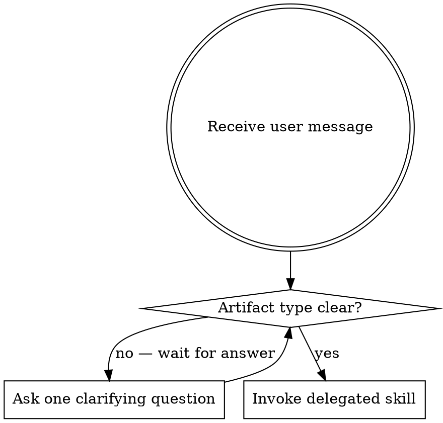

# Creating Tools

## Overview

**This is an orchestration skill.** It identifies the artifact type from the user's request and routes to the correct specialist skill. It does not author content itself — all creation happens inside the delegated skill.

## Hard Gate: Determine Artifact Type First

Before routing anywhere:

1. **Identify the artifact type** from the user's message.
2. **If ambiguous** — ask one clarifying question before routing. Do not guess.
3. **Never route simultaneously** to multiple skills.

Ambiguity examples that require a question before routing:
- "I want to create a new workflow component" → ask what type
- "I need something to guide engineers" → ask if it's a skill, rule, or agent
- "Add X to my setup" → ask what kind of artifact X is

Do not pick a route unilaterally under time pressure or convenience. The gate holds.

## Routing Table

| Artifact type | Route to | Notes |
|---|---|---|
| skill | `writing-skills` | Full TDD cycle + Pulser eval — see routing-table.md |
| agent | `writing-agents` | Process in writing-agents; structure via `plugin-dev:agent-development` internally |
| rule | `writing-rules` | Global or path-scoped |
| hook | `plugin-dev:hook-development` | Direct delegation |
| command | `plugin-dev:command-development` | Direct delegation |
| full plugin | `plugin-dev:create-plugin` | 8-phase guided workflow |

For full details on what each route covers, see `routing-table.md` in this directory.

## Coordinator Constraint

**creating-tools produces zero artifact content.** It routes — nothing more.

Broken behavior:
- Writing any file content before the delegated skill is invoked
- Writing frontmatter, system prompts, or rule text yourself
- Delegating to two routes simultaneously

## Gotchas

1. **Routing without asking on ambiguous input.** The hard gate exists because picking the wrong route wastes the user's time more than asking one question does. "I want to build something" is not enough to route.
2. **Authoring content before routing.** The moment you write a frontmatter field, a rule sentence, or any artifact content, you've violated the coordinator constraint. Stop and invoke the delegated skill instead.
3. **Routing to two destinations simultaneously.** A compound request ("I need a skill and a hook for it") is still one routing decision at a time. Handle them sequentially, not in parallel.
4. **Assuming the artifact type from keywords.** "Create a guide" could be a skill or a rule. "Build a checker" could be a skill, agent, or command. Ask, don't assume.

## Red Flags

These thoughts mean you are violating the coordinator constraint:

| Thought | Reality |
|---|---|
| "I'll just write the frontmatter first" | Stop. Route to the delegated skill. |
| "The user wants a skill — I know what to do" | Route to writing-skills. Do not start writing. |
| "I'll do a quick draft while loading the skill" | No. The delegated skill does the drafting. |
| "This is simple enough to handle directly" | The coordinator constraint has no exceptions. |
| "I'll route to both writing-agents and plugin-dev" | Never two routes simultaneously. Pick one. |
