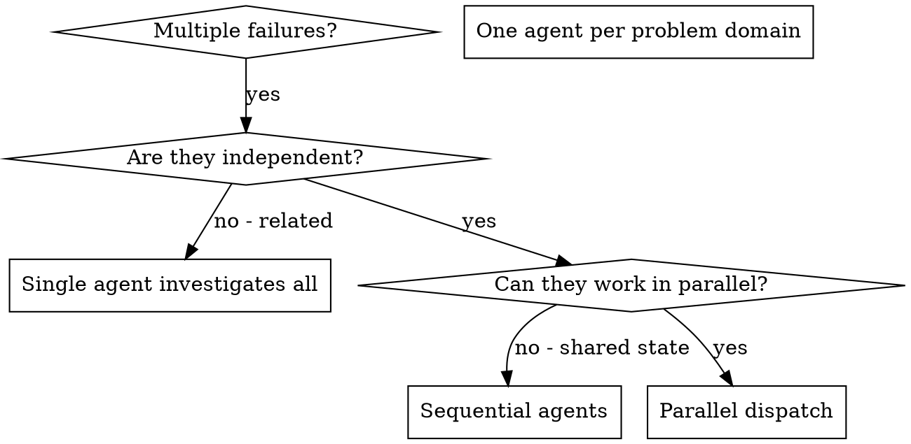

# Dispatching Parallel Agents

## Overview

You delegate tasks to specialized agents with isolated context. By precisely crafting their instructions and context, you ensure they stay focused and succeed at their task. They should never inherit your session's context or history — you construct exactly what they need. This also preserves your own context for coordination work.

**This skill is the regulated fan-out front-door.** All workflow fan-out routes through here. `review-workflow` and `deep-research` consume the helpers in `scripts/lib/dispatch.mjs` rather than re-implementing fan-out logic.

**Core principle:** Dispatch one agent per independent problem domain. Let them work concurrently — but through the correct helper so policy, retries, quorum, and token-budget gating are applied consistently.

Related:
- `scripts/lib/fail-successfully.mjs` — the underlying engine (`runUnit`, `quorumBarrier`)
- `scripts/lib/dispatch.mjs` — the three helpers (`parallelFanout`, `sequentialChain`, `dimensionalReview`)
- `docs/explanation/orchestration-regulation-layer.md` §5 / §9 — design rationale

## When to Use



**Use when:**
- 3+ test files failing with different root causes
- Multiple subsystems broken independently
- Each problem can be understood without context from others
- No shared state between investigations

**Don't use when:**
- Failures are related (fix one might fix others)
- Need to understand full system state
- Agents would interfere with each other

## Fan-Out Shapes

Three distinct dispatch patterns live in `scripts/lib/dispatch.mjs`. Choose the shape that matches the work structure; they all share the same `DispatchPolicy`.

---

### Shape 1 — Parallel Fan-Out: `parallelFanout(units, policy)`

Best for: N independent units where order does not matter and most must succeed.

```js
import { parallelFanout } from './lib/dispatch.mjs';

const { confirmed, abandoned, degraded, counts, stoppedReason } =
  await parallelFanout(units, {
    perUnitTimeoutMs: 30_000,
    maxInFlight: 8,
    quorum: Math.ceil(units.length / 2),
  });
```

**Return shape:** `{ confirmed, abandoned, degraded, counts, stoppedReason }`

- `confirmed` — array of values from SUCCEEDED units.
- `abandoned` — count of ABANDONED units.
- `degraded` — `true` when `confirmed.length < quorum`.
- `counts` — per-state counts aggregated across all batches.
- `stoppedReason` — `'token-budget'` if an early-stop fired; otherwise `undefined`.

**Important:** Read `degraded` together with `stoppedReason`. A `'token-budget'` early-stop can produce `degraded: true` even when every unit that actually ran succeeded — the quorum simply wasn't reachable because batches were skipped, not because units failed.

**How it works internally:** Units are chunked into `maxInFlight`-sized batches and passed through `quorumBarrier`. A post-hoc reactive token gate runs *between* batches (not before each unit).

---

### Shape 2 — Sequential Agent Chain: `sequentialChain(steps, policy)`

Best for: Pipeline stages where each step's output is the next step's input.

```js
import { sequentialChain } from './lib/dispatch.mjs';

const { results, completed, stoppedReason } =
  await sequentialChain(
    [
      { work: (_prior, _repair, _ctx) => fetchData() },
      { work: (prior, _repair, _ctx) => transform(prior) },
      { work: (prior, _repair, _ctx) => persist(prior) },
    ],
    { perUnitTimeoutMs: 60_000 }
  );
```

**Return shape:** `{ results, completed, stoppedReason }`

- `results` — array of `runUnit` result objects for each step (even partial runs).
- `completed` — number of steps that reached SUCCEEDED.
- `stoppedReason` — `'abandoned'` if any step was ABANDONED (chain halted); otherwise `undefined`.

**How it works:** Each step's `work(prior, repair, ctx)` receives the *previous* step's SUCCEEDED value as `prior`. Validation-as-feedback applies per step (governed by `maxValidationRetries`). The chain halts immediately on the first ABANDONED — no further steps run.

---

### Shape 3 — Monolith→Fan-Out Review: `dimensionalReview(dimensions, policy)`

Best for: Code review, analysis, or quality sweeps where multiple lenses run in parallel and findings are collected and optionally verified once.

```js
import { dimensionalReview } from './lib/dispatch.mjs';

const { findings, counts, degraded, verifyDegraded } =
  await dimensionalReview(dimensions, {
    perUnitTimeoutMs: 45_000,
    verify: async (allFindings) => deduplicate(allFindings),
  });
```

**Return shape:** `{ findings, counts, degraded, verifyDegraded }`

- `findings` — the final finding list (post-verify if verify succeeded; pre-verify if it abandoned).
- `counts` — per-state counts from the fan-out phase.
- `degraded` — `true` if the fan-out phase didn't reach quorum.
- `verifyDegraded` — `true` if the verify step was ABANDONED; when this is `true`, `findings` are **UNVERIFIED** — the caller must check this flag before trusting results.

**Cost decision — ONE batched verify, not 3-votes-per-finding:** `policy.verify` is called once over all findings. This is a deliberate cost choice: per-finding multi-vote verification burned ~290 agents / 6.4 M tokens in a prior session. Do not reintroduce per-finding verification.

---

## DispatchPolicy Calling Convention

Every helper accepts a `policy` object merged over `DEFAULT_POLICY`. These are the real defaults in `dispatch.mjs`:

| Key | Default | Notes |
|---|---|---|
| `maxInFlight` | `8` | Keep `≤ min(16, cores−2)` so nothing queues behind the runtime cap. NOT a magic 20. |
| `perUnitTimeoutMs` | **required** | No default — omitting throws `TypeError`. Watchdog → fast detect-and-abandon. |
| `maxRetries` | `1` | Crash/timeout retries. |
| `maxValidationRetries` | `1` | Validation-repair retries. Split budget from `maxRetries` so validation oscillation can't drain the crash budget. |
| `quorum` | `Math.ceil(units.length / 2)` | Override for stricter or relaxed consensus. |
| `modelTier` | `null` | Pin Haiku or Sonnet — **never Opus**. Threaded into the consumer's `agent({ model })`. |
| `tokenBudget` | `null` | Max output tokens for this fan-out. `null` = no limit. |
| `estimatedTokensPerUnit` | `0` | Coarse fallback only — output tokens are unknowable pre-call (`count_tokens` is input-only). If `0` AND no `getRemainingBudget`, the projection gate is inert. |
| `budgetReserve` | `0.9` | Stop at 90% of budget to bound non-preemptable in-flight overshoot. |
| `getRemainingBudget` | `null` | `() => number` — live remaining tokens. **Inside a Workflow: `() => budget.remaining()`** |
| `onOverloadBackoff` | `'exponential'` | Passthrough convention. The consumer's `work()` honors it on 529 / API-overload responses. The lib does not act on it. |

### Token-Budget Rule

**Inside a Workflow, pass `() => budget.remaining()` as `getRemainingBudget`.** The gate is post-hoc reactive: it reads real remaining tokens between batches (after each batch completes). This is the accurate signal.

`estimatedTokensPerUnit` is a coarse fallback projection because output tokens are unknowable before a call (`count_tokens` only counts input tokens). If `tokenBudget` is set but `estimatedTokensPerUnit` is `0` and `getRemainingBudget` is `null`, the projection gate is inert — no gating will occur.

```js
// Inside a Workflow — correct pattern
const { confirmed } = await parallelFanout(units, {
  perUnitTimeoutMs: 30_000,
  tokenBudget: budget.total(),
  getRemainingBudget: () => budget.remaining(),  // ← live signal between batches
});
```

---

## Non-Preemption Honesty Note

**A script-level watchdog stops *waiting* on a rogue agent — it cannot kill it.**

Claude Code subagents have no abort surface (GitHub: anthropics/claude-code #61405, open). "Kill rogues fast" means abandon-and-proceed at the orchestration level; the rogue agent continues running until it naturally completes or the outer session ends.

Practical implications:

- **`maxInFlight` is your real rogue-containment.** Small batches bound how many agents can be rogue simultaneously.
- **The token gate gates new *spawns* only.** In-flight units always finish — the gate cannot reach back and cancel them.
- **`AbortSignal` is the right tool only when `work` is local-abortable async** (fetch/fs operations), not for agent units. Do not pass `AbortSignal` to `runUnit` expecting agent termination.

When a unit times out, the watchdog fires ABANDONED and the chain/fan-out continues without that unit's result. The agent itself is unaffected.

---

## P1 Routing Rule

**All workflow fan-out routes through this skill's helpers as the canonical front-door.**

`review-workflow` and `deep-research` consume `parallelFanout` / `sequentialChain` / `dimensionalReview` in Wave 3 rather than each implementing its own fan-out. This is the cross-family de-duplication decision. If you are building a new workflow that fans out work to multiple agents, use these helpers — do not write a new batching loop.

---

## Agent Prompt Structure

Good agent prompts are:
1. **Focused** - One clear problem domain
2. **Self-contained** - All context needed to understand the problem
3. **Specific about output** - What should the agent return?

```markdown
Fix the 3 failing tests in src/agents/agent-tool-abort.test.ts:

1. "should abort tool with partial output capture" - expects 'interrupted at' in message
2. "should handle mixed completed and aborted tools" - fast tool aborted instead of completed
3. "should properly track pendingToolCount" - expects 3 results but gets 0

These are timing/race condition issues. Your task:

1. Read the test file and understand what each test verifies
2. Identify root cause - timing issues or actual bugs?
3. Fix by:
   - Replacing arbitrary timeouts with event-based waiting
   - Fixing bugs in abort implementation if found
   - Adjusting test expectations if testing changed behavior

Do NOT just increase timeouts - find the real issue.

Return: Summary of what you found and what you fixed.
```

## Common Mistakes

**❌ Too broad:** "Fix all the tests" - agent gets lost
**✅ Specific:** "Fix agent-tool-abort.test.ts" - focused scope

**❌ No context:** "Fix the race condition" - agent doesn't know where
**✅ Context:** Paste the error messages and test names

**❌ No constraints:** Agent might refactor everything
**✅ Constraints:** "Do NOT change production code" or "Fix tests only"

**❌ Vague output:** "Fix it" - you don't know what changed
**✅ Specific:** "Return summary of root cause and changes"

**❌ Omitting `perUnitTimeoutMs`:** Throws `TypeError` at dispatch time
**✅ Always set:** `perUnitTimeoutMs: 30_000` (or appropriate bound for the work)

**❌ Opus for leaf agents:** Token budget burns 10–50× faster than Sonnet/Haiku
**✅ Set `modelTier`:** Pin to Haiku or Sonnet via the consumer's `agent({ model })`

**❌ Per-finding verification loops:** Re-introduced ~290-agent / 6.4M-token sessions
**✅ `dimensionalReview` with one `policy.verify`:** ONE batched verify over all findings

## Gotchas

1. Only dispatch agents in parallel when tasks are genuinely independent — shared state (same file, same TODO.md row) causes merge conflicts.
2. Each agent needs a fully self-contained prompt — it has no memory of prior agents or the current conversation.
3. Collect all results before synthesizing — do not act on partial results from a subset of agents.
4. `degraded: true` does not always mean failure — check `stoppedReason`. A `'token-budget'` stop sets `degraded: true` even when every unit that ran succeeded.
5. When `verifyDegraded: true` from `dimensionalReview`, treat `findings` as unverified — surface the flag to the caller before presenting results.
6. Rogues cannot be killed at the agent level (#61405). Size `maxInFlight` conservatively and set `perUnitTimeoutMs` to bound worst-case blast radius.
