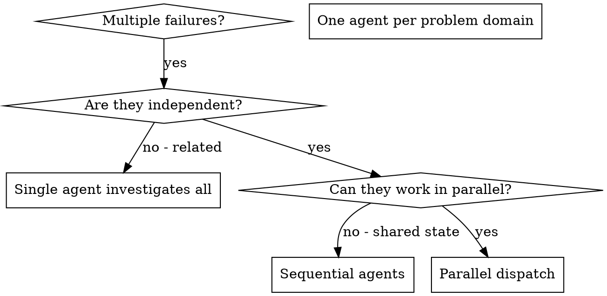

# Dispatching Parallel Agents

## Overview

You delegate tasks to specialized agents with isolated context. By precisely crafting their instructions and context, you ensure they stay focused and succeed at their task. They should never inherit your session's context or history — you construct exactly what they need. This also preserves your own context for coordination work.

**This skill is the regulated fan-out front-door.** All workflow fan-out routes through here. **Engine-path** consumers (executable `.workflow.mjs`, e.g. `librarian`, `orchestration-audit`) call the helpers in `scripts/lib/dispatch.mjs` directly. **Prose-path** consumers (skills whose fan-out is natural-language instructions the orchestrator follows — they cannot import `.mjs`) follow the protocol and policy described here and in `references/` (`dispatch-policy.md`, `verify-protocol.md`).

**Core principle:** Dispatch one agent per independent problem domain. Let them work concurrently — but through the correct helper so policy, retries, quorum, and token-budget gating are applied consistently.

Related:
- `scripts/lib/fail-successfully.mjs` — the underlying engine (`runUnit`, `quorumBarrier`)
- `scripts/lib/dispatch.mjs` — the three helpers (`parallelFanout`, `sequentialChain`, `dimensionalReview`)
- `references/verify-protocol.md` — the canonical tiered-adversarial verify protocol (triage → clustered re-check → minority-veto consensus) + machine-readable param block
- `docs/explanation/orchestration-regulation-layer.md` §5 / §9 — design rationale

## When to Use



**Use when:**
- 3+ test files failing with different root causes
- Multiple subsystems broken independently
- Each problem can be understood without context from others
- No shared state between investigations

**Don't use when:**
- Failures are related (fix one might fix others)
- Need to understand full system state
- Agents would interfere with each other

## Fan-Out Shapes

Three distinct dispatch patterns live in `scripts/lib/dispatch.mjs`. All share the same `DispatchPolicy`.

> Full `DispatchPolicy` schema, per-shape return contracts, token-budget mechanics, and non-preemption details: see [`references/dispatch-policy.md`](references/dispatch-policy.md).

---

### Shape 1 — `parallelFanout(units, policy)`

**When:** N independent units where order doesn't matter and most must succeed.

```js
import { parallelFanout } from './lib/dispatch.mjs';
const { confirmed, abandoned, degraded, counts, stoppedReason } =
  await parallelFanout(units, { perUnitTimeoutMs: 30_000, maxInFlight: 8,
    quorum: Math.ceil(units.length / 2) });
```

Returns: `{ confirmed[], abandoned, degraded, counts, stoppedReason }`.  
Check `stoppedReason` alongside `degraded` — a `'token-budget'` stop can set `degraded: true` even when all completed units succeeded.

---

### Shape 2 — `sequentialChain(steps, policy)`

**When:** Pipeline stages where each step's output feeds the next.

```js
import { sequentialChain } from './lib/dispatch.mjs';
const { results, completed, stoppedReason } =
  await sequentialChain(steps, { perUnitTimeoutMs: 60_000 });
```

Returns: `{ results[], completed, stoppedReason }`.  
Chain halts on first ABANDONED — no further steps run.

---

### Shape 3 — `dimensionalReview(dimensions, policy)`

**When:** Multiple review lenses run in parallel, findings collected and optionally verified once.

```js
import { dimensionalReview } from './lib/dispatch.mjs';
const { findings, counts, degraded, verifyDegraded } =
  await dimensionalReview(dimensions, { perUnitTimeoutMs: 45_000,
    verify: async (all) => deduplicate(all) });
```

Returns: `{ findings[], counts, degraded, verifyDegraded }`.  
When `verifyDegraded: true`, treat `findings` as unverified before presenting.

---

## Key Rules

- **Model pinning:** Set `modelTier` to Haiku or Sonnet — **never Opus**. Unthrottled Opus burns the session budget 10–50× faster.
- **`maxInFlight`:** Keep `≤ min(16, cores−2)`. This is your real rogue-containment — not a magic 20.
- **`perUnitTimeoutMs`:** Always set. Omitting throws `TypeError`.
- **Token budget (inside a Workflow):** Pass `getRemainingBudget: () => budget.remaining()`. The gate is post-hoc reactive (runs between batches). Full mechanics in `references/dispatch-policy.md`.
- **Non-preemption:** A watchdog abandons a timed-out unit but cannot kill its agent (GitHub anthropics/claude-code #61405). The agent runs to natural completion. Full note in `references/dispatch-policy.md`.

## Dispatching in prose (main-context Agent tool)

When you are in a prose skill or agent — not inside a Workflow script — you apply the same three shapes through the `Agent` tool directly. There are no JS helpers to call; the helpers are the *embodiment* of these recipes, inlined into Workflow scripts via the engine bundle (`scripts/build-engine-bundle.mjs`). Prose consumers follow the markdown recipe below; executable consumers inline the helpers.

The five rules apply identically regardless of surface:

| Rule | Prose translation |
|---|---|
| 1. Model-pin leaves | Pass `model: "claude-haiku-4-5-20251001"` (or Sonnet) in every `Agent` call. Never Opus. |
| 2. Cap concurrency | Dispatch at most `min(16, cores−2)` agents in a single parallel block (≤ ~16–20). Batch the rest. |
| 3. Per-agent timeout | State an explicit time bound in the agent prompt ("complete within 60 s or surface what you have"). Mark any non-responding agent ABANDONED and proceed. |
| 4. Tiered adversarial verify | Where a fan-out produces findings to verify, run the tiered verify (`references/verify-protocol.md`): one batched triage → bounded per-cluster re-check → minority-veto consensus on the contested tail only. Never a per-finding verification loop over the full findings set. |
| 5. This section IS the citation target | Link here from consuming prose skills; link to [`references/dispatch-policy.md`](references/dispatch-policy.md) for schema depth. |

---

### Shape A — Dimensional-review panel

Dispatch N lens-prompt agents in parallel (one per review dimension). After all return (or are abandoned), run the tiered-adversarial verify protocol over all findings, then synthesize.

> **Verify:** Shape A's verify step follows the canonical three-tier protocol: batched triage → clustered re-check → minority-veto consensus. Full spec, per-consumer profiles, graceful-degradation rules, and the machine-readable param block are in [`references/verify-protocol.md`](references/verify-protocol.md).

```
1. Identify N independent review lenses (security, performance, correctness, …).
2. Dispatch all N via Agent tool in one parallel block, model-pinned to Haiku/Sonnet.
3. Collect all results. Mark non-responding agents ABANDONED.
4. If confirmed.length < quorum (default: ceil(N/2)), surface degraded state to caller.
5. Run tiered-adversarial verify (see references/verify-protocol.md):
     Tier 1 — ONE batched triage call: label each finding supported/uncertain/unsupported; drop unsupported.
     Tier 2 — ONE re-check call per cluster (grouped by file or subQuestion): re-read cited source, keep/drop per member.
     Tier 3 — Three structurally-diverse voters each attempt to refute each contested finding; ≥2 failed refutations = keep (minority-veto rule).
   If any tier is abandoned → return that tier's input set stamped verifyDegraded (see protocol § Graceful Degradation).
6. Synthesize and return.
```

---

### Shape B — Parallel fan-out

Dispatch N independent unit agents in parallel. Collect results. Apply quorum / health check.

```
1. Partition work into N independent units (no shared state).
2. Dispatch all N via Agent tool, model-pinned, in batches of ≤ min(16, cores−2).
3. Collect results. ABANDONED units do not count toward quorum.
4. If confirmed.length < ceil(N/2), set degraded: true and surface to caller.
5. Return confirmed results. Do not synthesize before quorum check.
```

---

### Shape C — Sequential chain

Each step feeds the next. Set a per-step expectation; abandon-and-surface on a hang.

```
1. Define ordered steps [S1, S2, …, Sn]; each step's prompt includes the prior step's output.
2. Dispatch S1 via Agent tool, model-pinned.
3. If S1 is ABANDONED (hung past your stated bound) → halt, surface partial results.
4. Pass S1 output into S2 prompt. Repeat through Sn.
5. Chain halts on the first ABANDONED step — do not skip ahead.
```

---

## P1 Routing Rule

**All workflow fan-out routes through this skill as the canonical front-door.**

`review-workflow` and `deep-research` follow this skill's fan-out protocol rather than each implementing their own fan-out — the cross-family de-duplication decision. If you are building a new workflow that fans out work to multiple agents, route it through this front-door (engine-path `.workflow.mjs` calls the `scripts/lib/dispatch.mjs` helpers directly; prose-path skills follow the protocol described here) instead of writing a new batching loop.

## Agent Prompt Structure

Good agent prompts are:
1. **Focused** — one clear problem domain
2. **Self-contained** — all context needed to understand the problem
3. **Specific about output** — what should the agent return?

```markdown
Fix the 3 failing tests in src/agents/agent-tool-abort.test.ts:

1. "should abort tool with partial output capture" - expects 'interrupted at' in message
2. "should handle mixed completed and aborted tools" - fast tool aborted instead of completed
3. "should properly track pendingToolCount" - expects 3 results but gets 0

These are timing/race condition issues. Your task:

1. Read the test file and understand what each test verifies
2. Identify root cause - timing issues or actual bugs?
3. Fix by:
   - Replacing arbitrary timeouts with event-based waiting
   - Fixing bugs in abort implementation if found
   - Adjusting test expectations if testing changed behavior

Do NOT just increase timeouts - find the real issue.

Return: Summary of what you found and what you fixed.
```

## Common Mistakes

**❌ Too broad:** "Fix all the tests" — agent gets lost  
**✅ Specific:** "Fix agent-tool-abort.test.ts" — focused scope

**❌ No context:** "Fix the race condition" — agent doesn't know where  
**✅ Context:** Paste the error messages and test names

**❌ No constraints:** Agent might refactor everything  
**✅ Constraints:** "Do NOT change production code" or "Fix tests only"

**❌ Omitting `perUnitTimeoutMs`:** Throws `TypeError` at dispatch time  
**✅ Always set:** `perUnitTimeoutMs: 30_000` (or appropriate bound for the work)

**❌ Opus for leaf agents:** Token budget burns 10–50× faster than Sonnet/Haiku  
**✅ Set `modelTier`:** Pin to Haiku or Sonnet via the consumer's `agent({ model })`

**❌ Per-finding verification loops:** Re-introduced ~290-agent / 6.4M-token sessions  
**✅ `dimensionalReview` with one `policy.verify`:** ONE batched verify over all findings

## Gotchas

1. Only dispatch agents in parallel when tasks are genuinely independent — shared state (same file, same TODO.md row) causes merge conflicts.
2. Each agent needs a fully self-contained prompt — it has no memory of prior agents or the current conversation.
3. Collect all results before synthesizing — do not act on partial results from a subset of agents.
4. `degraded: true` does not always mean failure — check `stoppedReason`. A `'token-budget'` stop sets `degraded: true` even when every unit that ran succeeded.
5. When `verifyDegraded: true` from `dimensionalReview`, treat `findings` as unverified — surface the flag to the caller before presenting results.
6. Rogues cannot be killed at the agent level (#61405). Size `maxInFlight` conservatively and set `perUnitTimeoutMs` to bound worst-case blast radius.
