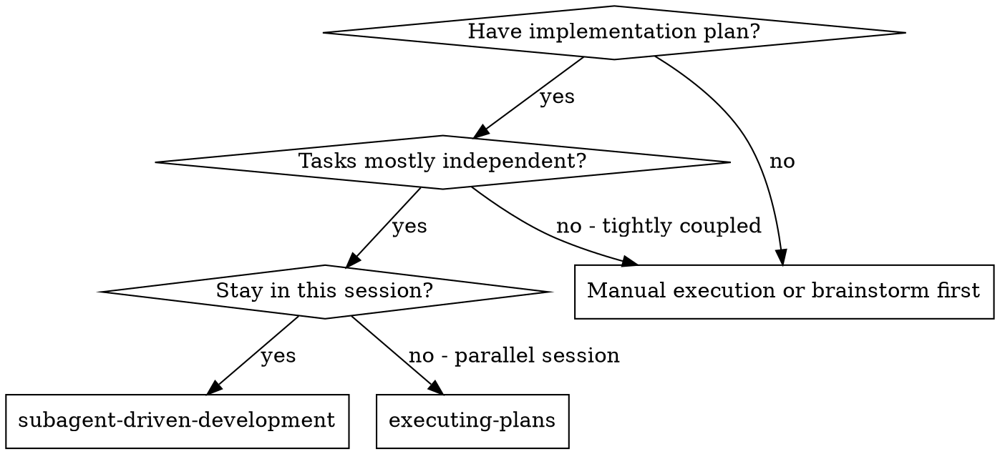
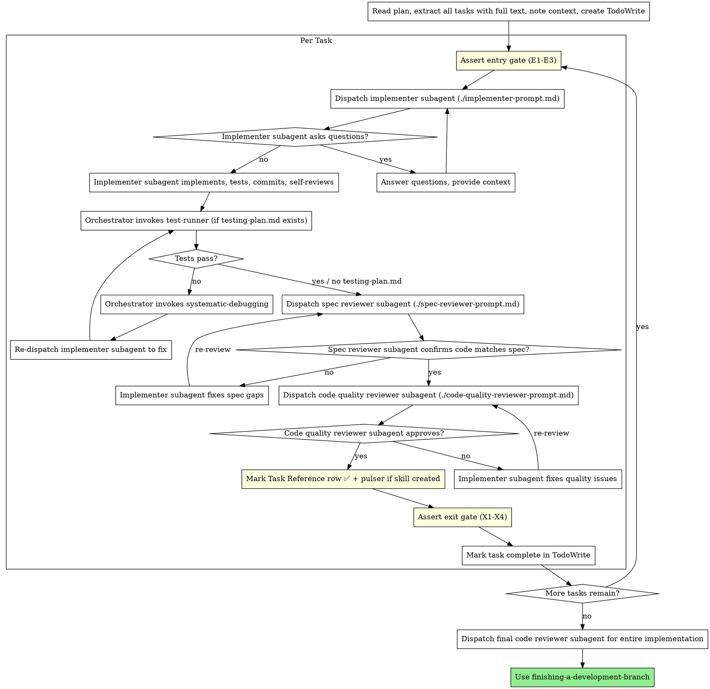

# Subagent-Driven Development

Execute plan by dispatching fresh subagent per task, with two-stage review after each: spec compliance review first, then code quality review.

**Why subagents:** You delegate tasks to specialized agents with isolated context. By precisely crafting their instructions and context, you ensure they stay focused and succeed at their task. They should never inherit your session's context or history — you construct exactly what they need. This also preserves your own context for coordination work.

**Core principle:** Fresh subagent per task + two-stage review (spec then quality) = high quality, fast iteration

## When to Use



**vs. Executing Plans (parallel session):**
- Same session (no context switch)
- Fresh subagent per task (no context pollution)
- Two-stage review after each task: spec compliance first, then code quality
- Faster iteration (no human-in-loop between tasks)

## The Process



## Model Selection

Use the least powerful model that can handle each role to conserve cost and increase speed.

**Selecting the model:**

| Complexity | Examples | Model |
|---|---|---|
| S (Trivial — Haiku-eligible) | doc edit, jira transition, test-runner output parsing, single-file rename, config tweak | claude-haiku-4-5-20251001 |
| M (Standard) | feature implementation, multi-file change, debugging | claude-sonnet-4-6 |
| L (Complex) | architecture decisions, cross-cutting refactor, design judgment | claude-opus-4-7 |

**Source of complexity:** The plan doc's Task Reference table includes a Complexity column with values S / M / L. The orchestrator reads this column at dispatch time and picks the model accordingly (S → Haiku, M → Sonnet, L → Opus). If the plan predates this convention and the column is absent, default to M (Sonnet) and log the fallback.

**Frontmatter pinning wins.** Some agents are pinned to a specific tier in their frontmatter (e.g., `researcher` and `test-runner` pin to Haiku). The PreToolUse `agent-model-pinning.mjs` hook (Tier 1, A1) overrides the orchestrator's `model:` choice with the pinned value when present. The plan-time tier becomes a soft default in those cases — A1's hook is the source of truth.

**Per-dispatch requirement:** Each implementer dispatch must explicitly set the `model:` parameter on the Task tool AND echo the choice as `**Model:** <name> — <rationale>` in the prompt body (see `./implementer-prompt.md`). Parent-context model selection must not silently propagate — every task gets a deliberate, visible choice.

## Handling Implementer Status

Implementer subagents report one of four statuses. Handle each appropriately:

**DONE:** If `.claude/testing-plan.md` exists in the repo, invoke test-runner before spec review:

```
Agent {
  subagent_type: "test-runner",
  prompt: "plan_doc: [plan path]\ntesting_plan: .claude/testing-plan.md"
}
```

- **PASS**: proceed to spec compliance review.
- **FAILURE**: invoke `Skill { skill: "systematic-debugging" }` as the orchestrator. After
  systematic-debugging completes Phase 1, re-dispatch the implementer to fix the root cause.
  Re-run test-runner after the fix before dispatching spec review.
- **SETUP REQUIRED**: no testing-plan.md — proceed to spec review without test-runner.

test-runner must always be invoked by the orchestrator (this context), never by the implementer
subagent — the implementer does not have Skill tool access needed to act on the REQUIRED NEXT
STEP block if tests fail.

If `.claude/testing-plan.md` does not exist: proceed directly to spec review.

**DONE_WITH_CONCERNS:** The implementer completed the work but flagged doubts. Read the concerns before proceeding. If the concerns are about correctness or scope, address them before review. If they're observations (e.g., "this file is getting large"), note them and proceed to review.

**NEEDS_CONTEXT:** The implementer needs information that wasn't provided. Provide the missing context and re-dispatch.

**BLOCKED:** The implementer cannot complete the task. Assess the blocker:
1. If it's a context problem, provide more context and re-dispatch with the same model
2. If the task requires more reasoning, re-dispatch with a more capable model
3. If the task is too large, break it into smaller pieces
4. If the plan itself is wrong, escalate to the human

**Never** ignore an escalation or force the same model to retry without changes. If the implementer said it's stuck, something needs to change.

## Per-Task Constitutional Gates

**Gate ownership:** The orchestrator (this skill / this context) is responsible for running all gates. The implementer subagent does **not** have `Skill` tool access to `plan-management` and cannot invoke gates itself. The sequence is:

1. Orchestrator runs **entry gate** before dispatching the implementer for a task
2. Implementer reports DONE / DONE_WITH_CONCERNS / NEEDS_CONTEXT / BLOCKED
3. Orchestrator handles status (test-runner, spec review, code quality review per above)
4. Orchestrator runs **exit gate** before marking the task complete in TodoWrite

The two-stage review (spec compliance, then code quality) still happens between entry and exit gate runs — the gates wrap the entire per-task cycle.

### Constitutional Entry Gate (assert before dispatching the implementer)

Before dispatching the implementer for a task, assert all of the following. **If any check fails, stop and refuse to start the task until the condition is met.**

- [ ] **E1 — Active plan confirmed:** `.claude/active-plan` exists and points to the correct plan doc for this work. If missing or pointing to the wrong plan, do not start — surface the discrepancy to the user.
- [ ] **E2 — Previous task ✅:** The previous task's row in the plan's Task Reference table is marked ✅ (or this is Task 1 and no prior row exists). If the prior task row is not ✅, do not start the new task — mark the prior task complete first.
- [ ] **E3 — Task prompt read:** The dispatch prompt for this task has been read in full before any implementation begins.

**Entry gate failure message format:**
> ENTRY GATE FAILED — [E1 | E2 | E3]: [specific reason]. Cannot start Task N until this is resolved.

---

### Constitutional Exit Gate (assert before marking the task complete in TodoWrite)

Before marking a task complete in TodoWrite, assert all of the following. **If any check fails, stop and refuse to advance until the condition is met.**

Before running this gate, the orchestrator performs three pre-exit actions:

1. **Mark the task's row in the plan's Task Reference table ✅** — edit `<top>-plan.md` and add the ✅ marker to the row. This is the durable completion record the exit gate (X1) confirms. Doing this before the exit gate makes X1 a confirmation step rather than an orphaned precondition.
2. **Tick all step-level checkboxes inside the just-completed task's detail section** — edit `<top>-plan.md` and change every `- [ ]` to `- [x]` inside the Task N detail section. Bulk-ticking at task close is acceptable (the Task Reference row ✅ is the authoritative completion signal); step checkboxes provide a durable per-step track record for future sessions reading the plan.
3. **If the task created or modified one or more skills:** invoke `pulser --strict --skill <name> --no-anim` (via Bash) before running the exit gate. Fix any warnings or errors first. This is a hard gate — do not skip even if pulser was not listed in the plan's testing section. The implementer subagent does not have the access required to run this; the orchestrator must invoke it.

- [ ] **X1 — Task Reference row ✅:** The task's row in the plan's Task Reference table has been marked ✅. This is mandatory even for trivial changes.
- [ ] **X2 — Divergence journaled (if applicable):** If any divergence occurred during the task — architecture change, file path moved, signature changed, scope shift, discovered bug, test-debt finding — a journal entry has been appended via `plan-management:divergence`. See trivial-change exception below.
- [ ] **X3 — Handoff refreshed:** The handoff's status table has been updated: Active task advanced to the next task, and any new gotchas relevant to the next session have been recorded.
- [ ] **X4 — Test-mechanics divergence handled (if applicable):** If the task changed how tests run (new pytest flag, new fixture, new env var requirement, new skip group, changed test command, etc.), then:
  - A journal entry tagged `[test-mechanics]` was written via `plan-management:divergence`, AND
  - The relevant testing artifact (`.claude/testing-plan.md`, `scripts/run-tests.sh`, or repo equivalent) was updated **in the same `plan-management:divergence` call**.
  Test-mechanics changes always count as divergence regardless of how small they appear.

**Exit gate failure message format:**
> EXIT GATE FAILED — [X1 | X2 | X3 | X4]: [specific reason]. Cannot mark Task N complete until this is resolved.

**Trivial-change exception (X2 and X4 only):**
The journal entry (X2) is optional — and X4 does not apply — when ALL of the following are true:
- The change is a one-line typo fix, whitespace/formatting correction, comment-only edit, or documentation-only prose edit (e.g., rewording one paragraph in a markdown file with no logic, behavioral, or test-mechanics implications)
- No behavioral change of any kind was introduced
- No test-running mechanics were changed
X1 (Task Reference ✅) and X3 (handoff refresh) are still mandatory even for trivial changes — they are never skipped.

**Orchestrator owns the exception decision:** the orchestrator asserts this exception based on its own inspection of the implementer's diff or commit message — the implementer subagent's self-description ("I just fixed a typo") is not sufficient. If the diff disagrees with the implementer's framing, the exception does not apply and X2/X4 fire normally.

---

### Post-Exit-Gate — Promote Task in Tracking

After the exit gate passes:

1. **If Jira enabled:** transition the task's Jira ticket to **Done** (or **Testing** if AWS verification required) via `jira-workflow-manager`. **If Jira disabled:** skip.
2. **Invoke `plan-management:completed`:** with the plan-doc path, status `completed`, and a 1–2 sentence summary. **If Jira enabled:** include `jira-key`. **If Jira disabled:** omit `jira-key` entirely. This promotes the TODO.md entry from In Progress to History.
3. Mark the task complete in TodoWrite.

Skipping step 2 leaves TODO.md In Progress entries stuck forever — the executor (this skill) is the only path that updates the TODO.md registry for the task.

---

## Prompt Templates and Auto-Prepended Prefixes

Each role has two artifacts:

| Role | Prefix file (auto-prepended) | Variable-suffix template |
|---|---|---|
| Implementer | `./prefixes/implementer.md` | `./implementer-prompt.md` |
| Spec reviewer | `./prefixes/spec-reviewer.md` | `./spec-reviewer-prompt.md` |
| Code quality reviewer | `./prefixes/code-quality-reviewer.md` | `./code-quality-reviewer-prompt.md` |

The `.claude/hooks/preToolUse/subagent-prefix-prepend.mjs` hook detects a `[role: <name>]` marker on the first non-empty line of the prompt parameter, reads the matching prefix file byte-for-byte, and prepends it (with a `---` separator) before the dispatch lands.

**Why:** byte-identical prefix bytes across same-role dispatches yield automatic prompt-cache hits (cache-read = 0.1× input cost). Mid-session edits to a prefix file change its bytes; the next dispatch caches a new prefix. Visible — each prefix file carries a `version:` field in frontmatter; the hook logs `(role, prefix_version, suffix_first_60_chars)` per dispatch to `.claude/logs/subagent-prefix.jsonl` so cache invalidation is auditable.

**Authoring discipline:** when constructing a dispatch prompt, write only the variable suffix following the role's prompt-template file. The first non-empty line must be the marker. The hook does the rest. Do NOT paste the methodological prefix manually — that would defeat the point of the hook (orchestrator drift was the original failure mode).

**Rollback:** `CLAUDE_DISABLE_WORKFLOW_HOOKS=1` disables the hook (along with all other workflow hooks).

## Plan Anchor (re-anchoring block)

Counters orchestrator and implementer drift across long sessions. The orchestrator authors a small (~60–80 token) anchor block and prepends it to the variable suffix of every implementer dispatch. Reviewers don't get one — they're short-lived and narrow-scoped.

**Block format:**

```
## Plan Anchor
Plan goal: <one sentence from plan doc Context section>
This task's contribution: <one sentence on why this task exists>
Recent completed tasks (last 3–5): <task IDs + one-line names, no summaries>
Active stack hats: <names + a one-line digest each, resolved from project.json stacks; "none" if no stacks declared>
```

**Position:** First block of the variable suffix, immediately after the `[role: implementer]` marker line, before the `Task N:` line. The implementer reads "what's the goal" before "what's the task," matching how a human briefs a colleague.

**Author:** Orchestrator (this skill / this context). Re-read the plan doc's Context section before each implementer dispatch — the re-read is itself part of B2 and counters orchestrator-level drift. Also resolve the repo's active stack hats once (read `project.json` `stacks`; for each, read `~/.claude/stacks/<name>.md` `## Hat`) and fill the `Active stack hats` field with a one-line digest per hat. See `rules/stack-hats.md`. This adds ~10–30 tokens to the anchor; keep each hat to a single line.

**Sizing rule (anti-bloat):**
- Recent completed tasks list: cap at the last 3–5 tasks; digest format only (IDs + one-line names, never per-task summaries).
- Older completed tasks decay in salience and don't earn a slot.
- Total anchor token budget: ~60 tokens typical, ~80–100 even on plans with 20+ completed tasks.

**Scope:** Implementer dispatches only. Spec-reviewer and code-quality-reviewer dispatches do NOT get an anchor.

## Example Workflow

```
You: I'm using Subagent-Driven Development to execute this plan.

[Read plan file once: docs/superpowers/plans/feature-plan.md]
[Extract all 5 tasks with full text and context]
[Create TodoWrite with all tasks]

Task 1: Hook installation script

[Get Task 1 text and context (already extracted)]
[Assert entry gate: E1 ✅ active-plan confirmed, E2 ✅ no prior task (Task 1), E3 ✅ prompt read]
[Dispatch implementation subagent with full task text + context]

Implementer: "Before I begin - should the hook be installed at user or system level?"

You: "User level (~/.config/superpowers/hooks/)"

Implementer: "Got it. Implementing now..."
[Later] Implementer:
  - Implemented install-hook command
  - Added tests, 5/5 passing
  - Self-review: Found I missed --force flag, added it
  - Committed

[Dispatch spec compliance reviewer]
Spec reviewer: ✅ Spec compliant - all requirements met, nothing extra

[Get git SHAs, dispatch code quality reviewer]
Code reviewer: Strengths: Good test coverage, clean. Issues: None. Approved.

[Mark Task 1 row ✅ in plan Task Reference]
[Pulser n/a — no skill created in this task]
[Assert exit gate: X1 ✅ row marked, X2 n/a (no divergence), X3 ✅ handoff refreshed, X4 n/a (no test-mechanics change)]
[Mark Task 1 complete in TodoWrite]

Task 2: Recovery modes

[Get Task 2 text and context (already extracted)]
[Assert entry gate: E1 ✅ active-plan confirmed, E2 ✅ Task 1 row marked, E3 ✅ prompt read]
[Dispatch implementation subagent with full task text + context]

Implementer: [No questions, proceeds]
Implementer:
  - Added verify/repair modes
  - 8/8 tests passing
  - Self-review: All good
  - Committed

[Dispatch spec compliance reviewer]
Spec reviewer: ❌ Issues:
  - Missing: Progress reporting (spec says "report every 100 items")
  - Extra: Added --json flag (not requested)

[Implementer fixes issues]
Implementer: Removed --json flag, added progress reporting

[Spec reviewer reviews again]
Spec reviewer: ✅ Spec compliant now

[Dispatch code quality reviewer]
Code reviewer: Strengths: Solid. Issues (Important): Magic number (100)

[Implementer fixes]
Implementer: Extracted PROGRESS_INTERVAL constant

[Code reviewer reviews again]
Code reviewer: ✅ Approved

[Mark Task 2 row ✅ in plan Task Reference]
[Pulser n/a — no skill created in this task]
[Assert exit gate: X1 ✅ row marked, X2 ✅ journal entry appended via plan-management:divergence (scope shift: removed --json flag, added progress reporting), X3 ✅ handoff refreshed, X4 n/a]
[Mark Task 2 complete in TodoWrite]

...

[After all tasks]
[Dispatch final code-reviewer]
Final reviewer: All requirements met, ready to merge

Done!
```

## Advantages

**vs. Manual execution:**
- Subagents follow TDD naturally
- Fresh context per task (no confusion)
- Parallel-safe (subagents don't interfere)
- Subagent can ask questions (before AND during work)

**vs. Executing Plans:**
- Same session (no handoff)
- Continuous progress (no waiting)
- Review checkpoints automatic

**Efficiency gains:**
- No file reading overhead (controller provides full text)
- Controller curates exactly what context is needed
- Subagent gets complete information upfront
- Questions surfaced before work begins (not after)

**Quality gates:**
- Self-review catches issues before handoff
- Two-stage review: spec compliance, then code quality
- Review loops ensure fixes actually work
- Spec compliance prevents over/under-building
- Code quality ensures implementation is well-built

**Cost:**
- More subagent invocations (implementer + 2 reviewers per task)
- Controller does more prep work (extracting all tasks upfront)
- Review loops add iterations
- But catches issues early (cheaper than debugging later)

## Red Flags

**Never:**
- Start implementation on main/master branch without explicit user consent
- Skip reviews (spec compliance OR code quality)
- Proceed with unfixed issues
- Dispatch multiple implementation subagents in parallel (conflicts)
- Make subagent read plan file (provide full text instead)
- Skip scene-setting context (subagent needs to understand where task fits)
- Ignore subagent questions (answer before letting them proceed)
- Accept "close enough" on spec compliance (spec reviewer found issues = not done)
- Skip review loops (reviewer found issues = implementer fixes = review again)
- Let implementer self-review replace actual review (both are needed)
- **Start code quality review before spec compliance is ✅** (wrong order)
- Move to next task while either review has open issues
- Dispatch test-runner from within an implementer subagent (orchestrator must invoke it directly)
- Dispatch spec reviewer before test-runner passes when testing-plan.md exists

**If subagent asks questions:**
- Answer clearly and completely
- Provide additional context if needed
- Don't rush them into implementation

**If reviewer finds issues:**
- Implementer (same subagent) fixes them
- Reviewer reviews again
- Repeat until approved
- Don't skip the re-review

**If subagent fails task:**
- Dispatch fix subagent with specific instructions
- Don't try to fix manually (context pollution)

## Integration

**Required workflow skills:**
- **using-git-worktrees** - REQUIRED: Set up isolated workspace before starting
- **writing-plans** - Creates the plan this skill executes
- **requesting-code-review** - Code review template for reviewer subagents
- **finishing-a-development-branch** - Complete development after all tasks

**Subagents should use:**
- **test-driven-development** - Subagents follow TDD for each task

**Alternative workflow:**
- **executing-plans** - Use for parallel session instead of same-session execution

## Gotchas

1. Only use for tasks from a plan doc that have been verified as independent — do not parallelize tasks with shared file dependencies.
2. Each subagent receives the full task context from the plan doc — do not rely on subagents inferring shared state.
3. Collect all subagent results before committing — partial commits from parallel work create messy history.
